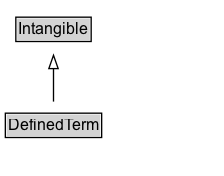

# DefinedTerm

A word, name, acronym, phrase, etc. with a formal definition. Often used in the context of category or subject classification, glossaries or dictionaries, product or creative work types, etc. Use the name property for the term being defined, use termCode if the term has an alpha-numeric code allocated, use description to provide the definition of the term. Use the about property to specify what the term is about.

## Diagram

=== "SVG (interactive)"

    <!-- Generated by graphviz version 14.1.3 (20260303.0454)
     -->
    <!-- Pages: 1 -->
    <svg width="168pt" height="132pt"
     viewBox="0.00 0.00 168.00 132.00" xmlns="http://www.w3.org/2000/svg" xmlns:xlink="http://www.w3.org/1999/xlink">
    <g id="graph0" class="graph" transform="scale(1 1) rotate(0) translate(4 128)">
    <polygon fill="white" stroke="none" points="-4,4 -4,-128 164.12,-128 164.12,4 -4,4"/>
    <g id="clust3" class="cluster">
    <title>cluster_associated</title>
    </g>
    <!-- Intangible -->
    <g id="node1" class="node">
    <title>Intangible</title>
    <g id="a_node1"><a xlink:href="../Intangible" xlink:title="&lt;TABLE&gt;">
    <polygon fill="lightgray" stroke="none" points="8.88,-97.88 8.88,-114.12 63.38,-114.12 63.38,-97.88 8.88,-97.88"/>
    <text xml:space="preserve" text-anchor="start" x="9.88" y="-101.88" font-family="Arial" font-size="12.00">Intangible</text>
    <polygon fill="none" stroke="black" points="7.88,-96.88 7.88,-115.12 64.38,-115.12 64.38,-96.88 7.88,-96.88"/>
    </a>
    </g>
    </g>
    <!-- DefinedTerm -->
    <g id="node2" class="node">
    <title>DefinedTerm</title>
    <g id="a_node2"><a xlink:href="../DefinedTerm" xlink:title="&lt;TABLE&gt;">
    <polygon fill="lightgray" stroke="none" points="1,-25.88 1,-42.12 71.25,-42.12 71.25,-25.88 1,-25.88"/>
    <text xml:space="preserve" text-anchor="start" x="2" y="-29.88" font-family="Arial" font-size="12.00">DefinedTerm</text>
    <polygon fill="none" stroke="black" points="0,-24.88 0,-43.12 72.25,-43.12 72.25,-24.88 0,-24.88"/>
    </a>
    </g>
    </g>
    <!-- DefinedTerm&#45;&gt;Intangible -->
    <g id="edge1" class="edge">
    <title>DefinedTerm&#45;&gt;Intangible</title>
    <path fill="none" stroke="black" d="M36.12,-51.79C36.12,-59.25 36.12,-68.24 36.12,-76.69"/>
    <polygon fill="none" stroke="black" points="32.63,-76.54 36.13,-86.54 39.63,-76.54 32.63,-76.54"/>
    </g>
    <!-- Invis -->
    </g>
    </svg>

=== "PNG"

    

## Specializations of DefinedTerm

| Class | Description |
|-------|-------------|
| [Category Code](CategoryCode.md) | A Category Code. |
| [Medical Code](MedicalCode.md) | A code for a medical entity. |

## Formalization for DefinedTerm

| Property | Constraint |
|----------|------------|
| subClassOf | [Intangible](Intangible.md) |

