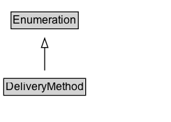

# DeliveryMethod

A delivery method is a standardized procedure for transferring the product or service to the destination of fulfillment chosen by the customer. Delivery methods are characterized by the means of transportation used, and by the organization or group that is the contracting party for the sending organization or person.\n\nCommonly used values:\n\n* http://purl.org/goodrelations/v1#DeliveryModeDirectDownload\n* http://purl.org/goodrelations/v1#DeliveryModeFreight\n* http://purl.org/goodrelations/v1#DeliveryModeMail\n* http://purl.org/goodrelations/v1#DeliveryModeOwnFleet\n* http://purl.org/goodrelations/v1#DeliveryModePickUp\n* http://purl.org/goodrelations/v1#DHL\n* http://purl.org/goodrelations/v1#FederalExpress\n* http://purl.org/goodrelations/v1#UPS
        

## Diagram

=== "SVG (interactive)"

    <!-- Generated by graphviz version 14.1.3 (20260303.0454)
     -->
    <!-- Pages: 1 -->
    <svg width="184pt" height="132pt"
     viewBox="0.00 0.00 184.00 132.00" xmlns="http://www.w3.org/2000/svg" xmlns:xlink="http://www.w3.org/1999/xlink">
    <g id="graph0" class="graph" transform="scale(1 1) rotate(0) translate(4 128)">
    <polygon fill="white" stroke="none" points="-4,4 -4,-128 180,-128 180,4 -4,4"/>
    <g id="clust3" class="cluster">
    <title>cluster_associated</title>
    </g>
    <!-- Enumeration -->
    <g id="node1" class="node">
    <title>Enumeration</title>
    <g id="a_node1"><a xlink:href="../Enumeration" xlink:title="&lt;TABLE&gt;">
    <polygon fill="lightgray" stroke="none" points="8.88,-97.88 8.88,-114.12 79.12,-114.12 79.12,-97.88 8.88,-97.88"/>
    <text xml:space="preserve" text-anchor="start" x="9.88" y="-101.88" font-family="Arial" font-size="12.00">Enumeration</text>
    <polygon fill="none" stroke="black" points="7.88,-96.88 7.88,-115.12 80.12,-115.12 80.12,-96.88 7.88,-96.88"/>
    </a>
    </g>
    </g>
    <!-- DeliveryMethod -->
    <g id="node2" class="node">
    <title>DeliveryMethod</title>
    <g id="a_node2"><a xlink:href="../DeliveryMethod" xlink:title="&lt;TABLE&gt;">
    <polygon fill="lightgray" stroke="none" points="1,-25.88 1,-42.12 87,-42.12 87,-25.88 1,-25.88"/>
    <text xml:space="preserve" text-anchor="start" x="2" y="-29.88" font-family="Arial" font-size="12.00">DeliveryMethod</text>
    <polygon fill="none" stroke="black" points="0,-24.88 0,-43.12 88,-43.12 88,-24.88 0,-24.88"/>
    </a>
    </g>
    </g>
    <!-- DeliveryMethod&#45;&gt;Enumeration -->
    <g id="edge1" class="edge">
    <title>DeliveryMethod&#45;&gt;Enumeration</title>
    <path fill="none" stroke="black" d="M44,-51.79C44,-59.25 44,-68.24 44,-76.69"/>
    <polygon fill="none" stroke="black" points="40.5,-76.54 44,-86.54 47.5,-76.54 40.5,-76.54"/>
    </g>
    <!-- Invis -->
    </g>
    </svg>

=== "PNG"

    

## Formalization for DeliveryMethod

| Property | Constraint |
|----------|------------|
| subClassOf | [Enumeration](Enumeration.md) |

