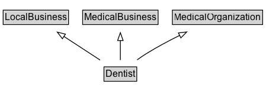

# Dentist

A dentist.

## Diagram

=== "SVG (interactive)"

    <!-- Generated by graphviz version 14.1.3 (20260303.0454)
     -->
    <!-- Pages: 1 -->
    <svg width="337pt" height="132pt"
     viewBox="0.00 0.00 337.00 132.00" xmlns="http://www.w3.org/2000/svg" xmlns:xlink="http://www.w3.org/1999/xlink">
    <g id="graph0" class="graph" transform="scale(1 1) rotate(0) translate(4 128)">
    <polygon fill="white" stroke="none" points="-4,4 -4,-128 332.5,-128 332.5,4 -4,4"/>
    <g id="clust3" class="cluster">
    <title>cluster_associated</title>
    </g>
    <!-- LocalBusiness -->
    <g id="node1" class="node">
    <title>LocalBusiness</title>
    <g id="a_node1"><a xlink:href="../LocalBusiness" xlink:title="&lt;TABLE&gt;">
    <polygon fill="lightgray" stroke="none" points="1,-97.88 1,-114.12 81.75,-114.12 81.75,-97.88 1,-97.88"/>
    <text xml:space="preserve" text-anchor="start" x="2" y="-101.88" font-family="Arial" font-size="12.00">LocalBusiness</text>
    <polygon fill="none" stroke="black" points="0,-96.88 0,-115.12 82.75,-115.12 82.75,-96.88 0,-96.88"/>
    </a>
    </g>
    </g>
    <!-- MedicalBusiness -->
    <g id="node2" class="node">
    <title>MedicalBusiness</title>
    <g id="a_node2"><a xlink:href="../MedicalBusiness" xlink:title="&lt;TABLE&gt;">
    <polygon fill="lightgray" stroke="none" points="101.62,-97.88 101.62,-114.12 195.12,-114.12 195.12,-97.88 101.62,-97.88"/>
    <text xml:space="preserve" text-anchor="start" x="102.62" y="-101.88" font-family="Arial" font-size="12.00">MedicalBusiness</text>
    <polygon fill="none" stroke="black" points="100.62,-96.88 100.62,-115.12 196.12,-115.12 196.12,-96.88 100.62,-96.88"/>
    </a>
    </g>
    </g>
    <!-- MedicalOrganization -->
    <g id="node3" class="node">
    <title>MedicalOrganization</title>
    <g id="a_node3"><a xlink:href="../MedicalOrganization" xlink:title="&lt;TABLE&gt;">
    <polygon fill="lightgray" stroke="none" points="215.25,-97.88 215.25,-114.12 327.5,-114.12 327.5,-97.88 215.25,-97.88"/>
    <text xml:space="preserve" text-anchor="start" x="216.25" y="-101.88" font-family="Arial" font-size="12.00">MedicalOrganization</text>
    <polygon fill="none" stroke="black" points="214.25,-96.88 214.25,-115.12 328.5,-115.12 328.5,-96.88 214.25,-96.88"/>
    </a>
    </g>
    </g>
    <!-- Dentist -->
    <g id="node4" class="node">
    <title>Dentist</title>
    <g id="a_node4"><a xlink:href="../Dentist" xlink:title="&lt;TABLE&gt;">
    <polygon fill="lightgray" stroke="none" points="128.62,-25.88 128.62,-42.12 168.12,-42.12 168.12,-25.88 128.62,-25.88"/>
    <text xml:space="preserve" text-anchor="start" x="129.62" y="-29.88" font-family="Arial" font-size="12.00">Dentist</text>
    <polygon fill="none" stroke="black" points="127.62,-24.88 127.62,-43.12 169.12,-43.12 169.12,-24.88 127.62,-24.88"/>
    </a>
    </g>
    </g>
    <!-- Dentist&#45;&gt;LocalBusiness -->
    <g id="edge1" class="edge">
    <title>Dentist&#45;&gt;LocalBusiness</title>
    <path fill="none" stroke="black" d="M122.71,-51.79C108.95,-60.79 91.78,-72.02 76.77,-81.84"/>
    <polygon fill="none" stroke="black" points="75,-78.82 68.54,-87.23 78.83,-84.68 75,-78.82"/>
    </g>
    <!-- Dentist&#45;&gt;MedicalBusiness -->
    <g id="edge2" class="edge">
    <title>Dentist&#45;&gt;MedicalBusiness</title>
    <path fill="none" stroke="black" d="M148.38,-51.79C148.38,-59.25 148.38,-68.24 148.38,-76.69"/>
    <polygon fill="none" stroke="black" points="144.88,-76.54 148.38,-86.54 151.88,-76.54 144.88,-76.54"/>
    </g>
    <!-- Dentist&#45;&gt;MedicalOrganization -->
    <g id="edge3" class="edge">
    <title>Dentist&#45;&gt;MedicalOrganization</title>
    <path fill="none" stroke="black" d="M169.63,-52C173.45,-54.8 177.47,-57.57 181.38,-60 194.62,-68.23 209.57,-76.19 223.42,-83.07"/>
    <polygon fill="none" stroke="black" points="221.87,-86.21 232.4,-87.44 224.94,-79.92 221.87,-86.21"/>
    </g>
    <!-- Invis -->
    </g>
    </svg>

=== "PNG"

    

## Formalization for Dentist

| Property | Constraint |
|----------|------------|
| subClassOf | [LocalBusiness](LocalBusiness.md) |
| subClassOf | [MedicalBusiness](MedicalBusiness.md) |
| subClassOf | [MedicalOrganization](MedicalOrganization.md) |

