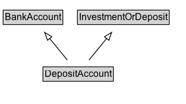

# DepositAccount

A type of Bank Account with a main purpose of depositing funds to gain interest or other benefits.

## Diagram

=== "SVG (interactive)"

    <!-- Generated by graphviz version 14.1.3 (20260303.0454)
     -->
    <!-- Pages: 1 -->
    <svg width="235pt" height="132pt"
     viewBox="0.00 0.00 235.00 132.00" xmlns="http://www.w3.org/2000/svg" xmlns:xlink="http://www.w3.org/1999/xlink">
    <g id="graph0" class="graph" transform="scale(1 1) rotate(0) translate(4 128)">
    <polygon fill="white" stroke="none" points="-4,4 -4,-128 230.62,-128 230.62,4 -4,4"/>
    <g id="clust3" class="cluster">
    <title>cluster_associated</title>
    </g>
    <!-- BankAccount -->
    <g id="node1" class="node">
    <title>BankAccount</title>
    <g id="a_node1"><a xlink:href="../BankAccount" xlink:title="&lt;TABLE&gt;">
    <polygon fill="lightgray" stroke="none" points="1,-97.88 1,-114.12 74.25,-114.12 74.25,-97.88 1,-97.88"/>
    <text xml:space="preserve" text-anchor="start" x="2" y="-101.88" font-family="Arial" font-size="12.00">BankAccount</text>
    <polygon fill="none" stroke="black" points="0,-96.88 0,-115.12 75.25,-115.12 75.25,-96.88 0,-96.88"/>
    </a>
    </g>
    </g>
    <!-- InvestmentOrDeposit -->
    <g id="node2" class="node">
    <title>InvestmentOrDeposit</title>
    <g id="a_node2"><a xlink:href="../InvestmentOrDeposit" xlink:title="&lt;TABLE&gt;">
    <polygon fill="lightgray" stroke="none" points="94.75,-97.88 94.75,-114.12 208.5,-114.12 208.5,-97.88 94.75,-97.88"/>
    <text xml:space="preserve" text-anchor="start" x="95.75" y="-101.88" font-family="Arial" font-size="12.00">InvestmentOrDeposit</text>
    <polygon fill="none" stroke="black" points="93.75,-96.88 93.75,-115.12 209.5,-115.12 209.5,-96.88 93.75,-96.88"/>
    </a>
    </g>
    </g>
    <!-- DepositAccount -->
    <g id="node3" class="node">
    <title>DepositAccount</title>
    <g id="a_node3"><a xlink:href="../DepositAccount" xlink:title="&lt;TABLE&gt;">
    <polygon fill="lightgray" stroke="none" points="51.25,-25.88 51.25,-42.12 138,-42.12 138,-25.88 51.25,-25.88"/>
    <text xml:space="preserve" text-anchor="start" x="52.25" y="-29.88" font-family="Arial" font-size="12.00">DepositAccount</text>
    <polygon fill="none" stroke="black" points="50.25,-24.88 50.25,-43.12 139,-43.12 139,-24.88 50.25,-24.88"/>
    </a>
    </g>
    </g>
    <!-- DepositAccount&#45;&gt;BankAccount -->
    <g id="edge1" class="edge">
    <title>DepositAccount&#45;&gt;BankAccount</title>
    <path fill="none" stroke="black" d="M80.95,-51.79C74.25,-60.02 66.03,-70.11 58.56,-79.29"/>
    <polygon fill="none" stroke="black" points="55.98,-76.92 52.38,-86.88 61.41,-81.34 55.98,-76.92"/>
    </g>
    <!-- DepositAccount&#45;&gt;InvestmentOrDeposit -->
    <g id="edge2" class="edge">
    <title>DepositAccount&#45;&gt;InvestmentOrDeposit</title>
    <path fill="none" stroke="black" d="M108.3,-51.79C115,-60.02 123.22,-70.11 130.69,-79.29"/>
    <polygon fill="none" stroke="black" points="127.84,-81.34 136.87,-86.88 133.27,-76.92 127.84,-81.34"/>
    </g>
    <!-- Invis -->
    </g>
    </svg>

=== "PNG"

    

## Formalization for DepositAccount

| Property | Constraint |
|----------|------------|
| subClassOf | [BankAccount](BankAccount.md) |
| subClassOf | [InvestmentOrDeposit](InvestmentOrDeposit.md) |

