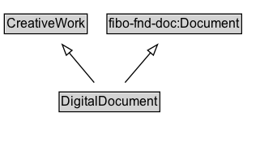

# DigitalDocument

An electronic file or document.

## Diagram

=== "SVG (interactive)"

    <!-- Generated by graphviz version 14.1.3 (20260303.0454)
     -->
    <!-- Pages: 1 -->
    <svg width="240pt" height="132pt"
     viewBox="0.00 0.00 240.00 132.00" xmlns="http://www.w3.org/2000/svg" xmlns:xlink="http://www.w3.org/1999/xlink">
    <g id="graph0" class="graph" transform="scale(1 1) rotate(0) translate(4 128)">
    <polygon fill="white" stroke="none" points="-4,4 -4,-128 236.38,-128 236.38,4 -4,4"/>
    <g id="clust3" class="cluster">
    <title>cluster_associated</title>
    </g>
    <!-- CreativeWork -->
    <g id="node1" class="node">
    <title>CreativeWork</title>
    <g id="a_node1"><a xlink:href="../CreativeWork" xlink:title="&lt;TABLE&gt;">
    <polygon fill="lightgray" stroke="none" points="1,-97.88 1,-114.12 75.75,-114.12 75.75,-97.88 1,-97.88"/>
    <text xml:space="preserve" text-anchor="start" x="2" y="-101.88" font-family="Arial" font-size="12.00">CreativeWork</text>
    <polygon fill="none" stroke="black" points="0,-96.88 0,-115.12 76.75,-115.12 76.75,-96.88 0,-96.88"/>
    </a>
    </g>
    </g>
    <!-- fibo&#45;fnd&#45;doc_Document -->
    <g id="node2" class="node">
    <title>fibo&#45;fnd&#45;doc_Document</title>
    <g id="a_node2"><a xlink:href="https://w3id.org/citydata/imported/fibo-fnd-doc/latest/Document" xlink:title="&lt;TABLE&gt;">
    <polygon fill="lightgray" stroke="none" points="96,-97.88 96,-114.12 218.75,-114.12 218.75,-97.88 96,-97.88"/>
    <text xml:space="preserve" text-anchor="start" x="97" y="-101.88" font-family="Arial" font-size="12.00">fibo&#45;fnd&#45;doc:Document</text>
    <polygon fill="none" stroke="black" points="95,-96.88 95,-115.12 219.75,-115.12 219.75,-96.88 95,-96.88"/>
    </a>
    </g>
    </g>
    <!-- DigitalDocument -->
    <g id="node3" class="node">
    <title>DigitalDocument</title>
    <g id="a_node3"><a xlink:href="../DigitalDocument" xlink:title="&lt;TABLE&gt;">
    <polygon fill="lightgray" stroke="none" points="51.75,-25.88 51.75,-42.12 143,-42.12 143,-25.88 51.75,-25.88"/>
    <text xml:space="preserve" text-anchor="start" x="52.75" y="-29.88" font-family="Arial" font-size="12.00">DigitalDocument</text>
    <polygon fill="none" stroke="black" points="50.75,-24.88 50.75,-43.12 144,-43.12 144,-24.88 50.75,-24.88"/>
    </a>
    </g>
    </g>
    <!-- DigitalDocument&#45;&gt;CreativeWork -->
    <g id="edge1" class="edge">
    <title>DigitalDocument&#45;&gt;CreativeWork</title>
    <path fill="none" stroke="black" d="M83.22,-51.79C76.29,-60.02 67.78,-70.11 60.05,-79.29"/>
    <polygon fill="none" stroke="black" points="57.4,-77 53.63,-86.9 62.75,-81.51 57.4,-77"/>
    </g>
    <!-- DigitalDocument&#45;&gt;fibo&#45;fnd&#45;doc_Document -->
    <g id="edge2" class="edge">
    <title>DigitalDocument&#45;&gt;fibo&#45;fnd&#45;doc_Document</title>
    <path fill="none" stroke="black" d="M111.77,-51.79C118.89,-60.11 127.65,-70.32 135.58,-79.58"/>
    <polygon fill="none" stroke="black" points="132.7,-81.59 141.87,-86.91 138.02,-77.04 132.7,-81.59"/>
    </g>
    <!-- Invis -->
    </g>
    </svg>

=== "PNG"

    

## Specializations of DigitalDocument

| Class | Description |
|-------|-------------|
| [Note Digital Document](NoteDigitalDocument.md) | A file containing a note, primarily for the author. |
| [Presentation Digital Document](PresentationDigitalDocument.md) | A file containing slides or used for a presentation. |
| [Spreadsheet Digital Document](SpreadsheetDigitalDocument.md) | A spreadsheet file. |
| [Text Digital Document](TextDigitalDocument.md) | A file composed primarily of text. |

## Formalization for DigitalDocument

| Property | Constraint |
|----------|------------|
| subClassOf | [CreativeWork](CreativeWork.md) |
| subClassOf | [fibo-fnd-doc:Document](https://w3id.org/citydata/imported/fibo-fnd-doc/Document) |

