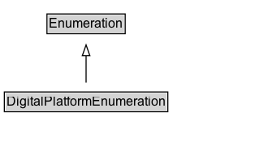

# DigitalPlatformEnumeration

Enumerates some common technology platforms, for use with properties such as [[actionPlatform]]. It is not supposed to be comprehensive - when a suitable code is not enumerated here, textual or URL values can be used instead. These codes are at a fairly high level and do not deal with versioning and other nuance. Additional codes can be suggested [in github](https://github.com/schemaorg/schemaorg/issues/3057). 

## Diagram

=== "SVG (interactive)"

    <!-- Generated by graphviz version 14.1.3 (20260303.0454)
     -->
    <!-- Pages: 1 -->
    <svg width="248pt" height="132pt"
     viewBox="0.00 0.00 248.00 132.00" xmlns="http://www.w3.org/2000/svg" xmlns:xlink="http://www.w3.org/1999/xlink">
    <g id="graph0" class="graph" transform="scale(1 1) rotate(0) translate(4 128)">
    <polygon fill="white" stroke="none" points="-4,4 -4,-128 243.5,-128 243.5,4 -4,4"/>
    <g id="clust3" class="cluster">
    <title>cluster_associated</title>
    </g>
    <!-- Enumeration -->
    <g id="node1" class="node">
    <title>Enumeration</title>
    <g id="a_node1"><a xlink:href="../Enumeration" xlink:title="&lt;TABLE&gt;">
    <polygon fill="lightgray" stroke="none" points="40.38,-97.88 40.38,-114.12 110.62,-114.12 110.62,-97.88 40.38,-97.88"/>
    <text xml:space="preserve" text-anchor="start" x="41.38" y="-101.88" font-family="Arial" font-size="12.00">Enumeration</text>
    <polygon fill="none" stroke="black" points="39.38,-96.88 39.38,-115.12 111.62,-115.12 111.62,-96.88 39.38,-96.88"/>
    </a>
    </g>
    </g>
    <!-- DigitalPlatformEnumeration -->
    <g id="node2" class="node">
    <title>DigitalPlatformEnumeration</title>
    <g id="a_node2"><a xlink:href="../DigitalPlatformEnumeration" xlink:title="&lt;TABLE&gt;">
    <polygon fill="lightgray" stroke="none" points="1,-25.88 1,-42.12 150,-42.12 150,-25.88 1,-25.88"/>
    <text xml:space="preserve" text-anchor="start" x="2" y="-29.88" font-family="Arial" font-size="12.00">DigitalPlatformEnumeration</text>
    <polygon fill="none" stroke="black" points="0,-24.88 0,-43.12 151,-43.12 151,-24.88 0,-24.88"/>
    </a>
    </g>
    </g>
    <!-- DigitalPlatformEnumeration&#45;&gt;Enumeration -->
    <g id="edge1" class="edge">
    <title>DigitalPlatformEnumeration&#45;&gt;Enumeration</title>
    <path fill="none" stroke="black" d="M75.5,-51.79C75.5,-59.25 75.5,-68.24 75.5,-76.69"/>
    <polygon fill="none" stroke="black" points="72,-76.54 75.5,-86.54 79,-76.54 72,-76.54"/>
    </g>
    <!-- Invis -->
    </g>
    </svg>

=== "PNG"

    

## Formalization for DigitalPlatformEnumeration

| Property | Constraint |
|----------|------------|
| subClassOf | [Enumeration](Enumeration.md) |

