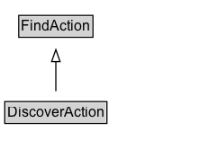

# DiscoverAction

The act of discovering/finding an object.

## Diagram

=== "SVG (interactive)"

    <!-- Generated by graphviz version 14.1.3 (20260303.0454)
     -->
    <!-- Pages: 1 -->
    <svg width="182pt" height="132pt"
     viewBox="0.00 0.00 182.00 132.00" xmlns="http://www.w3.org/2000/svg" xmlns:xlink="http://www.w3.org/1999/xlink">
    <g id="graph0" class="graph" transform="scale(1 1) rotate(0) translate(4 128)">
    <polygon fill="white" stroke="none" points="-4,4 -4,-128 177.5,-128 177.5,4 -4,4"/>
    <g id="clust3" class="cluster">
    <title>cluster_associated</title>
    </g>
    <!-- FindAction -->
    <g id="node1" class="node">
    <title>FindAction</title>
    <g id="a_node1"><a xlink:href="../FindAction" xlink:title="&lt;TABLE&gt;">
    <polygon fill="lightgray" stroke="none" points="12.62,-97.88 12.62,-114.12 72.38,-114.12 72.38,-97.88 12.62,-97.88"/>
    <text xml:space="preserve" text-anchor="start" x="13.62" y="-101.88" font-family="Arial" font-size="12.00">FindAction</text>
    <polygon fill="none" stroke="black" points="11.62,-96.88 11.62,-115.12 73.38,-115.12 73.38,-96.88 11.62,-96.88"/>
    </a>
    </g>
    </g>
    <!-- DiscoverAction -->
    <g id="node2" class="node">
    <title>DiscoverAction</title>
    <g id="a_node2"><a xlink:href="../DiscoverAction" xlink:title="&lt;TABLE&gt;">
    <polygon fill="lightgray" stroke="none" points="1,-25.88 1,-42.12 84,-42.12 84,-25.88 1,-25.88"/>
    <text xml:space="preserve" text-anchor="start" x="2" y="-29.88" font-family="Arial" font-size="12.00">DiscoverAction</text>
    <polygon fill="none" stroke="black" points="0,-24.88 0,-43.12 85,-43.12 85,-24.88 0,-24.88"/>
    </a>
    </g>
    </g>
    <!-- DiscoverAction&#45;&gt;FindAction -->
    <g id="edge1" class="edge">
    <title>DiscoverAction&#45;&gt;FindAction</title>
    <path fill="none" stroke="black" d="M42.5,-51.79C42.5,-59.25 42.5,-68.24 42.5,-76.69"/>
    <polygon fill="none" stroke="black" points="39,-76.54 42.5,-86.54 46,-76.54 39,-76.54"/>
    </g>
    <!-- Invis -->
    </g>
    </svg>

=== "PNG"

    

## Formalization for DiscoverAction

| Property | Constraint |
|----------|------------|
| subClassOf | [FindAction](FindAction.md) |

