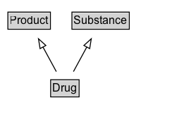

# Drug

A chemical or biologic substance, used as a medical therapy, that has a physiological effect on an organism. Here the term drug is used interchangeably with the term medicine although clinical knowledge makes a clear difference between them.

## Diagram

=== "SVG (interactive)"

    <!-- Generated by graphviz version 14.1.3 (20260303.0454)
     -->
    <!-- Pages: 1 -->
    <svg width="188pt" height="132pt"
     viewBox="0.00 0.00 188.00 132.00" xmlns="http://www.w3.org/2000/svg" xmlns:xlink="http://www.w3.org/1999/xlink">
    <g id="graph0" class="graph" transform="scale(1 1) rotate(0) translate(4 128)">
    <polygon fill="white" stroke="none" points="-4,4 -4,-128 184,-128 184,4 -4,4"/>
    <g id="clust3" class="cluster">
    <title>cluster_associated</title>
    </g>
    <!-- Product -->
    <g id="node1" class="node">
    <title>Product</title>
    <g id="a_node1"><a xlink:href="../Product" xlink:title="&lt;TABLE&gt;">
    <polygon fill="lightgray" stroke="none" points="5.38,-97.88 5.38,-114.12 48.62,-114.12 48.62,-97.88 5.38,-97.88"/>
    <text xml:space="preserve" text-anchor="start" x="6.38" y="-101.88" font-family="Arial" font-size="12.00">Product</text>
    <polygon fill="none" stroke="black" points="4.38,-96.88 4.38,-115.12 49.62,-115.12 49.62,-96.88 4.38,-96.88"/>
    </a>
    </g>
    </g>
    <!-- Substance -->
    <g id="node2" class="node">
    <title>Substance</title>
    <g id="a_node2"><a xlink:href="../Substance" xlink:title="&lt;TABLE&gt;">
    <polygon fill="lightgray" stroke="none" points="73.5,-97.88 73.5,-114.12 132.5,-114.12 132.5,-97.88 73.5,-97.88"/>
    <text xml:space="preserve" text-anchor="start" x="74.5" y="-101.88" font-family="Arial" font-size="12.00">Substance</text>
    <polygon fill="none" stroke="black" points="72.5,-96.88 72.5,-115.12 133.5,-115.12 133.5,-96.88 72.5,-96.88"/>
    </a>
    </g>
    </g>
    <!-- Drug -->
    <g id="node3" class="node">
    <title>Drug</title>
    <g id="a_node3"><a xlink:href="../Drug" xlink:title="&lt;TABLE&gt;">
    <polygon fill="lightgray" stroke="none" points="50.88,-25.88 50.88,-42.12 79.12,-42.12 79.12,-25.88 50.88,-25.88"/>
    <text xml:space="preserve" text-anchor="start" x="51.88" y="-29.88" font-family="Arial" font-size="12.00">Drug</text>
    <polygon fill="none" stroke="black" points="49.88,-24.88 49.88,-43.12 80.12,-43.12 80.12,-24.88 49.88,-24.88"/>
    </a>
    </g>
    </g>
    <!-- Drug&#45;&gt;Product -->
    <g id="edge1" class="edge">
    <title>Drug&#45;&gt;Product</title>
    <path fill="none" stroke="black" d="M55.89,-51.79C51.6,-59.68 46.39,-69.28 41.58,-78.14"/>
    <polygon fill="none" stroke="black" points="38.62,-76.27 36.92,-86.72 44.77,-79.61 38.62,-76.27"/>
    </g>
    <!-- Drug&#45;&gt;Substance -->
    <g id="edge2" class="edge">
    <title>Drug&#45;&gt;Substance</title>
    <path fill="none" stroke="black" d="M74.11,-51.79C78.4,-59.68 83.61,-69.28 88.42,-78.14"/>
    <polygon fill="none" stroke="black" points="85.23,-79.61 93.08,-86.72 91.38,-76.27 85.23,-79.61"/>
    </g>
    <!-- Invis -->
    </g>
    </svg>

=== "PNG"

    

## Formalization for Drug

| Property | Constraint |
|----------|------------|
| subClassOf | [Product](Product.md) |
| subClassOf | [Substance](Substance.md) |

