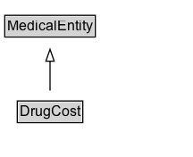

# DrugCost

The cost per unit of a medical drug. Note that this type is not meant to represent the price in an offer of a drug for sale; see the Offer type for that. This type will typically be used to tag wholesale or average retail cost of a drug, or maximum reimbursable cost. Costs of medical drugs vary widely depending on how and where they are paid for, so while this type captures some of the variables, costs should be used with caution by consumers of this schema's markup.

## Diagram

=== "SVG (interactive)"

    <!-- Generated by graphviz version 14.1.3 (20260303.0454)
     -->
    <!-- Pages: 1 -->
    <svg width="162pt" height="132pt"
     viewBox="0.00 0.00 162.00 132.00" xmlns="http://www.w3.org/2000/svg" xmlns:xlink="http://www.w3.org/1999/xlink">
    <g id="graph0" class="graph" transform="scale(1 1) rotate(0) translate(4 128)">
    <polygon fill="white" stroke="none" points="-4,4 -4,-128 158,-128 158,4 -4,4"/>
    <g id="clust3" class="cluster">
    <title>cluster_associated</title>
    </g>
    <!-- MedicalEntity -->
    <g id="node1" class="node">
    <title>MedicalEntity</title>
    <g id="a_node1"><a xlink:href="../MedicalEntity" xlink:title="&lt;TABLE&gt;">
    <polygon fill="lightgray" stroke="none" points="1,-97.88 1,-114.12 75,-114.12 75,-97.88 1,-97.88"/>
    <text xml:space="preserve" text-anchor="start" x="2" y="-101.88" font-family="Arial" font-size="12.00">MedicalEntity</text>
    <polygon fill="none" stroke="black" points="0,-96.88 0,-115.12 76,-115.12 76,-96.88 0,-96.88"/>
    </a>
    </g>
    </g>
    <!-- DrugCost -->
    <g id="node2" class="node">
    <title>DrugCost</title>
    <g id="a_node2"><a xlink:href="../DrugCost" xlink:title="&lt;TABLE&gt;">
    <polygon fill="lightgray" stroke="none" points="11.5,-25.88 11.5,-42.12 64.5,-42.12 64.5,-25.88 11.5,-25.88"/>
    <text xml:space="preserve" text-anchor="start" x="12.5" y="-29.88" font-family="Arial" font-size="12.00">DrugCost</text>
    <polygon fill="none" stroke="black" points="10.5,-24.88 10.5,-43.12 65.5,-43.12 65.5,-24.88 10.5,-24.88"/>
    </a>
    </g>
    </g>
    <!-- DrugCost&#45;&gt;MedicalEntity -->
    <g id="edge1" class="edge">
    <title>DrugCost&#45;&gt;MedicalEntity</title>
    <path fill="none" stroke="black" d="M38,-51.79C38,-59.25 38,-68.24 38,-76.69"/>
    <polygon fill="none" stroke="black" points="34.5,-76.54 38,-86.54 41.5,-76.54 34.5,-76.54"/>
    </g>
    <!-- Invis -->
    </g>
    </svg>

=== "PNG"

    

## Formalization for DrugCost

| Property | Constraint |
|----------|------------|
| subClassOf | [MedicalEntity](MedicalEntity.md) |

