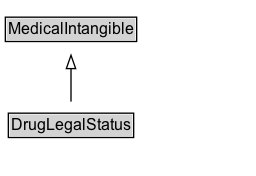

# DrugLegalStatus

The legal availability status of a medical drug.

## Diagram

=== "SVG (interactive)"

    <!-- Generated by graphviz version 14.1.3 (20260303.0454)
     -->
    <!-- Pages: 1 -->
    <svg width="192pt" height="132pt"
     viewBox="0.00 0.00 192.00 132.00" xmlns="http://www.w3.org/2000/svg" xmlns:xlink="http://www.w3.org/1999/xlink">
    <g id="graph0" class="graph" transform="scale(1 1) rotate(0) translate(4 128)">
    <polygon fill="white" stroke="none" points="-4,4 -4,-128 188.25,-128 188.25,4 -4,4"/>
    <g id="clust3" class="cluster">
    <title>cluster_associated</title>
    </g>
    <!-- MedicalIntangible -->
    <g id="node1" class="node">
    <title>MedicalIntangible</title>
    <g id="a_node1"><a xlink:href="../MedicalIntangible" xlink:title="&lt;TABLE&gt;">
    <polygon fill="lightgray" stroke="none" points="1,-97.88 1,-114.12 97.5,-114.12 97.5,-97.88 1,-97.88"/>
    <text xml:space="preserve" text-anchor="start" x="2" y="-101.88" font-family="Arial" font-size="12.00">MedicalIntangible</text>
    <polygon fill="none" stroke="black" points="0,-96.88 0,-115.12 98.5,-115.12 98.5,-96.88 0,-96.88"/>
    </a>
    </g>
    </g>
    <!-- DrugLegalStatus -->
    <g id="node2" class="node">
    <title>DrugLegalStatus</title>
    <g id="a_node2"><a xlink:href="../DrugLegalStatus" xlink:title="&lt;TABLE&gt;">
    <polygon fill="lightgray" stroke="none" points="3.25,-25.88 3.25,-42.12 95.25,-42.12 95.25,-25.88 3.25,-25.88"/>
    <text xml:space="preserve" text-anchor="start" x="4.25" y="-29.88" font-family="Arial" font-size="12.00">DrugLegalStatus</text>
    <polygon fill="none" stroke="black" points="2.25,-24.88 2.25,-43.12 96.25,-43.12 96.25,-24.88 2.25,-24.88"/>
    </a>
    </g>
    </g>
    <!-- DrugLegalStatus&#45;&gt;MedicalIntangible -->
    <g id="edge1" class="edge">
    <title>DrugLegalStatus&#45;&gt;MedicalIntangible</title>
    <path fill="none" stroke="black" d="M49.25,-51.79C49.25,-59.25 49.25,-68.24 49.25,-76.69"/>
    <polygon fill="none" stroke="black" points="45.75,-76.54 49.25,-86.54 52.75,-76.54 45.75,-76.54"/>
    </g>
    <!-- Invis -->
    </g>
    </svg>

=== "PNG"

    

## Formalization for DrugLegalStatus

| Property | Constraint |
|----------|------------|
| subClassOf | [MedicalIntangible](MedicalIntangible.md) |

