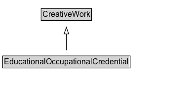

# EducationalOccupationalCredential

An educational or occupational credential. A diploma, academic degree, certification, qualification, badge, etc., that may be awarded to a person or other entity that meets the requirements defined by the credentialer.

## Diagram

=== "SVG (interactive)"

    <!-- Generated by graphviz version 14.1.3 (20260303.0454)
     -->
    <!-- Pages: 1 -->
    <svg width="290pt" height="132pt"
     viewBox="0.00 0.00 290.00 132.00" xmlns="http://www.w3.org/2000/svg" xmlns:xlink="http://www.w3.org/1999/xlink">
    <g id="graph0" class="graph" transform="scale(1 1) rotate(0) translate(4 128)">
    <polygon fill="white" stroke="none" points="-4,4 -4,-128 285.88,-128 285.88,4 -4,4"/>
    <g id="clust3" class="cluster">
    <title>cluster_associated</title>
    </g>
    <!-- CreativeWork -->
    <g id="node1" class="node">
    <title>CreativeWork</title>
    <g id="a_node1"><a xlink:href="../CreativeWork" xlink:title="&lt;TABLE&gt;">
    <polygon fill="lightgray" stroke="none" points="59.5,-97.88 59.5,-114.12 134.25,-114.12 134.25,-97.88 59.5,-97.88"/>
    <text xml:space="preserve" text-anchor="start" x="60.5" y="-101.88" font-family="Arial" font-size="12.00">CreativeWork</text>
    <polygon fill="none" stroke="black" points="58.5,-96.88 58.5,-115.12 135.25,-115.12 135.25,-96.88 58.5,-96.88"/>
    </a>
    </g>
    </g>
    <!-- EducationalOccupationalCredential -->
    <g id="node2" class="node">
    <title>EducationalOccupationalCredential</title>
    <g id="a_node2"><a xlink:href="../EducationalOccupationalCredential" xlink:title="&lt;TABLE&gt;">
    <polygon fill="lightgray" stroke="none" points="1,-25.88 1,-42.12 192.75,-42.12 192.75,-25.88 1,-25.88"/>
    <text xml:space="preserve" text-anchor="start" x="2" y="-29.88" font-family="Arial" font-size="12.00">EducationalOccupationalCredential</text>
    <polygon fill="none" stroke="black" points="0,-24.88 0,-43.12 193.75,-43.12 193.75,-24.88 0,-24.88"/>
    </a>
    </g>
    </g>
    <!-- EducationalOccupationalCredential&#45;&gt;CreativeWork -->
    <g id="edge1" class="edge">
    <title>EducationalOccupationalCredential&#45;&gt;CreativeWork</title>
    <path fill="none" stroke="black" d="M96.88,-51.79C96.88,-59.25 96.88,-68.24 96.88,-76.69"/>
    <polygon fill="none" stroke="black" points="93.38,-76.54 96.88,-86.54 100.38,-76.54 93.38,-76.54"/>
    </g>
    <!-- Invis -->
    </g>
    </svg>

=== "PNG"

    

## Formalization for EducationalOccupationalCredential

| Property | Constraint |
|----------|------------|
| subClassOf | [CreativeWork](CreativeWork.md) |

