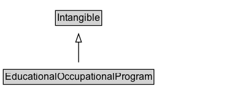

# EducationalOccupationalProgram

A program offered by an institution which determines the learning progress to achieve an outcome, usually a credential like a degree or certificate. This would define a discrete set of opportunities (e.g., job, courses) that together constitute a program with a clear start, end, set of requirements, and transition to a new occupational opportunity (e.g., a job), or sometimes a higher educational opportunity (e.g., an advanced degree).

## Diagram

=== "SVG (interactive)"

    <!-- Generated by graphviz version 14.1.3 (20260303.0454)
     -->
    <!-- Pages: 1 -->
    <svg width="280pt" height="132pt"
     viewBox="0.00 0.00 280.00 132.00" xmlns="http://www.w3.org/2000/svg" xmlns:xlink="http://www.w3.org/1999/xlink">
    <g id="graph0" class="graph" transform="scale(1 1) rotate(0) translate(4 128)">
    <polygon fill="white" stroke="none" points="-4,4 -4,-128 276,-128 276,4 -4,4"/>
    <g id="clust3" class="cluster">
    <title>cluster_associated</title>
    </g>
    <!-- Intangible -->
    <g id="node1" class="node">
    <title>Intangible</title>
    <g id="a_node1"><a xlink:href="../Intangible" xlink:title="&lt;TABLE&gt;">
    <polygon fill="lightgray" stroke="none" points="64.75,-97.88 64.75,-114.12 119.25,-114.12 119.25,-97.88 64.75,-97.88"/>
    <text xml:space="preserve" text-anchor="start" x="65.75" y="-101.88" font-family="Arial" font-size="12.00">Intangible</text>
    <polygon fill="none" stroke="black" points="63.75,-96.88 63.75,-115.12 120.25,-115.12 120.25,-96.88 63.75,-96.88"/>
    </a>
    </g>
    </g>
    <!-- EducationalOccupationalProgram -->
    <g id="node2" class="node">
    <title>EducationalOccupationalProgram</title>
    <g id="a_node2"><a xlink:href="../EducationalOccupationalProgram" xlink:title="&lt;TABLE&gt;">
    <polygon fill="lightgray" stroke="none" points="1,-25.88 1,-42.12 183,-42.12 183,-25.88 1,-25.88"/>
    <text xml:space="preserve" text-anchor="start" x="2" y="-29.88" font-family="Arial" font-size="12.00">EducationalOccupationalProgram</text>
    <polygon fill="none" stroke="black" points="0,-24.88 0,-43.12 184,-43.12 184,-24.88 0,-24.88"/>
    </a>
    </g>
    </g>
    <!-- EducationalOccupationalProgram&#45;&gt;Intangible -->
    <g id="edge1" class="edge">
    <title>EducationalOccupationalProgram&#45;&gt;Intangible</title>
    <path fill="none" stroke="black" d="M92,-51.79C92,-59.25 92,-68.24 92,-76.69"/>
    <polygon fill="none" stroke="black" points="88.5,-76.54 92,-86.54 95.5,-76.54 88.5,-76.54"/>
    </g>
    <!-- Invis -->
    </g>
    </svg>

=== "PNG"

    

## Specializations of EducationalOccupationalProgram

| Class | Description |
|-------|-------------|
| [Work Based Program](WorkBasedProgram.md) | A program with both an educational and employment component. Typically based at a workplace and structured around work-based learning, with the aim of instilling competencies related to an occupation. WorkBasedProgram is used to distinguish programs such as apprenticeships from school, college or other classroom based educational programs. |

## Formalization for EducationalOccupationalProgram

| Property | Constraint |
|----------|------------|
| subClassOf | [Intangible](Intangible.md) |

