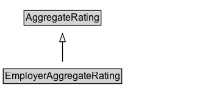

# EmployerAggregateRating

An aggregate rating of an Organization related to its role as an employer.

## Diagram

=== "SVG (interactive)"

    <!-- Generated by graphviz version 14.1.3 (20260303.0454)
     -->
    <!-- Pages: 1 -->
    <svg width="242pt" height="132pt"
     viewBox="0.00 0.00 242.00 132.00" xmlns="http://www.w3.org/2000/svg" xmlns:xlink="http://www.w3.org/1999/xlink">
    <g id="graph0" class="graph" transform="scale(1 1) rotate(0) translate(4 128)">
    <polygon fill="white" stroke="none" points="-4,4 -4,-128 237.88,-128 237.88,4 -4,4"/>
    <g id="clust3" class="cluster">
    <title>cluster_associated</title>
    </g>
    <!-- AggregateRating -->
    <g id="node1" class="node">
    <title>AggregateRating</title>
    <g id="a_node1"><a xlink:href="../AggregateRating" xlink:title="&lt;TABLE&gt;">
    <polygon fill="lightgray" stroke="none" points="26.5,-97.88 26.5,-114.12 119.25,-114.12 119.25,-97.88 26.5,-97.88"/>
    <text xml:space="preserve" text-anchor="start" x="27.5" y="-101.88" font-family="Arial" font-size="12.00">AggregateRating</text>
    <polygon fill="none" stroke="black" points="25.5,-96.88 25.5,-115.12 120.25,-115.12 120.25,-96.88 25.5,-96.88"/>
    </a>
    </g>
    </g>
    <!-- EmployerAggregateRating -->
    <g id="node2" class="node">
    <title>EmployerAggregateRating</title>
    <g id="a_node2"><a xlink:href="../EmployerAggregateRating" xlink:title="&lt;TABLE&gt;">
    <polygon fill="lightgray" stroke="none" points="1,-25.88 1,-42.12 144.75,-42.12 144.75,-25.88 1,-25.88"/>
    <text xml:space="preserve" text-anchor="start" x="2" y="-29.88" font-family="Arial" font-size="12.00">EmployerAggregateRating</text>
    <polygon fill="none" stroke="black" points="0,-24.88 0,-43.12 145.75,-43.12 145.75,-24.88 0,-24.88"/>
    </a>
    </g>
    </g>
    <!-- EmployerAggregateRating&#45;&gt;AggregateRating -->
    <g id="edge1" class="edge">
    <title>EmployerAggregateRating&#45;&gt;AggregateRating</title>
    <path fill="none" stroke="black" d="M72.88,-51.79C72.88,-59.25 72.88,-68.24 72.88,-76.69"/>
    <polygon fill="none" stroke="black" points="69.38,-76.54 72.88,-86.54 76.38,-76.54 69.38,-76.54"/>
    </g>
    <!-- Invis -->
    </g>
    </svg>

=== "PNG"

    

## Formalization for EmployerAggregateRating

| Property | Constraint |
|----------|------------|
| subClassOf | [AggregateRating](AggregateRating.md) |

