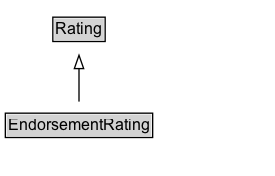

# EndorsementRating

An EndorsementRating is a rating that expresses some level of endorsement, for example inclusion in a "critic's pick" blog, a
"Like" or "+1" on a social network. It can be considered the [[result]] of an [[EndorseAction]] in which the [[object]] of the action is rated positively by
some [[agent]]. As is common elsewhere in schema.org, it is sometimes more useful to describe the results of such an action without explicitly describing the [[Action]].

An [[EndorsementRating]] may be part of a numeric scale or organized system, but this is not required: having an explicit type for indicating a positive,
endorsement rating is particularly useful in the absence of numeric scales as it helps consumers understand that the rating is broadly positive.

## Diagram

=== "SVG (interactive)"

    <!-- Generated by graphviz version 14.1.3 (20260303.0454)
     -->
    <!-- Pages: 1 -->
    <svg width="206pt" height="132pt"
     viewBox="0.00 0.00 206.00 132.00" xmlns="http://www.w3.org/2000/svg" xmlns:xlink="http://www.w3.org/1999/xlink">
    <g id="graph0" class="graph" transform="scale(1 1) rotate(0) translate(4 128)">
    <polygon fill="white" stroke="none" points="-4,4 -4,-128 202.25,-128 202.25,4 -4,4"/>
    <g id="clust3" class="cluster">
    <title>cluster_associated</title>
    </g>
    <!-- Rating -->
    <g id="node1" class="node">
    <title>Rating</title>
    <g id="a_node1"><a xlink:href="../Rating" xlink:title="&lt;TABLE&gt;">
    <polygon fill="lightgray" stroke="none" points="36.62,-97.88 36.62,-114.12 73.88,-114.12 73.88,-97.88 36.62,-97.88"/>
    <text xml:space="preserve" text-anchor="start" x="37.62" y="-101.88" font-family="Arial" font-size="12.00">Rating</text>
    <polygon fill="none" stroke="black" points="35.62,-96.88 35.62,-115.12 74.88,-115.12 74.88,-96.88 35.62,-96.88"/>
    </a>
    </g>
    </g>
    <!-- EndorsementRating -->
    <g id="node2" class="node">
    <title>EndorsementRating</title>
    <g id="a_node2"><a xlink:href="../EndorsementRating" xlink:title="&lt;TABLE&gt;">
    <polygon fill="lightgray" stroke="none" points="1,-25.88 1,-42.12 109.5,-42.12 109.5,-25.88 1,-25.88"/>
    <text xml:space="preserve" text-anchor="start" x="2" y="-29.88" font-family="Arial" font-size="12.00">EndorsementRating</text>
    <polygon fill="none" stroke="black" points="0,-24.88 0,-43.12 110.5,-43.12 110.5,-24.88 0,-24.88"/>
    </a>
    </g>
    </g>
    <!-- EndorsementRating&#45;&gt;Rating -->
    <g id="edge1" class="edge">
    <title>EndorsementRating&#45;&gt;Rating</title>
    <path fill="none" stroke="black" d="M55.25,-51.79C55.25,-59.25 55.25,-68.24 55.25,-76.69"/>
    <polygon fill="none" stroke="black" points="51.75,-76.54 55.25,-86.54 58.75,-76.54 51.75,-76.54"/>
    </g>
    <!-- Invis -->
    </g>
    </svg>

=== "PNG"

    

## Formalization for EndorsementRating

| Property | Constraint |
|----------|------------|
| subClassOf | [Rating](Rating.md) |

