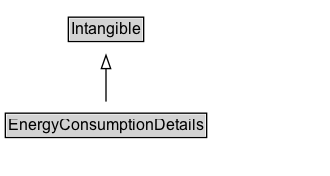

# EnergyConsumptionDetails

EnergyConsumptionDetails represents information related to the energy efficiency of a product that consumes energy. The information that can be provided is based on international regulations such as for example [EU directive 2017/1369](https://eur-lex.europa.eu/eli/reg/2017/1369/oj) for energy labeling and the [Energy labeling rule](https://www.ftc.gov/enforcement/rules/rulemaking-regulatory-reform-proceedings/energy-water-use-labeling-consumer) under the Energy Policy and Conservation Act (EPCA) in the US.

## Diagram

=== "SVG (interactive)"

    <!-- Generated by graphviz version 14.1.3 (20260303.0454)
     -->
    <!-- Pages: 1 -->
    <svg width="248pt" height="132pt"
     viewBox="0.00 0.00 248.00 132.00" xmlns="http://www.w3.org/2000/svg" xmlns:xlink="http://www.w3.org/1999/xlink">
    <g id="graph0" class="graph" transform="scale(1 1) rotate(0) translate(4 128)">
    <polygon fill="white" stroke="none" points="-4,4 -4,-128 243.5,-128 243.5,4 -4,4"/>
    <g id="clust3" class="cluster">
    <title>cluster_associated</title>
    </g>
    <!-- Intangible -->
    <g id="node1" class="node">
    <title>Intangible</title>
    <g id="a_node1"><a xlink:href="../Intangible" xlink:title="&lt;TABLE&gt;">
    <polygon fill="lightgray" stroke="none" points="48.25,-97.88 48.25,-114.12 102.75,-114.12 102.75,-97.88 48.25,-97.88"/>
    <text xml:space="preserve" text-anchor="start" x="49.25" y="-101.88" font-family="Arial" font-size="12.00">Intangible</text>
    <polygon fill="none" stroke="black" points="47.25,-96.88 47.25,-115.12 103.75,-115.12 103.75,-96.88 47.25,-96.88"/>
    </a>
    </g>
    </g>
    <!-- EnergyConsumptionDetails -->
    <g id="node2" class="node">
    <title>EnergyConsumptionDetails</title>
    <g id="a_node2"><a xlink:href="../EnergyConsumptionDetails" xlink:title="&lt;TABLE&gt;">
    <polygon fill="lightgray" stroke="none" points="1,-25.88 1,-42.12 150,-42.12 150,-25.88 1,-25.88"/>
    <text xml:space="preserve" text-anchor="start" x="2" y="-29.88" font-family="Arial" font-size="12.00">EnergyConsumptionDetails</text>
    <polygon fill="none" stroke="black" points="0,-24.88 0,-43.12 151,-43.12 151,-24.88 0,-24.88"/>
    </a>
    </g>
    </g>
    <!-- EnergyConsumptionDetails&#45;&gt;Intangible -->
    <g id="edge1" class="edge">
    <title>EnergyConsumptionDetails&#45;&gt;Intangible</title>
    <path fill="none" stroke="black" d="M75.5,-51.79C75.5,-59.25 75.5,-68.24 75.5,-76.69"/>
    <polygon fill="none" stroke="black" points="72,-76.54 75.5,-86.54 79,-76.54 72,-76.54"/>
    </g>
    <!-- Invis -->
    </g>
    </svg>

=== "PNG"

    

## Formalization for EnergyConsumptionDetails

| Property | Constraint |
|----------|------------|
| subClassOf | [Intangible](Intangible.md) |

