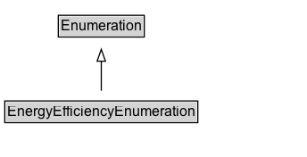

# EnergyEfficiencyEnumeration

Enumerates energy efficiency levels (also known as "classes" or "ratings") and certifications that are part of several international energy efficiency standards.

## Diagram

=== "SVG (interactive)"

    <!-- Generated by graphviz version 14.1.3 (20260303.0454)
     -->
    <!-- Pages: 1 -->
    <svg width="258pt" height="132pt"
     viewBox="0.00 0.00 258.00 132.00" xmlns="http://www.w3.org/2000/svg" xmlns:xlink="http://www.w3.org/1999/xlink">
    <g id="graph0" class="graph" transform="scale(1 1) rotate(0) translate(4 128)">
    <polygon fill="white" stroke="none" points="-4,4 -4,-128 254.12,-128 254.12,4 -4,4"/>
    <g id="clust3" class="cluster">
    <title>cluster_associated</title>
    </g>
    <!-- Enumeration -->
    <g id="node1" class="node">
    <title>Enumeration</title>
    <g id="a_node1"><a xlink:href="../Enumeration" xlink:title="&lt;TABLE&gt;">
    <polygon fill="lightgray" stroke="none" points="46,-97.88 46,-114.12 116.25,-114.12 116.25,-97.88 46,-97.88"/>
    <text xml:space="preserve" text-anchor="start" x="47" y="-101.88" font-family="Arial" font-size="12.00">Enumeration</text>
    <polygon fill="none" stroke="black" points="45,-96.88 45,-115.12 117.25,-115.12 117.25,-96.88 45,-96.88"/>
    </a>
    </g>
    </g>
    <!-- EnergyEfficiencyEnumeration -->
    <g id="node2" class="node">
    <title>EnergyEfficiencyEnumeration</title>
    <g id="a_node2"><a xlink:href="../EnergyEfficiencyEnumeration" xlink:title="&lt;TABLE&gt;">
    <polygon fill="lightgray" stroke="none" points="1,-25.88 1,-42.12 161.25,-42.12 161.25,-25.88 1,-25.88"/>
    <text xml:space="preserve" text-anchor="start" x="2" y="-29.88" font-family="Arial" font-size="12.00">EnergyEfficiencyEnumeration</text>
    <polygon fill="none" stroke="black" points="0,-24.88 0,-43.12 162.25,-43.12 162.25,-24.88 0,-24.88"/>
    </a>
    </g>
    </g>
    <!-- EnergyEfficiencyEnumeration&#45;&gt;Enumeration -->
    <g id="edge1" class="edge">
    <title>EnergyEfficiencyEnumeration&#45;&gt;Enumeration</title>
    <path fill="none" stroke="black" d="M81.12,-51.79C81.12,-59.25 81.12,-68.24 81.12,-76.69"/>
    <polygon fill="none" stroke="black" points="77.63,-76.54 81.13,-86.54 84.63,-76.54 77.63,-76.54"/>
    </g>
    <!-- Invis -->
    </g>
    </svg>

=== "PNG"

    

## Specializations of EnergyEfficiencyEnumeration

| Class | Description |
|-------|-------------|
| [Energy Star Energy Efficiency Enumeration](EnergyStarEnergyEfficiencyEnumeration.md) | Used to indicate whether a product is EnergyStar certified. |
| [Eu Energy Efficiency Enumeration](EUEnergyEfficiencyEnumeration.md) | Enumerates the EU energy efficiency classes A-G as well as A+, A++, and A+++ as defined in EU directive 2017/1369. |

## Formalization for EnergyEfficiencyEnumeration

| Property | Constraint |
|----------|------------|
| subClassOf | [Enumeration](Enumeration.md) |

