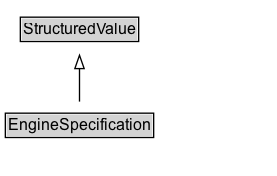

# EngineSpecification

Information about the engine of the vehicle. A vehicle can have multiple engines represented by multiple engine specification entities.

## Diagram

=== "SVG (interactive)"

    <!-- Generated by graphviz version 14.1.3 (20260303.0454)
     -->
    <!-- Pages: 1 -->
    <svg width="208pt" height="132pt"
     viewBox="0.00 0.00 208.00 132.00" xmlns="http://www.w3.org/2000/svg" xmlns:xlink="http://www.w3.org/1999/xlink">
    <g id="graph0" class="graph" transform="scale(1 1) rotate(0) translate(4 128)">
    <polygon fill="white" stroke="none" points="-4,4 -4,-128 203.62,-128 203.62,4 -4,4"/>
    <g id="clust3" class="cluster">
    <title>cluster_associated</title>
    </g>
    <!-- StructuredValue -->
    <g id="node1" class="node">
    <title>StructuredValue</title>
    <g id="a_node1"><a xlink:href="../StructuredValue" xlink:title="&lt;TABLE&gt;">
    <polygon fill="lightgray" stroke="none" points="12.25,-97.88 12.25,-114.12 99,-114.12 99,-97.88 12.25,-97.88"/>
    <text xml:space="preserve" text-anchor="start" x="13.25" y="-101.88" font-family="Arial" font-size="12.00">StructuredValue</text>
    <polygon fill="none" stroke="black" points="11.25,-96.88 11.25,-115.12 100,-115.12 100,-96.88 11.25,-96.88"/>
    </a>
    </g>
    </g>
    <!-- EngineSpecification -->
    <g id="node2" class="node">
    <title>EngineSpecification</title>
    <g id="a_node2"><a xlink:href="../EngineSpecification" xlink:title="&lt;TABLE&gt;">
    <polygon fill="lightgray" stroke="none" points="1,-25.88 1,-42.12 110.25,-42.12 110.25,-25.88 1,-25.88"/>
    <text xml:space="preserve" text-anchor="start" x="2" y="-29.88" font-family="Arial" font-size="12.00">EngineSpecification</text>
    <polygon fill="none" stroke="black" points="0,-24.88 0,-43.12 111.25,-43.12 111.25,-24.88 0,-24.88"/>
    </a>
    </g>
    </g>
    <!-- EngineSpecification&#45;&gt;StructuredValue -->
    <g id="edge1" class="edge">
    <title>EngineSpecification&#45;&gt;StructuredValue</title>
    <path fill="none" stroke="black" d="M55.62,-51.79C55.62,-59.25 55.62,-68.24 55.62,-76.69"/>
    <polygon fill="none" stroke="black" points="52.13,-76.54 55.63,-86.54 59.13,-76.54 52.13,-76.54"/>
    </g>
    <!-- Invis -->
    </g>
    </svg>

=== "PNG"

    

## Formalization for EngineSpecification

| Property | Constraint |
|----------|------------|
| subClassOf | [StructuredValue](StructuredValue.md) |

