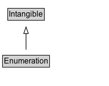

# Enumeration

Lists or enumerations—for example, a list of cuisines or music genres, etc.

## Diagram

=== "SVG (interactive)"

    <!-- Generated by graphviz version 14.1.3 (20260303.0454)
     -->
    <!-- Pages: 1 -->
    <svg width="168pt" height="132pt"
     viewBox="0.00 0.00 168.00 132.00" xmlns="http://www.w3.org/2000/svg" xmlns:xlink="http://www.w3.org/1999/xlink">
    <g id="graph0" class="graph" transform="scale(1 1) rotate(0) translate(4 128)">
    <polygon fill="white" stroke="none" points="-4,4 -4,-128 164.12,-128 164.12,4 -4,4"/>
    <g id="clust3" class="cluster">
    <title>cluster_associated</title>
    </g>
    <!-- Intangible -->
    <g id="node1" class="node">
    <title>Intangible</title>
    <g id="a_node1"><a xlink:href="../Intangible" xlink:title="&lt;TABLE&gt;">
    <polygon fill="lightgray" stroke="none" points="8.88,-97.88 8.88,-114.12 63.38,-114.12 63.38,-97.88 8.88,-97.88"/>
    <text xml:space="preserve" text-anchor="start" x="9.88" y="-101.88" font-family="Arial" font-size="12.00">Intangible</text>
    <polygon fill="none" stroke="black" points="7.88,-96.88 7.88,-115.12 64.38,-115.12 64.38,-96.88 7.88,-96.88"/>
    </a>
    </g>
    </g>
    <!-- Enumeration -->
    <g id="node2" class="node">
    <title>Enumeration</title>
    <g id="a_node2"><a xlink:href="../Enumeration" xlink:title="&lt;TABLE&gt;">
    <polygon fill="lightgray" stroke="none" points="1,-25.88 1,-42.12 71.25,-42.12 71.25,-25.88 1,-25.88"/>
    <text xml:space="preserve" text-anchor="start" x="2" y="-29.88" font-family="Arial" font-size="12.00">Enumeration</text>
    <polygon fill="none" stroke="black" points="0,-24.88 0,-43.12 72.25,-43.12 72.25,-24.88 0,-24.88"/>
    </a>
    </g>
    </g>
    <!-- Enumeration&#45;&gt;Intangible -->
    <g id="edge1" class="edge">
    <title>Enumeration&#45;&gt;Intangible</title>
    <path fill="none" stroke="black" d="M36.12,-51.79C36.12,-59.25 36.12,-68.24 36.12,-76.69"/>
    <polygon fill="none" stroke="black" points="32.63,-76.54 36.13,-86.54 39.63,-76.54 32.63,-76.54"/>
    </g>
    <!-- Invis -->
    </g>
    </svg>

=== "PNG"

    

## Specializations of Enumeration

| Class | Description |
|-------|-------------|
| [Action Status Type](ActionStatusType.md) | The status of an Action. |
| [Adult Oriented Enumeration](AdultOrientedEnumeration.md) | Enumeration of considerations that make a product relevant or potentially restricted for adults only. |
| [Bed Type](BedType.md) | A type of bed. This is used for indicating the bed or beds available in an accommodation. |
| [Boarding Policy Type](BoardingPolicyType.md) | A type of boarding policy used by an airline. |
| [Body Measurement Type Enumeration](BodyMeasurementTypeEnumeration.md) | Enumerates types (or dimensions) of a person's body measurements, for example for fitting of clothes. |
| [Book Format Type](BookFormatType.md) | The publication format of the book. |
| [Business Entity Type](BusinessEntityType.md) | A business entity type is a conceptual entity representing the legal form, the size, the main line of business, the position in the value chain, or any combination thereof, of an organization or business person.\n\nCommonly used values:\n\n* http://purl.org/goodrelations/v1#Business\n* http://purl.org/goodrelations/v1#Enduser\n* http://purl.org/goodrelations/v1#PublicInstitution\n* http://purl.org/goodrelations/v1#Reseller
     |
| [Business Function](BusinessFunction.md) | The business function specifies the type of activity or access (i.e., the bundle of rights) offered by the organization or business person through the offer. Typical are sell, rental or lease, maintenance or repair, manufacture / produce, recycle / dispose, engineering / construction, or installation. Proprietary specifications of access rights are also instances of this class.\n\nCommonly used values:\n\n* http://purl.org/goodrelations/v1#ConstructionInstallation\n* http://purl.org/goodrelations/v1#Dispose\n* http://purl.org/goodrelations/v1#LeaseOut\n* http://purl.org/goodrelations/v1#Maintain\n* http://purl.org/goodrelations/v1#ProvideService\n* http://purl.org/goodrelations/v1#Repair\n* http://purl.org/goodrelations/v1#Sell\n* http://purl.org/goodrelations/v1#Buy
         |
| [Car Usage Type](CarUsageType.md) | A value indicating a special usage of a car, e.g. commercial rental, driving school, or as a taxi. |
| [Certification Status Enumeration](CertificationStatusEnumeration.md) | Enumerates the different statuses of a Certification (Active and Inactive). |
| [Contact Point Option](ContactPointOption.md) | Enumerated options related to a ContactPoint. |
| [Day Of Week](DayOfWeek.md) | The day of the week, e.g. used to specify to which day the opening hours of an OpeningHoursSpecification refer.

Originally, URLs from [GoodRelations](http://purl.org/goodrelations/v1) were used (for [[Monday]], [[Tuesday]], [[Wednesday]], [[Thursday]], [[Friday]], [[Saturday]], [[Sunday]] plus a special entry for [[PublicHolidays]]); these have now been integrated directly into schema.org.
       |
| [Delivery Method](DeliveryMethod.md) | A delivery method is a standardized procedure for transferring the product or service to the destination of fulfillment chosen by the customer. Delivery methods are characterized by the means of transportation used, and by the organization or group that is the contracting party for the sending organization or person.\n\nCommonly used values:\n\n* http://purl.org/goodrelations/v1#DeliveryModeDirectDownload\n* http://purl.org/goodrelations/v1#DeliveryModeFreight\n* http://purl.org/goodrelations/v1#DeliveryModeMail\n* http://purl.org/goodrelations/v1#DeliveryModeOwnFleet\n* http://purl.org/goodrelations/v1#DeliveryModePickUp\n* http://purl.org/goodrelations/v1#DHL\n* http://purl.org/goodrelations/v1#FederalExpress\n* http://purl.org/goodrelations/v1#UPS
         |
| [Digital Document Permission Type](DigitalDocumentPermissionType.md) | A type of permission which can be granted for accessing a digital document. |
| [Digital Platform Enumeration](DigitalPlatformEnumeration.md) | Enumerates some common technology platforms, for use with properties such as [[actionPlatform]]. It is not supposed to be comprehensive - when a suitable code is not enumerated here, textual or URL values can be used instead. These codes are at a fairly high level and do not deal with versioning and other nuance. Additional codes can be suggested [in github](https://github.com/schemaorg/schemaorg/issues/3057).  |
| [Drive Wheel Configuration Value](DriveWheelConfigurationValue.md) | A value indicating which roadwheels will receive torque. |
| [Drug Cost Category](DrugCostCategory.md) | Enumerated categories of medical drug costs. |
| [Drug Pregnancy Category](DrugPregnancyCategory.md) | Categories that represent an assessment of the risk of fetal injury due to a drug or pharmaceutical used as directed by the mother during pregnancy. |
| [Drug Prescription Status](DrugPrescriptionStatus.md) | Indicates whether this drug is available by prescription or over-the-counter. |
| [Energy Efficiency Enumeration](EnergyEfficiencyEnumeration.md) | Enumerates energy efficiency levels (also known as "classes" or "ratings") and certifications that are part of several international energy efficiency standards. |
| [Energy Star Energy Efficiency Enumeration](EnergyStarEnergyEfficiencyEnumeration.md) | Used to indicate whether a product is EnergyStar certified. |
| [Eu Energy Efficiency Enumeration](EUEnergyEfficiencyEnumeration.md) | Enumerates the EU energy efficiency classes A-G as well as A+, A++, and A+++ as defined in EU directive 2017/1369. |
| [Event Attendance Mode Enumeration](EventAttendanceModeEnumeration.md) | An EventAttendanceModeEnumeration value is one of potentially several modes of organising an event, relating to whether it is online or offline. |
| [Event Status Type](EventStatusType.md) | EventStatusType is an enumeration type whose instances represent several states that an Event may be in. |
| [Fulfillment Type Enumeration](FulfillmentTypeEnumeration.md) | A type of product fulfillment. |
| [Game Availability Enumeration](GameAvailabilityEnumeration.md) | For a [[VideoGame]], such as used with a [[PlayGameAction]], an enumeration of the kind of game availability offered.  |
| [Game Play Mode](GamePlayMode.md) | Indicates whether this game is multi-player, co-op or single-player. |
| [Game Server Status](GameServerStatus.md) | Status of a game server. |
| [Gender Type](GenderType.md) | An enumeration of genders. |
| [Government Benefits Type](GovernmentBenefitsType.md) | GovernmentBenefitsType enumerates several kinds of government benefits to support the COVID-19 situation. Note that this structure may not capture all benefits offered. |
| [Health Aspect Enumeration](HealthAspectEnumeration.md) | HealthAspectEnumeration enumerates several aspects of health content online, each of which might be described using [[hasHealthAspect]] and [[HealthTopicContent]]. |
| [Incentive Qualified Expense Type](IncentiveQualifiedExpenseType.md) | The types of expenses that are covered by the incentive. For example some incentives are only for the goods (tangible items) but the services (labor) are excluded. |
| [Incentive Status](IncentiveStatus.md) | Enumerates a status for an incentive, such as whether it is active. |
| [Incentive Type](IncentiveType.md) | Enumerates common financial incentives for products, including tax credits, tax deductions, rebates and subsidies, etc. |
| [Infectious Agent Class](InfectiousAgentClass.md) | Classes of agents or pathogens that transmit infectious diseases. Enumerated type. |
| [Iptc Digital Source Enumeration](IPTCDigitalSourceEnumeration.md) | <a href="https://www.iptc.org/">IPTC</a> "Digital Source" codes for use with the [[digitalSourceType]] property, providing information about the source for a digital media object.
In general these codes are not declared here to be mutually exclusive, although some combinations would be contradictory if applied simultaneously, or might be considered mutually incompatible by upstream maintainers of the definitions. See the IPTC <a href="https://www.iptc.org/std/photometadata/documentation/userguide/">documentation</a>
 for <a href="https://cv.iptc.org/newscodes/digitalsourcetype/">detailed definitions</a> of all terms. |
| [Item Availability](ItemAvailability.md) | A list of possible product availability options. |
| [Item List Order Type](ItemListOrderType.md) | Enumerated for values for itemListOrder for indicating how an ordered ItemList is organized. |
| [Legal Force Status](LegalForceStatus.md) | A list of possible statuses for the legal force of a legislation. |
| [Legal Value Level](LegalValueLevel.md) | A list of possible levels for the legal validity of a legislation. |
| [Map Category Type](MapCategoryType.md) | An enumeration of several kinds of Map. |
| [Measurement Method Enum](MeasurementMethodEnum.md) | Enumeration(s) for use with [[measurementMethod]]. |
| [Measurement Type Enumeration](MeasurementTypeEnumeration.md) | Enumeration of common measurement types (or dimensions), for example "chest" for a person, "inseam" for pants, "gauge" for screws, or "wheel" for bicycles. |
| [Media Enumeration](MediaEnumeration.md) | MediaEnumeration enumerations are lists of codes, labels etc. useful for describing media objects. They may be reflections of externally developed lists, or created at schema.org, or a combination. |
| [Media Manipulation Rating Enumeration](MediaManipulationRatingEnumeration.md) |  Codes for use with the [[mediaAuthenticityCategory]] property, indicating the authenticity of a media object (in the context of how it was published or shared). In general these codes are not mutually exclusive, although some combinations (such as 'original' versus 'transformed', 'edited' and 'staged') would be contradictory if applied in the same [[MediaReview]]. Note that the application of these codes is with regard to a piece of media shared or published in a particular context. |
| [Medical Audience Type](MedicalAudienceType.md) | Target audiences types for medical web pages. Enumerated type. |
| [Medical Device Purpose](MedicalDevicePurpose.md) | Categories of medical devices, organized by the purpose or intended use of the device. |
| [Medical Enumeration](MedicalEnumeration.md) | Enumerations related to health and the practice of medicine: A concept that is used to attribute a quality to another concept, as a qualifier, a collection of items or a listing of all of the elements of a set in medicine practice. |
| [Medical Evidence Level](MedicalEvidenceLevel.md) | Level of evidence for a medical guideline. Enumerated type. |
| [Medical Imaging Technique](MedicalImagingTechnique.md) | Any medical imaging modality typically used for diagnostic purposes. Enumerated type. |
| [Medical Observational Study Design](MedicalObservationalStudyDesign.md) | Design models for observational medical studies. Enumerated type. |
| [Medical Procedure Type](MedicalProcedureType.md) | An enumeration that describes different types of medical procedures. |
| [Medical Specialty](MedicalSpecialty.md) | Any specific branch of medical science or practice. Medical specialities include clinical specialties that pertain to particular organ systems and their respective disease states, as well as allied health specialties. Enumerated type. |
| [Medical Specialty](MedicalSpecialty.md) | Any specific branch of medical science or practice. Medical specialities include clinical specialties that pertain to particular organ systems and their respective disease states, as well as allied health specialties. Enumerated type. |
| [Medical Study Status](MedicalStudyStatus.md) | The status of a medical study. Enumerated type. |
| [Medical Trial Design](MedicalTrialDesign.md) | Design models for medical trials. Enumerated type. |
| [Medicine System](MedicineSystem.md) | Systems of medical practice. |
| [Merchant Return Enumeration](MerchantReturnEnumeration.md) | Enumerates several kinds of product return policies. |
| [Music Album Production Type](MusicAlbumProductionType.md) | Classification of the album by its type of content: soundtrack, live album, studio album, etc. |
| [Music Album Release Type](MusicAlbumReleaseType.md) | The kind of release which this album is: single, EP or album. |
| [Music Release Format Type](MusicReleaseFormatType.md) | Format of this release (the type of recording media used, i.e. compact disc, digital media, LP, etc.). |
| [Nl Nonprofit Type](NLNonprofitType.md) | NLNonprofitType: Non-profit organization type originating from the Netherlands. |
| [Nonprofit Type](NonprofitType.md) | NonprofitType enumerates several kinds of official non-profit types of which a non-profit organization can be. |
| [Offer Item Condition](OfferItemCondition.md) | A list of possible conditions for the item. |
| [Order Status](OrderStatus.md) | Enumerated status values for Order. |
| [Payment Method Type](PaymentMethodType.md) | The type of payment method, only for generic payment types, specific forms of payments, like card payment should be expressed using subclasses of PaymentMethod. |
| [Payment Status Type](PaymentStatusType.md) | A specific payment status. For example, PaymentDue, PaymentComplete, etc. |
| [Physical Activity Category](PhysicalActivityCategory.md) | Categories of physical activity, organized by physiologic classification. |
| [Physical Exam](PhysicalExam.md) | A type of physical examination of a patient performed by a physician.  |
| [Price Component Type Enumeration](PriceComponentTypeEnumeration.md) | Enumerates different price components that together make up the total price for an offered product. |
| [Price Type Enumeration](PriceTypeEnumeration.md) | Enumerates different price types, for example list price, invoice price, and sale price. |
| [Purchase Type](PurchaseType.md) | Enumerates a purchase type for an item. |
| [Qualitative Value](QualitativeValue.md) | A predefined value for a product characteristic, e.g. the power cord plug type 'US' or the garment sizes 'S', 'M', 'L', and 'XL'. |
| [Refund Type Enumeration](RefundTypeEnumeration.md) | Enumerates several kinds of product return refund types. |
| [Reservation Status Type](ReservationStatusType.md) | Enumerated status values for Reservation. |
| [Restricted Diet](RestrictedDiet.md) | A diet restricted to certain foods or preparations for cultural, religious, health or lifestyle reasons.  |
| [Return Fees Enumeration](ReturnFeesEnumeration.md) | Enumerates several kinds of policies for product return fees. |
| [Return Label Source Enumeration](ReturnLabelSourceEnumeration.md) | Enumerates several types of return labels for product returns. |
| [Return Method Enumeration](ReturnMethodEnumeration.md) | Enumerates several types of product return methods. |
| [Rsvp Response Type](RsvpResponseType.md) | RsvpResponseType is an enumeration type whose instances represent responding to an RSVP request. |
| [Size Group Enumeration](SizeGroupEnumeration.md) | Enumerates common size groups for various product categories. |
| [Size Specification](SizeSpecification.md) | Size related properties of a product, typically a size code ([[name]]) and optionally a [[sizeSystem]], [[sizeGroup]], and product measurements ([[hasMeasurement]]). In addition, the intended audience can be defined through [[suggestedAge]], [[suggestedGender]], and suggested body measurements ([[suggestedMeasurement]]). |
| [Size System Enumeration](SizeSystemEnumeration.md) | Enumerates common size systems for different categories of products, for example "EN-13402" or "UK" for wearables or "Imperial" for screws. |
| [Specialty](Specialty.md) | Any branch of a field in which people typically develop specific expertise, usually after significant study, time, and effort. |
| [Status Enumeration](StatusEnumeration.md) | Lists or enumerations dealing with status types. |
| [Steering Position Value](SteeringPositionValue.md) | A value indicating a steering position. |
| [Tier Benefit Enumeration](TierBenefitEnumeration.md) | An enumeration of possible benefits as part of a loyalty (members) program. |
| [Uk Nonprofit Type](UKNonprofitType.md) | UKNonprofitType: Non-profit organization type originating from the United Kingdom. |
| [Us Nonprofit Type](USNonprofitType.md) | USNonprofitType: Non-profit organization type originating from the United States. |
| [Warranty Scope](WarrantyScope.md) | A range of services that will be provided to a customer free of charge in case of a defect or malfunction of a product.\n\nCommonly used values:\n\n* http://purl.org/goodrelations/v1#Labor-BringIn\n* http://purl.org/goodrelations/v1#PartsAndLabor-BringIn\n* http://purl.org/goodrelations/v1#PartsAndLabor-PickUp
       |
| [Wearable Measurement Type Enumeration](WearableMeasurementTypeEnumeration.md) | Enumerates common types of measurement for wearables products. |
| [Wearable Size Group Enumeration](WearableSizeGroupEnumeration.md) | Enumerates common size groups (also known as "size types") for wearable products. |
| [Wearable Size System Enumeration](WearableSizeSystemEnumeration.md) | Enumerates common size systems specific for wearable products. |

## Formalization for Enumeration

| Property | Constraint |
|----------|------------|
| subClassOf | [Intangible](Intangible.md) |

