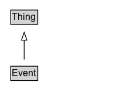

# Event

An event happening at a certain time and location, such as a concert, lecture, or festival. Ticketing information may be added via the [[offers]] property. Repeated events may be structured as separate Event objects.

## Diagram

=== "SVG (interactive)"

    <!-- Generated by graphviz version 14.1.3 (20260303.0454)
     -->
    <!-- Pages: 1 -->
    <svg width="150pt" height="132pt"
     viewBox="0.00 0.00 150.00 132.00" xmlns="http://www.w3.org/2000/svg" xmlns:xlink="http://www.w3.org/1999/xlink">
    <g id="graph0" class="graph" transform="scale(1 1) rotate(0) translate(4 128)">
    <polygon fill="white" stroke="none" points="-4,4 -4,-128 146,-128 146,4 -4,4"/>
    <g id="clust3" class="cluster">
    <title>cluster_associated</title>
    </g>
    <!-- Thing -->
    <g id="node1" class="node">
    <title>Thing</title>
    <g id="a_node1"><a xlink:href="../Thing" xlink:title="&lt;TABLE&gt;">
    <polygon fill="lightgray" stroke="none" points="10.62,-97.88 10.62,-114.12 43.38,-114.12 43.38,-97.88 10.62,-97.88"/>
    <text xml:space="preserve" text-anchor="start" x="11.62" y="-101.88" font-family="Arial" font-size="12.00">Thing</text>
    <polygon fill="none" stroke="black" points="9.62,-96.88 9.62,-115.12 44.38,-115.12 44.38,-96.88 9.62,-96.88"/>
    </a>
    </g>
    </g>
    <!-- Event -->
    <g id="node2" class="node">
    <title>Event</title>
    <g id="a_node2"><a xlink:href="../Event" xlink:title="&lt;TABLE&gt;">
    <polygon fill="lightgray" stroke="none" points="10.62,-25.88 10.62,-42.12 43.38,-42.12 43.38,-25.88 10.62,-25.88"/>
    <text xml:space="preserve" text-anchor="start" x="11.62" y="-29.88" font-family="Arial" font-size="12.00">Event</text>
    <polygon fill="none" stroke="black" points="9.62,-24.88 9.62,-43.12 44.38,-43.12 44.38,-24.88 9.62,-24.88"/>
    </a>
    </g>
    </g>
    <!-- Event&#45;&gt;Thing -->
    <g id="edge1" class="edge">
    <title>Event&#45;&gt;Thing</title>
    <path fill="none" stroke="black" d="M27,-51.79C27,-59.25 27,-68.24 27,-76.69"/>
    <polygon fill="none" stroke="black" points="23.5,-76.54 27,-86.54 30.5,-76.54 23.5,-76.54"/>
    </g>
    <!-- Invis -->
    </g>
    </svg>

=== "PNG"

    

## Specializations of Event

| Class | Description |
|-------|-------------|
| [Broadcast Event](BroadcastEvent.md) | An over the air or online broadcast event. |
| [Business Event](BusinessEvent.md) | Event type: Business event. |
| [Childrens Event](ChildrensEvent.md) | Event type: Children's event. |
| [Comedy Event](ComedyEvent.md) | Event type: Comedy event. |
| [Conference Event](ConferenceEvent.md) | Event type: Conference event. |
| [Course Instance](CourseInstance.md) | An instance of a [[Course]] which is distinct from other instances because it is offered at a different time or location or through different media or modes of study or to a specific section of students. |
| [Dance Event](DanceEvent.md) | Event type: A social dance. |
| [Delivery Event](DeliveryEvent.md) | An event involving the delivery of an item. |
| [Education Event](EducationEvent.md) | Event type: Education event. |
| [Event Series](EventSeries.md) | A series of [[Event]]s. Included events can relate with the series using the [[superEvent]] property.

An EventSeries is a collection of events that share some unifying characteristic. For example, "The Olympic Games" is a series, which
is repeated regularly. The "2012 London Olympics" can be presented both as an [[Event]] in the series "Olympic Games", and as an
[[EventSeries]] that included a number of sporting competitions as Events.

The nature of the association between the events in an [[EventSeries]] can vary, but typical examples could
include a thematic event series (e.g. topical meetups or classes), or a series of regular events that share a location, attendee group and/or organizers.

EventSeries has been defined as a kind of Event to make it easy for publishers to use it in an Event context without
worrying about which kinds of series are really event-like enough to call an Event. In general an EventSeries
may seem more Event-like when the period of time is compact and when aspects such as location are fixed, but
it may also sometimes prove useful to describe a longer-term series as an Event.
    |
| [Exhibition Event](ExhibitionEvent.md) | Event type: Exhibition event, e.g. at a museum, library, archive, tradeshow, ... |
| [Festival](Festival.md) | Event type: Festival. |
| [Food Event](FoodEvent.md) | Event type: Food event. |
| [Hackathon](Hackathon.md) | A [hackathon](https://en.wikipedia.org/wiki/Hackathon) event. |
| [Literary Event](LiteraryEvent.md) | Event type: Literary event. |
| [Music Event](MusicEvent.md) | Event type: Music event. |
| [On Demand Event](OnDemandEvent.md) | A publication event, e.g. catch-up TV or radio podcast, during which a program is available on-demand. |
| [Performing Arts Event](PerformingArtsEvent.md) | Live performance <a class="localLink" href="http://schema.org/Event">Event of the performing arts (music, theatre, dance, acrobatics, spoken word), including performance art and performative sports (e.g. choreographed forms of martial arts, figure skating, competitive ballroom dancing).  Note: Use <a class="localLink" href="http://schema.org/additionalType">additionalType</a> to differentiate between productions / shows (PerformanceWork, EventSeries), tours (EventSeries), and individual performances. |
| [Publication Event](PublicationEvent.md) | A PublicationEvent corresponds indifferently to the event of publication for a CreativeWork of any type, e.g. a broadcast event, an on-demand event, a book/journal publication via a variety of delivery media. |
| [Sale Event](SaleEvent.md) | Event type: Sales event. |
| [Screening Event](ScreeningEvent.md) | A screening of a movie or other video. |
| [Social Event](SocialEvent.md) | Event type: Social event. |
| [Sports Event](SportsEvent.md) | Event type: Sports event. |
| [Theater Event](TheaterEvent.md) | Event type: Theater performance. |
| [User Blocks](UserBlocks.md) | UserInteraction and its subtypes is an old way of talking about users interacting with pages. It is generally better to use [[Action]]-based vocabulary, alongside types such as [[Comment]]. |
| [User Checkins](UserCheckins.md) | UserInteraction and its subtypes is an old way of talking about users interacting with pages. It is generally better to use [[Action]]-based vocabulary, alongside types such as [[Comment]]. |
| [User Comments](UserComments.md) | UserInteraction and its subtypes is an old way of talking about users interacting with pages. It is generally better to use [[Action]]-based vocabulary, alongside types such as [[Comment]]. |
| [User Downloads](UserDownloads.md) | UserInteraction and its subtypes is an old way of talking about users interacting with pages. It is generally better to use [[Action]]-based vocabulary, alongside types such as [[Comment]]. |
| [User Interaction](UserInteraction.md) | UserInteraction and its subtypes is an old way of talking about users interacting with pages. It is generally better to use [[Action]]-based vocabulary, alongside types such as [[Comment]]. |
| [User Likes](UserLikes.md) | UserInteraction and its subtypes is an old way of talking about users interacting with pages. It is generally better to use [[Action]]-based vocabulary, alongside types such as [[Comment]]. |
| [User Page Visits](UserPageVisits.md) | UserInteraction and its subtypes is an old way of talking about users interacting with pages. It is generally better to use [[Action]]-based vocabulary, alongside types such as [[Comment]]. |
| [User Plays](UserPlays.md) | UserInteraction and its subtypes is an old way of talking about users interacting with pages. It is generally better to use [[Action]]-based vocabulary, alongside types such as [[Comment]]. |
| [User Plus Ones](UserPlusOnes.md) | UserInteraction and its subtypes is an old way of talking about users interacting with pages. It is generally better to use [[Action]]-based vocabulary, alongside types such as [[Comment]]. |
| [User Tweets](UserTweets.md) | UserInteraction and its subtypes is an old way of talking about users interacting with pages. It is generally better to use [[Action]]-based vocabulary, alongside types such as [[Comment]]. |
| [Visual Arts Event](VisualArtsEvent.md) | Event type: Visual arts event. |

## Formalization for Event

| Property | Constraint |
|----------|------------|
| subClassOf | [Thing](Thing.md) |

