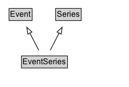

# EventSeries

A series of [[Event]]s. Included events can relate with the series using the [[superEvent]] property.

An EventSeries is a collection of events that share some unifying characteristic. For example, "The Olympic Games" is a series, which
is repeated regularly. The "2012 London Olympics" can be presented both as an [[Event]] in the series "Olympic Games", and as an
[[EventSeries]] that included a number of sporting competitions as Events.

The nature of the association between the events in an [[EventSeries]] can vary, but typical examples could
include a thematic event series (e.g. topical meetups or classes), or a series of regular events that share a location, attendee group and/or organizers.

EventSeries has been defined as a kind of Event to make it easy for publishers to use it in an Event context without
worrying about which kinds of series are really event-like enough to call an Event. In general an EventSeries
may seem more Event-like when the period of time is compact and when aspects such as location are fixed, but
it may also sometimes prove useful to describe a longer-term series as an Event.
   

## Diagram

=== "SVG (interactive)"

    <!-- Generated by graphviz version 14.1.3 (20260303.0454)
     -->
    <!-- Pages: 1 -->
    <svg width="194pt" height="132pt"
     viewBox="0.00 0.00 194.00 132.00" xmlns="http://www.w3.org/2000/svg" xmlns:xlink="http://www.w3.org/1999/xlink">
    <g id="graph0" class="graph" transform="scale(1 1) rotate(0) translate(4 128)">
    <polygon fill="white" stroke="none" points="-4,4 -4,-128 190,-128 190,4 -4,4"/>
    <g id="clust3" class="cluster">
    <title>cluster_associated</title>
    </g>
    <!-- Event -->
    <g id="node1" class="node">
    <title>Event</title>
    <g id="a_node1"><a xlink:href="../Event" xlink:title="&lt;TABLE&gt;">
    <polygon fill="lightgray" stroke="none" points="10.62,-97.88 10.62,-114.12 43.38,-114.12 43.38,-97.88 10.62,-97.88"/>
    <text xml:space="preserve" text-anchor="start" x="11.62" y="-101.88" font-family="Arial" font-size="12.00">Event</text>
    <polygon fill="none" stroke="black" points="9.62,-96.88 9.62,-115.12 44.38,-115.12 44.38,-96.88 9.62,-96.88"/>
    </a>
    </g>
    </g>
    <!-- Series -->
    <g id="node2" class="node">
    <title>Series</title>
    <g id="a_node2"><a xlink:href="../Series" xlink:title="&lt;TABLE&gt;">
    <polygon fill="lightgray" stroke="none" points="80.75,-97.88 80.75,-114.12 117.25,-114.12 117.25,-97.88 80.75,-97.88"/>
    <text xml:space="preserve" text-anchor="start" x="81.75" y="-101.88" font-family="Arial" font-size="12.00">Series</text>
    <polygon fill="none" stroke="black" points="79.75,-96.88 79.75,-115.12 118.25,-115.12 118.25,-96.88 79.75,-96.88"/>
    </a>
    </g>
    </g>
    <!-- EventSeries -->
    <g id="node3" class="node">
    <title>EventSeries</title>
    <g id="a_node3"><a xlink:href="../EventSeries" xlink:title="&lt;TABLE&gt;">
    <polygon fill="lightgray" stroke="none" points="29.38,-25.88 29.38,-42.12 96.62,-42.12 96.62,-25.88 29.38,-25.88"/>
    <text xml:space="preserve" text-anchor="start" x="30.38" y="-29.88" font-family="Arial" font-size="12.00">EventSeries</text>
    <polygon fill="none" stroke="black" points="28.38,-24.88 28.38,-43.12 97.62,-43.12 97.62,-24.88 28.38,-24.88"/>
    </a>
    </g>
    </g>
    <!-- EventSeries&#45;&gt;Event -->
    <g id="edge1" class="edge">
    <title>EventSeries&#45;&gt;Event</title>
    <path fill="none" stroke="black" d="M54.37,-51.79C50.35,-59.59 45.48,-69.07 40.96,-77.85"/>
    <polygon fill="none" stroke="black" points="37.87,-76.22 36.41,-86.71 44.09,-79.42 37.87,-76.22"/>
    </g>
    <!-- EventSeries&#45;&gt;Series -->
    <g id="edge2" class="edge">
    <title>EventSeries&#45;&gt;Series</title>
    <path fill="none" stroke="black" d="M71.63,-51.79C75.65,-59.59 80.52,-69.07 85.04,-77.85"/>
    <polygon fill="none" stroke="black" points="81.91,-79.42 89.59,-86.71 88.13,-76.22 81.91,-79.42"/>
    </g>
    <!-- Invis -->
    </g>
    </svg>

=== "PNG"

    

## Formalization for EventSeries

| Property | Constraint |
|----------|------------|
| subClassOf | [Event](Event.md) |
| subClassOf | [Series](Series.md) |

