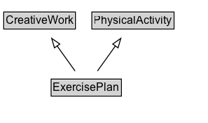

# ExercisePlan

Fitness-related activity designed for a specific health-related purpose, including defined exercise routines as well as activity prescribed by a clinician.

## Diagram

=== "SVG (interactive)"

    <!-- Generated by graphviz version 14.1.3 (20260303.0454)
     -->
    <!-- Pages: 1 -->
    <svg width="222pt" height="132pt"
     viewBox="0.00 0.00 222.00 132.00" xmlns="http://www.w3.org/2000/svg" xmlns:xlink="http://www.w3.org/1999/xlink">
    <g id="graph0" class="graph" transform="scale(1 1) rotate(0) translate(4 128)">
    <polygon fill="white" stroke="none" points="-4,4 -4,-128 218.38,-128 218.38,4 -4,4"/>
    <g id="clust3" class="cluster">
    <title>cluster_associated</title>
    </g>
    <!-- CreativeWork -->
    <g id="node1" class="node">
    <title>CreativeWork</title>
    <g id="a_node1"><a xlink:href="../CreativeWork" xlink:title="&lt;TABLE&gt;">
    <polygon fill="lightgray" stroke="none" points="1,-97.88 1,-114.12 75.75,-114.12 75.75,-97.88 1,-97.88"/>
    <text xml:space="preserve" text-anchor="start" x="2" y="-101.88" font-family="Arial" font-size="12.00">CreativeWork</text>
    <polygon fill="none" stroke="black" points="0,-96.88 0,-115.12 76.75,-115.12 76.75,-96.88 0,-96.88"/>
    </a>
    </g>
    </g>
    <!-- PhysicalActivity -->
    <g id="node2" class="node">
    <title>PhysicalActivity</title>
    <g id="a_node2"><a xlink:href="../PhysicalActivity" xlink:title="&lt;TABLE&gt;">
    <polygon fill="lightgray" stroke="none" points="95.38,-97.88 95.38,-114.12 181.38,-114.12 181.38,-97.88 95.38,-97.88"/>
    <text xml:space="preserve" text-anchor="start" x="96.38" y="-101.88" font-family="Arial" font-size="12.00">PhysicalActivity</text>
    <polygon fill="none" stroke="black" points="94.38,-96.88 94.38,-115.12 182.38,-115.12 182.38,-96.88 94.38,-96.88"/>
    </a>
    </g>
    </g>
    <!-- ExercisePlan -->
    <g id="node3" class="node">
    <title>ExercisePlan</title>
    <g id="a_node3"><a xlink:href="../ExercisePlan" xlink:title="&lt;TABLE&gt;">
    <polygon fill="lightgray" stroke="none" points="51.75,-25.88 51.75,-42.12 125,-42.12 125,-25.88 51.75,-25.88"/>
    <text xml:space="preserve" text-anchor="start" x="52.75" y="-29.88" font-family="Arial" font-size="12.00">ExercisePlan</text>
    <polygon fill="none" stroke="black" points="50.75,-24.88 50.75,-43.12 126,-43.12 126,-24.88 50.75,-24.88"/>
    </a>
    </g>
    </g>
    <!-- ExercisePlan&#45;&gt;CreativeWork -->
    <g id="edge1" class="edge">
    <title>ExercisePlan&#45;&gt;CreativeWork</title>
    <path fill="none" stroke="black" d="M76.38,-51.79C70.63,-59.85 63.59,-69.69 57.15,-78.71"/>
    <polygon fill="none" stroke="black" points="54.32,-76.65 51.36,-86.82 60.02,-80.72 54.32,-76.65"/>
    </g>
    <!-- ExercisePlan&#45;&gt;PhysicalActivity -->
    <g id="edge2" class="edge">
    <title>ExercisePlan&#45;&gt;PhysicalActivity</title>
    <path fill="none" stroke="black" d="M100.37,-51.79C106.12,-59.85 113.16,-69.69 119.6,-78.71"/>
    <polygon fill="none" stroke="black" points="116.73,-80.72 125.39,-86.82 122.43,-76.65 116.73,-80.72"/>
    </g>
    <!-- Invis -->
    </g>
    </svg>

=== "PNG"

    

## Formalization for ExercisePlan

| Property | Constraint |
|----------|------------|
| subClassOf | [CreativeWork](CreativeWork.md) |
| subClassOf | [PhysicalActivity](PhysicalActivity.md) |

