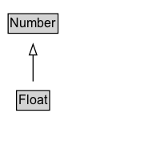

# Float

Data type: Floating number.

## Diagram

=== "SVG (interactive)"

    <!-- Generated by graphviz version 14.1.3 (20260303.0454)
     -->
    <!-- Pages: 1 -->
    <svg width="150pt" height="132pt"
     viewBox="0.00 0.00 150.00 132.00" xmlns="http://www.w3.org/2000/svg" xmlns:xlink="http://www.w3.org/1999/xlink">
    <g id="graph0" class="graph" transform="scale(1 1) rotate(0) translate(4 128)">
    <polygon fill="white" stroke="none" points="-4,4 -4,-128 146,-128 146,4 -4,4"/>
    <g id="clust3" class="cluster">
    <title>cluster_associated</title>
    </g>
    <!-- Number -->
    <g id="node1" class="node">
    <title>Number</title>
    <g id="a_node1"><a xlink:href="../Number" xlink:title="&lt;TABLE&gt;">
    <polygon fill="lightgray" stroke="none" points="4.62,-97.88 4.62,-114.12 49.38,-114.12 49.38,-97.88 4.62,-97.88"/>
    <text xml:space="preserve" text-anchor="start" x="5.62" y="-101.88" font-family="Arial" font-size="12.00">Number</text>
    <polygon fill="none" stroke="black" points="3.62,-96.88 3.62,-115.12 50.38,-115.12 50.38,-96.88 3.62,-96.88"/>
    </a>
    </g>
    </g>
    <!-- Float -->
    <g id="node2" class="node">
    <title>Float</title>
    <g id="a_node2"><a xlink:href="../Float" xlink:title="&lt;TABLE&gt;">
    <polygon fill="lightgray" stroke="none" points="12.5,-25.88 12.5,-42.12 41.5,-42.12 41.5,-25.88 12.5,-25.88"/>
    <text xml:space="preserve" text-anchor="start" x="13.5" y="-29.88" font-family="Arial" font-size="12.00">Float</text>
    <polygon fill="none" stroke="black" points="11.5,-24.88 11.5,-43.12 42.5,-43.12 42.5,-24.88 11.5,-24.88"/>
    </a>
    </g>
    </g>
    <!-- Float&#45;&gt;Number -->
    <g id="edge1" class="edge">
    <title>Float&#45;&gt;Number</title>
    <path fill="none" stroke="black" d="M27,-51.79C27,-59.25 27,-68.24 27,-76.69"/>
    <polygon fill="none" stroke="black" points="23.5,-76.54 27,-86.54 30.5,-76.54 23.5,-76.54"/>
    </g>
    <!-- Invis -->
    </g>
    </svg>

=== "PNG"

    

## Formalization for Float

| Property | Constraint |
|----------|------------|
| subClassOf | [Number](Number.md) |

