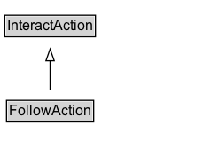

# FollowAction

The act of forming a personal connection with someone/something (object) unidirectionally/asymmetrically to get updates polled from.\n\nRelated actions:\n\n* [[BefriendAction]]: Unlike BefriendAction, FollowAction implies that the connection is *not* necessarily reciprocal.\n* [[SubscribeAction]]: Unlike SubscribeAction, FollowAction implies that the follower acts as an active agent constantly/actively polling for updates.\n* [[RegisterAction]]: Unlike RegisterAction, FollowAction implies that the agent is interested in continuing receiving updates from the object.\n* [[JoinAction]]: Unlike JoinAction, FollowAction implies that the agent is interested in getting updates from the object.\n* [[TrackAction]]: Unlike TrackAction, FollowAction refers to the polling of updates of all aspects of animate objects rather than the location of inanimate objects (e.g. you track a package, but you don't follow it).

## Diagram

=== "SVG (interactive)"

    <!-- Generated by graphviz version 14.1.3 (20260303.0454)
     -->
    <!-- Pages: 1 -->
    <svg width="171pt" height="132pt"
     viewBox="0.00 0.00 171.00 132.00" xmlns="http://www.w3.org/2000/svg" xmlns:xlink="http://www.w3.org/1999/xlink">
    <g id="graph0" class="graph" transform="scale(1 1) rotate(0) translate(4 128)">
    <polygon fill="white" stroke="none" points="-4,4 -4,-128 167.38,-128 167.38,4 -4,4"/>
    <g id="clust3" class="cluster">
    <title>cluster_associated</title>
    </g>
    <!-- InteractAction -->
    <g id="node1" class="node">
    <title>InteractAction</title>
    <g id="a_node1"><a xlink:href="../InteractAction" xlink:title="&lt;TABLE&gt;">
    <polygon fill="lightgray" stroke="none" points="1,-97.88 1,-114.12 75.75,-114.12 75.75,-97.88 1,-97.88"/>
    <text xml:space="preserve" text-anchor="start" x="2" y="-101.88" font-family="Arial" font-size="12.00">InteractAction</text>
    <polygon fill="none" stroke="black" points="0,-96.88 0,-115.12 76.75,-115.12 76.75,-96.88 0,-96.88"/>
    </a>
    </g>
    </g>
    <!-- FollowAction -->
    <g id="node2" class="node">
    <title>FollowAction</title>
    <g id="a_node2"><a xlink:href="../FollowAction" xlink:title="&lt;TABLE&gt;">
    <polygon fill="lightgray" stroke="none" points="2.5,-25.88 2.5,-42.12 74.25,-42.12 74.25,-25.88 2.5,-25.88"/>
    <text xml:space="preserve" text-anchor="start" x="3.5" y="-29.88" font-family="Arial" font-size="12.00">FollowAction</text>
    <polygon fill="none" stroke="black" points="1.5,-24.88 1.5,-43.12 75.25,-43.12 75.25,-24.88 1.5,-24.88"/>
    </a>
    </g>
    </g>
    <!-- FollowAction&#45;&gt;InteractAction -->
    <g id="edge1" class="edge">
    <title>FollowAction&#45;&gt;InteractAction</title>
    <path fill="none" stroke="black" d="M38.38,-51.79C38.38,-59.25 38.38,-68.24 38.38,-76.69"/>
    <polygon fill="none" stroke="black" points="34.88,-76.54 38.38,-86.54 41.88,-76.54 34.88,-76.54"/>
    </g>
    <!-- Invis -->
    </g>
    </svg>

=== "PNG"

    

## Formalization for FollowAction

| Property | Constraint |
|----------|------------|
| subClassOf | [InteractAction](InteractAction.md) |

