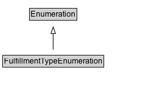

# FulfillmentTypeEnumeration

A type of product fulfillment.

## Diagram

=== "SVG (interactive)"

    <!-- Generated by graphviz version 14.1.3 (20260303.0454)
     -->
    <!-- Pages: 1 -->
    <svg width="250pt" height="132pt"
     viewBox="0.00 0.00 250.00 132.00" xmlns="http://www.w3.org/2000/svg" xmlns:xlink="http://www.w3.org/1999/xlink">
    <g id="graph0" class="graph" transform="scale(1 1) rotate(0) translate(4 128)">
    <polygon fill="white" stroke="none" points="-4,4 -4,-128 246,-128 246,4 -4,4"/>
    <g id="clust3" class="cluster">
    <title>cluster_associated</title>
    </g>
    <!-- Enumeration -->
    <g id="node1" class="node">
    <title>Enumeration</title>
    <g id="a_node1"><a xlink:href="../Enumeration" xlink:title="&lt;TABLE&gt;">
    <polygon fill="lightgray" stroke="none" points="41.88,-97.88 41.88,-114.12 112.12,-114.12 112.12,-97.88 41.88,-97.88"/>
    <text xml:space="preserve" text-anchor="start" x="42.88" y="-101.88" font-family="Arial" font-size="12.00">Enumeration</text>
    <polygon fill="none" stroke="black" points="40.88,-96.88 40.88,-115.12 113.12,-115.12 113.12,-96.88 40.88,-96.88"/>
    </a>
    </g>
    </g>
    <!-- FulfillmentTypeEnumeration -->
    <g id="node2" class="node">
    <title>FulfillmentTypeEnumeration</title>
    <g id="a_node2"><a xlink:href="../FulfillmentTypeEnumeration" xlink:title="&lt;TABLE&gt;">
    <polygon fill="lightgray" stroke="none" points="1,-25.88 1,-42.12 153,-42.12 153,-25.88 1,-25.88"/>
    <text xml:space="preserve" text-anchor="start" x="2" y="-29.88" font-family="Arial" font-size="12.00">FulfillmentTypeEnumeration</text>
    <polygon fill="none" stroke="black" points="0,-24.88 0,-43.12 154,-43.12 154,-24.88 0,-24.88"/>
    </a>
    </g>
    </g>
    <!-- FulfillmentTypeEnumeration&#45;&gt;Enumeration -->
    <g id="edge1" class="edge">
    <title>FulfillmentTypeEnumeration&#45;&gt;Enumeration</title>
    <path fill="none" stroke="black" d="M77,-51.79C77,-59.25 77,-68.24 77,-76.69"/>
    <polygon fill="none" stroke="black" points="73.5,-76.54 77,-86.54 80.5,-76.54 73.5,-76.54"/>
    </g>
    <!-- Invis -->
    </g>
    </svg>

=== "PNG"

    

## Formalization for FulfillmentTypeEnumeration

| Property | Constraint |
|----------|------------|
| subClassOf | [Enumeration](Enumeration.md) |

