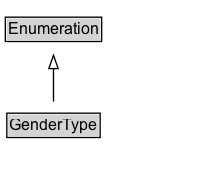

# GenderType

An enumeration of genders.

## Diagram

=== "SVG (interactive)"

    <!-- Generated by graphviz version 14.1.3 (20260303.0454)
     -->
    <!-- Pages: 1 -->
    <svg width="167pt" height="132pt"
     viewBox="0.00 0.00 167.00 132.00" xmlns="http://www.w3.org/2000/svg" xmlns:xlink="http://www.w3.org/1999/xlink">
    <g id="graph0" class="graph" transform="scale(1 1) rotate(0) translate(4 128)">
    <polygon fill="white" stroke="none" points="-4,4 -4,-128 163.12,-128 163.12,4 -4,4"/>
    <g id="clust3" class="cluster">
    <title>cluster_associated</title>
    </g>
    <!-- Enumeration -->
    <g id="node1" class="node">
    <title>Enumeration</title>
    <g id="a_node1"><a xlink:href="../Enumeration" xlink:title="&lt;TABLE&gt;">
    <polygon fill="lightgray" stroke="none" points="1,-97.88 1,-114.12 71.25,-114.12 71.25,-97.88 1,-97.88"/>
    <text xml:space="preserve" text-anchor="start" x="2" y="-101.88" font-family="Arial" font-size="12.00">Enumeration</text>
    <polygon fill="none" stroke="black" points="0,-96.88 0,-115.12 72.25,-115.12 72.25,-96.88 0,-96.88"/>
    </a>
    </g>
    </g>
    <!-- GenderType -->
    <g id="node2" class="node">
    <title>GenderType</title>
    <g id="a_node2"><a xlink:href="../GenderType" xlink:title="&lt;TABLE&gt;">
    <polygon fill="lightgray" stroke="none" points="2.12,-25.88 2.12,-42.12 70.12,-42.12 70.12,-25.88 2.12,-25.88"/>
    <text xml:space="preserve" text-anchor="start" x="3.12" y="-29.88" font-family="Arial" font-size="12.00">GenderType</text>
    <polygon fill="none" stroke="black" points="1.12,-24.88 1.12,-43.12 71.12,-43.12 71.12,-24.88 1.12,-24.88"/>
    </a>
    </g>
    </g>
    <!-- GenderType&#45;&gt;Enumeration -->
    <g id="edge1" class="edge">
    <title>GenderType&#45;&gt;Enumeration</title>
    <path fill="none" stroke="black" d="M36.12,-51.79C36.12,-59.25 36.12,-68.24 36.12,-76.69"/>
    <polygon fill="none" stroke="black" points="32.63,-76.54 36.13,-86.54 39.63,-76.54 32.63,-76.54"/>
    </g>
    <!-- Invis -->
    </g>
    </svg>

=== "PNG"

    

## Formalization for GenderType

| Property | Constraint |
|----------|------------|
| subClassOf | [Enumeration](Enumeration.md) |

