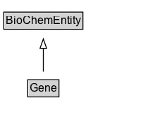

# Gene

A discrete unit of inheritance which affects one or more biological traits (Source: [https://en.wikipedia.org/wiki/Gene](https://en.wikipedia.org/wiki/Gene)). Examples include FOXP2 (Forkhead box protein P2), SCARNA21 (small Cajal body-specific RNA 21), A- (agouti genotype).

## Diagram

=== "SVG (interactive)"

    <!-- Generated by graphviz version 14.1.3 (20260303.0454)
     -->
    <!-- Pages: 1 -->
    <svg width="165pt" height="132pt"
     viewBox="0.00 0.00 165.00 132.00" xmlns="http://www.w3.org/2000/svg" xmlns:xlink="http://www.w3.org/1999/xlink">
    <g id="graph0" class="graph" transform="scale(1 1) rotate(0) translate(4 128)">
    <polygon fill="white" stroke="none" points="-4,4 -4,-128 161.12,-128 161.12,4 -4,4"/>
    <g id="clust3" class="cluster">
    <title>cluster_associated</title>
    </g>
    <!-- BioChemEntity -->
    <g id="node1" class="node">
    <title>BioChemEntity</title>
    <g id="a_node1"><a xlink:href="../BioChemEntity" xlink:title="&lt;TABLE&gt;">
    <polygon fill="lightgray" stroke="none" points="1,-97.88 1,-114.12 83.25,-114.12 83.25,-97.88 1,-97.88"/>
    <text xml:space="preserve" text-anchor="start" x="2" y="-101.88" font-family="Arial" font-size="12.00">BioChemEntity</text>
    <polygon fill="none" stroke="black" points="0,-96.88 0,-115.12 84.25,-115.12 84.25,-96.88 0,-96.88"/>
    </a>
    </g>
    </g>
    <!-- Gene -->
    <g id="node2" class="node">
    <title>Gene</title>
    <g id="a_node2"><a xlink:href="../Gene" xlink:title="&lt;TABLE&gt;">
    <polygon fill="lightgray" stroke="none" points="26.5,-25.88 26.5,-42.12 57.75,-42.12 57.75,-25.88 26.5,-25.88"/>
    <text xml:space="preserve" text-anchor="start" x="27.5" y="-29.88" font-family="Arial" font-size="12.00">Gene</text>
    <polygon fill="none" stroke="black" points="25.5,-24.88 25.5,-43.12 58.75,-43.12 58.75,-24.88 25.5,-24.88"/>
    </a>
    </g>
    </g>
    <!-- Gene&#45;&gt;BioChemEntity -->
    <g id="edge1" class="edge">
    <title>Gene&#45;&gt;BioChemEntity</title>
    <path fill="none" stroke="black" d="M42.12,-51.79C42.12,-59.25 42.12,-68.24 42.12,-76.69"/>
    <polygon fill="none" stroke="black" points="38.63,-76.54 42.13,-86.54 45.63,-76.54 38.63,-76.54"/>
    </g>
    <!-- Invis -->
    </g>
    </svg>

=== "PNG"

    

## Formalization for Gene

| Property | Constraint |
|----------|------------|
| subClassOf | [BioChemEntity](BioChemEntity.md) |

