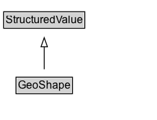

# GeoShape

The geographic shape of a place. A GeoShape can be described using several properties whose values are based on latitude/longitude pairs. Either whitespace or commas can be used to separate latitude and longitude; whitespace should be used when writing a list of several such points.

## Diagram

=== "SVG (interactive)"

    <!-- Generated by graphviz version 14.1.3 (20260303.0454)
     -->
    <!-- Pages: 1 -->
    <svg width="171pt" height="132pt"
     viewBox="0.00 0.00 171.00 132.00" xmlns="http://www.w3.org/2000/svg" xmlns:xlink="http://www.w3.org/1999/xlink">
    <g id="graph0" class="graph" transform="scale(1 1) rotate(0) translate(4 128)">
    <polygon fill="white" stroke="none" points="-4,4 -4,-128 167.38,-128 167.38,4 -4,4"/>
    <g id="clust3" class="cluster">
    <title>cluster_associated</title>
    </g>
    <!-- StructuredValue -->
    <g id="node1" class="node">
    <title>StructuredValue</title>
    <g id="a_node1"><a xlink:href="../StructuredValue" xlink:title="&lt;TABLE&gt;">
    <polygon fill="lightgray" stroke="none" points="1,-97.88 1,-114.12 87.75,-114.12 87.75,-97.88 1,-97.88"/>
    <text xml:space="preserve" text-anchor="start" x="2" y="-101.88" font-family="Arial" font-size="12.00">StructuredValue</text>
    <polygon fill="none" stroke="black" points="0,-96.88 0,-115.12 88.75,-115.12 88.75,-96.88 0,-96.88"/>
    </a>
    </g>
    </g>
    <!-- GeoShape -->
    <g id="node2" class="node">
    <title>GeoShape</title>
    <g id="a_node2"><a xlink:href="../GeoShape" xlink:title="&lt;TABLE&gt;">
    <polygon fill="lightgray" stroke="none" points="14.5,-25.88 14.5,-42.12 74.25,-42.12 74.25,-25.88 14.5,-25.88"/>
    <text xml:space="preserve" text-anchor="start" x="15.5" y="-29.88" font-family="Arial" font-size="12.00">GeoShape</text>
    <polygon fill="none" stroke="black" points="13.5,-24.88 13.5,-43.12 75.25,-43.12 75.25,-24.88 13.5,-24.88"/>
    </a>
    </g>
    </g>
    <!-- GeoShape&#45;&gt;StructuredValue -->
    <g id="edge1" class="edge">
    <title>GeoShape&#45;&gt;StructuredValue</title>
    <path fill="none" stroke="black" d="M44.38,-51.79C44.38,-59.25 44.38,-68.24 44.38,-76.69"/>
    <polygon fill="none" stroke="black" points="40.88,-76.54 44.38,-86.54 47.88,-76.54 40.88,-76.54"/>
    </g>
    <!-- Invis -->
    </g>
    </svg>

=== "PNG"

    

## Specializations of GeoShape

| Class | Description |
|-------|-------------|
| [Geo Circle](GeoCircle.md) | A GeoCircle is a GeoShape representing a circular geographic area. As it is a GeoShape
          it provides the simple textual property 'circle', but also allows the combination of postalCode alongside geoRadius.
          The center of the circle can be indicated via the 'geoMidpoint' property, or more approximately using 'address', 'postalCode'.
        |

## Formalization for GeoShape

| Property | Constraint |
|----------|------------|
| subClassOf | [StructuredValue](StructuredValue.md) |

