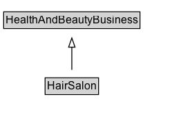

# HairSalon

A hair salon.

## Diagram

=== "SVG (interactive)"

    <!-- Generated by graphviz version 14.1.3 (20260303.0454)
     -->
    <!-- Pages: 1 -->
    <svg width="199pt" height="132pt"
     viewBox="0.00 0.00 199.00 132.00" xmlns="http://www.w3.org/2000/svg" xmlns:xlink="http://www.w3.org/1999/xlink">
    <g id="graph0" class="graph" transform="scale(1 1) rotate(0) translate(4 128)">
    <polygon fill="white" stroke="none" points="-4,4 -4,-128 195,-128 195,4 -4,4"/>
    <g id="clust3" class="cluster">
    <title>cluster_associated</title>
    </g>
    <!-- HealthAndBeautyBusiness -->
    <g id="node1" class="node">
    <title>HealthAndBeautyBusiness</title>
    <g id="a_node1"><a xlink:href="../HealthAndBeautyBusiness" xlink:title="&lt;TABLE&gt;">
    <polygon fill="lightgray" stroke="none" points="1,-97.88 1,-114.12 147,-114.12 147,-97.88 1,-97.88"/>
    <text xml:space="preserve" text-anchor="start" x="2" y="-101.88" font-family="Arial" font-size="12.00">HealthAndBeautyBusiness</text>
    <polygon fill="none" stroke="black" points="0,-96.88 0,-115.12 148,-115.12 148,-96.88 0,-96.88"/>
    </a>
    </g>
    </g>
    <!-- HairSalon -->
    <g id="node2" class="node">
    <title>HairSalon</title>
    <g id="a_node2"><a xlink:href="../HairSalon" xlink:title="&lt;TABLE&gt;">
    <polygon fill="lightgray" stroke="none" points="46,-25.88 46,-42.12 102,-42.12 102,-25.88 46,-25.88"/>
    <text xml:space="preserve" text-anchor="start" x="47" y="-29.88" font-family="Arial" font-size="12.00">HairSalon</text>
    <polygon fill="none" stroke="black" points="45,-24.88 45,-43.12 103,-43.12 103,-24.88 45,-24.88"/>
    </a>
    </g>
    </g>
    <!-- HairSalon&#45;&gt;HealthAndBeautyBusiness -->
    <g id="edge1" class="edge">
    <title>HairSalon&#45;&gt;HealthAndBeautyBusiness</title>
    <path fill="none" stroke="black" d="M74,-51.79C74,-59.25 74,-68.24 74,-76.69"/>
    <polygon fill="none" stroke="black" points="70.5,-76.54 74,-86.54 77.5,-76.54 70.5,-76.54"/>
    </g>
    <!-- Invis -->
    </g>
    </svg>

=== "PNG"

    

## Formalization for HairSalon

| Property | Constraint |
|----------|------------|
| subClassOf | [HealthAndBeautyBusiness](HealthAndBeautyBusiness.md) |

