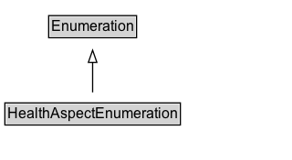

# HealthAspectEnumeration

HealthAspectEnumeration enumerates several aspects of health content online, each of which might be described using [[hasHealthAspect]] and [[HealthTopicContent]].

## Diagram

=== "SVG (interactive)"

    <!-- Generated by graphviz version 14.1.3 (20260303.0454)
     -->
    <!-- Pages: 1 -->
    <svg width="240pt" height="132pt"
     viewBox="0.00 0.00 240.00 132.00" xmlns="http://www.w3.org/2000/svg" xmlns:xlink="http://www.w3.org/1999/xlink">
    <g id="graph0" class="graph" transform="scale(1 1) rotate(0) translate(4 128)">
    <polygon fill="white" stroke="none" points="-4,4 -4,-128 236.12,-128 236.12,4 -4,4"/>
    <g id="clust3" class="cluster">
    <title>cluster_associated</title>
    </g>
    <!-- Enumeration -->
    <g id="node1" class="node">
    <title>Enumeration</title>
    <g id="a_node1"><a xlink:href="../Enumeration" xlink:title="&lt;TABLE&gt;">
    <polygon fill="lightgray" stroke="none" points="37,-97.88 37,-114.12 107.25,-114.12 107.25,-97.88 37,-97.88"/>
    <text xml:space="preserve" text-anchor="start" x="38" y="-101.88" font-family="Arial" font-size="12.00">Enumeration</text>
    <polygon fill="none" stroke="black" points="36,-96.88 36,-115.12 108.25,-115.12 108.25,-96.88 36,-96.88"/>
    </a>
    </g>
    </g>
    <!-- HealthAspectEnumeration -->
    <g id="node2" class="node">
    <title>HealthAspectEnumeration</title>
    <g id="a_node2"><a xlink:href="../HealthAspectEnumeration" xlink:title="&lt;TABLE&gt;">
    <polygon fill="lightgray" stroke="none" points="1,-25.88 1,-42.12 143.25,-42.12 143.25,-25.88 1,-25.88"/>
    <text xml:space="preserve" text-anchor="start" x="2" y="-29.88" font-family="Arial" font-size="12.00">HealthAspectEnumeration</text>
    <polygon fill="none" stroke="black" points="0,-24.88 0,-43.12 144.25,-43.12 144.25,-24.88 0,-24.88"/>
    </a>
    </g>
    </g>
    <!-- HealthAspectEnumeration&#45;&gt;Enumeration -->
    <g id="edge1" class="edge">
    <title>HealthAspectEnumeration&#45;&gt;Enumeration</title>
    <path fill="none" stroke="black" d="M72.12,-51.79C72.12,-59.25 72.12,-68.24 72.12,-76.69"/>
    <polygon fill="none" stroke="black" points="68.63,-76.54 72.13,-86.54 75.63,-76.54 68.63,-76.54"/>
    </g>
    <!-- Invis -->
    </g>
    </svg>

=== "PNG"

    

## Formalization for HealthAspectEnumeration

| Property | Constraint |
|----------|------------|
| subClassOf | [Enumeration](Enumeration.md) |

