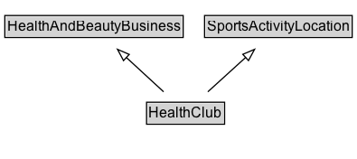

# HealthClub

A health club.

## Diagram

=== "SVG (interactive)"

    <!-- Generated by graphviz version 14.1.3 (20260303.0454)
     -->
    <!-- Pages: 1 -->
    <svg width="296pt" height="132pt"
     viewBox="0.00 0.00 296.00 132.00" xmlns="http://www.w3.org/2000/svg" xmlns:xlink="http://www.w3.org/1999/xlink">
    <g id="graph0" class="graph" transform="scale(1 1) rotate(0) translate(4 128)">
    <polygon fill="white" stroke="none" points="-4,4 -4,-128 292.25,-128 292.25,4 -4,4"/>
    <g id="clust3" class="cluster">
    <title>cluster_associated</title>
    </g>
    <!-- HealthAndBeautyBusiness -->
    <g id="node1" class="node">
    <title>HealthAndBeautyBusiness</title>
    <g id="a_node1"><a xlink:href="../HealthAndBeautyBusiness" xlink:title="&lt;TABLE&gt;">
    <polygon fill="lightgray" stroke="none" points="1,-97.88 1,-114.12 147,-114.12 147,-97.88 1,-97.88"/>
    <text xml:space="preserve" text-anchor="start" x="2" y="-101.88" font-family="Arial" font-size="12.00">HealthAndBeautyBusiness</text>
    <polygon fill="none" stroke="black" points="0,-96.88 0,-115.12 148,-115.12 148,-96.88 0,-96.88"/>
    </a>
    </g>
    </g>
    <!-- SportsActivityLocation -->
    <g id="node2" class="node">
    <title>SportsActivityLocation</title>
    <g id="a_node2"><a xlink:href="../SportsActivityLocation" xlink:title="&lt;TABLE&gt;">
    <polygon fill="lightgray" stroke="none" points="166.75,-97.88 166.75,-114.12 287.25,-114.12 287.25,-97.88 166.75,-97.88"/>
    <text xml:space="preserve" text-anchor="start" x="167.75" y="-101.88" font-family="Arial" font-size="12.00">SportsActivityLocation</text>
    <polygon fill="none" stroke="black" points="165.75,-96.88 165.75,-115.12 288.25,-115.12 288.25,-96.88 165.75,-96.88"/>
    </a>
    </g>
    </g>
    <!-- HealthClub -->
    <g id="node3" class="node">
    <title>HealthClub</title>
    <g id="a_node3"><a xlink:href="../HealthClub" xlink:title="&lt;TABLE&gt;">
    <polygon fill="lightgray" stroke="none" points="118.62,-25.88 118.62,-42.12 181.38,-42.12 181.38,-25.88 118.62,-25.88"/>
    <text xml:space="preserve" text-anchor="start" x="119.62" y="-29.88" font-family="Arial" font-size="12.00">HealthClub</text>
    <polygon fill="none" stroke="black" points="117.62,-24.88 117.62,-43.12 182.38,-43.12 182.38,-24.88 117.62,-24.88"/>
    </a>
    </g>
    </g>
    <!-- HealthClub&#45;&gt;HealthAndBeautyBusiness -->
    <g id="edge1" class="edge">
    <title>HealthClub&#45;&gt;HealthAndBeautyBusiness</title>
    <path fill="none" stroke="black" d="M131.77,-51.79C122.46,-60.36 110.96,-70.96 100.68,-80.43"/>
    <polygon fill="none" stroke="black" points="98.5,-77.68 93.51,-87.03 103.24,-82.83 98.5,-77.68"/>
    </g>
    <!-- HealthClub&#45;&gt;SportsActivityLocation -->
    <g id="edge2" class="edge">
    <title>HealthClub&#45;&gt;SportsActivityLocation</title>
    <path fill="none" stroke="black" d="M168.47,-51.79C177.9,-60.36 189.55,-70.96 199.97,-80.43"/>
    <polygon fill="none" stroke="black" points="197.49,-82.9 207.24,-87.04 202.2,-77.72 197.49,-82.9"/>
    </g>
    <!-- Invis -->
    </g>
    </svg>

=== "PNG"

    

## Formalization for HealthClub

| Property | Constraint |
|----------|------------|
| subClassOf | [HealthAndBeautyBusiness](HealthAndBeautyBusiness.md) |
| subClassOf | [SportsActivityLocation](SportsActivityLocation.md) |

