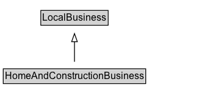

# HomeAndConstructionBusiness

A construction business.\n\nA HomeAndConstructionBusiness is a [[LocalBusiness]] that provides services around homes and buildings.\n\nAs a [[LocalBusiness]] it can be described as a [[provider]] of one or more [[Service]]\(s).

## Diagram

=== "SVG (interactive)"

    <!-- Generated by graphviz version 14.1.3 (20260303.0454)
     -->
    <!-- Pages: 1 -->
    <svg width="272pt" height="132pt"
     viewBox="0.00 0.00 272.00 132.00" xmlns="http://www.w3.org/2000/svg" xmlns:xlink="http://www.w3.org/1999/xlink">
    <g id="graph0" class="graph" transform="scale(1 1) rotate(0) translate(4 128)">
    <polygon fill="white" stroke="none" points="-4,4 -4,-128 267.5,-128 267.5,4 -4,4"/>
    <g id="clust3" class="cluster">
    <title>cluster_associated</title>
    </g>
    <!-- LocalBusiness -->
    <g id="node1" class="node">
    <title>LocalBusiness</title>
    <g id="a_node1"><a xlink:href="../LocalBusiness" xlink:title="&lt;TABLE&gt;">
    <polygon fill="lightgray" stroke="none" points="47.12,-97.88 47.12,-114.12 127.88,-114.12 127.88,-97.88 47.12,-97.88"/>
    <text xml:space="preserve" text-anchor="start" x="48.12" y="-101.88" font-family="Arial" font-size="12.00">LocalBusiness</text>
    <polygon fill="none" stroke="black" points="46.12,-96.88 46.12,-115.12 128.88,-115.12 128.88,-96.88 46.12,-96.88"/>
    </a>
    </g>
    </g>
    <!-- HomeAndConstructionBusiness -->
    <g id="node2" class="node">
    <title>HomeAndConstructionBusiness</title>
    <g id="a_node2"><a xlink:href="../HomeAndConstructionBusiness" xlink:title="&lt;TABLE&gt;">
    <polygon fill="lightgray" stroke="none" points="1,-25.88 1,-42.12 174,-42.12 174,-25.88 1,-25.88"/>
    <text xml:space="preserve" text-anchor="start" x="2" y="-29.88" font-family="Arial" font-size="12.00">HomeAndConstructionBusiness</text>
    <polygon fill="none" stroke="black" points="0,-24.88 0,-43.12 175,-43.12 175,-24.88 0,-24.88"/>
    </a>
    </g>
    </g>
    <!-- HomeAndConstructionBusiness&#45;&gt;LocalBusiness -->
    <g id="edge1" class="edge">
    <title>HomeAndConstructionBusiness&#45;&gt;LocalBusiness</title>
    <path fill="none" stroke="black" d="M87.5,-51.79C87.5,-59.25 87.5,-68.24 87.5,-76.69"/>
    <polygon fill="none" stroke="black" points="84,-76.54 87.5,-86.54 91,-76.54 84,-76.54"/>
    </g>
    <!-- Invis -->
    </g>
    </svg>

=== "PNG"

    

## Specializations of HomeAndConstructionBusiness

| Class | Description |
|-------|-------------|
| [Electrician](Electrician.md) | An electrician. |
| [General Contractor](GeneralContractor.md) | A general contractor. |
| [House Painter](HousePainter.md) | A house painting service. |
| [Hvac Business](HVACBusiness.md) | A business that provides Heating, Ventilation and Air Conditioning services. |
| [Locksmith](Locksmith.md) | A locksmith. |
| [Moving Company](MovingCompany.md) | A moving company. |
| [Plumber](Plumber.md) | A plumbing service. |
| [Roofing Contractor](RoofingContractor.md) | A roofing contractor. |

## Formalization for HomeAndConstructionBusiness

| Property | Constraint |
|----------|------------|
| subClassOf | [LocalBusiness](LocalBusiness.md) |

