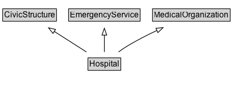

# Hospital

A hospital.

## Diagram

=== "SVG (interactive)"

    <!-- Generated by graphviz version 14.1.3 (20260303.0454)
     -->
    <!-- Pages: 1 -->
    <svg width="343pt" height="132pt"
     viewBox="0.00 0.00 343.00 132.00" xmlns="http://www.w3.org/2000/svg" xmlns:xlink="http://www.w3.org/1999/xlink">
    <g id="graph0" class="graph" transform="scale(1 1) rotate(0) translate(4 128)">
    <polygon fill="white" stroke="none" points="-4,4 -4,-128 338.62,-128 338.62,4 -4,4"/>
    <g id="clust3" class="cluster">
    <title>cluster_associated</title>
    </g>
    <!-- CivicStructure -->
    <g id="node1" class="node">
    <title>CivicStructure</title>
    <g id="a_node1"><a xlink:href="../CivicStructure" xlink:title="&lt;TABLE&gt;">
    <polygon fill="lightgray" stroke="none" points="1,-97.88 1,-114.12 78,-114.12 78,-97.88 1,-97.88"/>
    <text xml:space="preserve" text-anchor="start" x="2" y="-101.88" font-family="Arial" font-size="12.00">CivicStructure</text>
    <polygon fill="none" stroke="black" points="0,-96.88 0,-115.12 79,-115.12 79,-96.88 0,-96.88"/>
    </a>
    </g>
    </g>
    <!-- EmergencyService -->
    <g id="node2" class="node">
    <title>EmergencyService</title>
    <g id="a_node2"><a xlink:href="../EmergencyService" xlink:title="&lt;TABLE&gt;">
    <polygon fill="lightgray" stroke="none" points="97.88,-97.88 97.88,-114.12 201.12,-114.12 201.12,-97.88 97.88,-97.88"/>
    <text xml:space="preserve" text-anchor="start" x="98.88" y="-101.88" font-family="Arial" font-size="12.00">EmergencyService</text>
    <polygon fill="none" stroke="black" points="96.88,-96.88 96.88,-115.12 202.12,-115.12 202.12,-96.88 96.88,-96.88"/>
    </a>
    </g>
    </g>
    <!-- MedicalOrganization -->
    <g id="node3" class="node">
    <title>MedicalOrganization</title>
    <g id="a_node3"><a xlink:href="../MedicalOrganization" xlink:title="&lt;TABLE&gt;">
    <polygon fill="lightgray" stroke="none" points="221.38,-97.88 221.38,-114.12 333.62,-114.12 333.62,-97.88 221.38,-97.88"/>
    <text xml:space="preserve" text-anchor="start" x="222.38" y="-101.88" font-family="Arial" font-size="12.00">MedicalOrganization</text>
    <polygon fill="none" stroke="black" points="220.38,-96.88 220.38,-115.12 334.62,-115.12 334.62,-96.88 220.38,-96.88"/>
    </a>
    </g>
    </g>
    <!-- Hospital -->
    <g id="node4" class="node">
    <title>Hospital</title>
    <g id="a_node4"><a xlink:href="../Hospital" xlink:title="&lt;TABLE&gt;">
    <polygon fill="lightgray" stroke="none" points="126.38,-25.88 126.38,-42.12 172.62,-42.12 172.62,-25.88 126.38,-25.88"/>
    <text xml:space="preserve" text-anchor="start" x="127.38" y="-29.88" font-family="Arial" font-size="12.00">Hospital</text>
    <polygon fill="none" stroke="black" points="125.38,-24.88 125.38,-43.12 173.62,-43.12 173.62,-24.88 125.38,-24.88"/>
    </a>
    </g>
    </g>
    <!-- Hospital&#45;&gt;CivicStructure -->
    <g id="edge1" class="edge">
    <title>Hospital&#45;&gt;CivicStructure</title>
    <path fill="none" stroke="black" d="M123.12,-51.79C108.84,-60.88 90.99,-72.24 75.45,-82.12"/>
    <polygon fill="none" stroke="black" points="73.96,-78.92 67.4,-87.24 77.72,-84.83 73.96,-78.92"/>
    </g>
    <!-- Hospital&#45;&gt;EmergencyService -->
    <g id="edge2" class="edge">
    <title>Hospital&#45;&gt;EmergencyService</title>
    <path fill="none" stroke="black" d="M149.5,-51.79C149.5,-59.25 149.5,-68.24 149.5,-76.69"/>
    <polygon fill="none" stroke="black" points="146,-76.54 149.5,-86.54 153,-76.54 146,-76.54"/>
    </g>
    <!-- Hospital&#45;&gt;MedicalOrganization -->
    <g id="edge3" class="edge">
    <title>Hospital&#45;&gt;MedicalOrganization</title>
    <path fill="none" stroke="black" d="M170.35,-51.81C174.29,-54.69 178.44,-57.54 182.5,-60 196.44,-68.46 212.21,-76.49 226.85,-83.37"/>
    <polygon fill="none" stroke="black" points="225.34,-86.52 235.89,-87.52 228.27,-80.16 225.34,-86.52"/>
    </g>
    <!-- Invis -->
    </g>
    </svg>

=== "PNG"

    

## Formalization for Hospital

| Property | Constraint |
|----------|------------|
| subClassOf | [CivicStructure](CivicStructure.md) |
| subClassOf | [EmergencyService](EmergencyService.md) |
| subClassOf | [MedicalOrganization](MedicalOrganization.md) |

