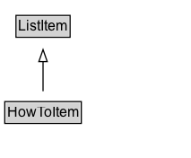

# HowToItem

An item used as either a tool or supply when performing the instructions for how to achieve a result.

## Diagram

=== "SVG (interactive)"

    <!-- Generated by graphviz version 14.1.3 (20260303.0454)
     -->
    <!-- Pages: 1 -->
    <svg width="160pt" height="132pt"
     viewBox="0.00 0.00 160.00 132.00" xmlns="http://www.w3.org/2000/svg" xmlns:xlink="http://www.w3.org/1999/xlink">
    <g id="graph0" class="graph" transform="scale(1 1) rotate(0) translate(4 128)">
    <polygon fill="white" stroke="none" points="-4,4 -4,-128 156,-128 156,4 -4,4"/>
    <g id="clust3" class="cluster">
    <title>cluster_associated</title>
    </g>
    <!-- ListItem -->
    <g id="node1" class="node">
    <title>ListItem</title>
    <g id="a_node1"><a xlink:href="../ListItem" xlink:title="&lt;TABLE&gt;">
    <polygon fill="lightgray" stroke="none" points="10.38,-97.88 10.38,-114.12 53.62,-114.12 53.62,-97.88 10.38,-97.88"/>
    <text xml:space="preserve" text-anchor="start" x="11.38" y="-101.88" font-family="Arial" font-size="12.00">ListItem</text>
    <polygon fill="none" stroke="black" points="9.38,-96.88 9.38,-115.12 54.62,-115.12 54.62,-96.88 9.38,-96.88"/>
    </a>
    </g>
    </g>
    <!-- HowToItem -->
    <g id="node2" class="node">
    <title>HowToItem</title>
    <g id="a_node2"><a xlink:href="../HowToItem" xlink:title="&lt;TABLE&gt;">
    <polygon fill="lightgray" stroke="none" points="1,-25.88 1,-42.12 63,-42.12 63,-25.88 1,-25.88"/>
    <text xml:space="preserve" text-anchor="start" x="2" y="-29.88" font-family="Arial" font-size="12.00">HowToItem</text>
    <polygon fill="none" stroke="black" points="0,-24.88 0,-43.12 64,-43.12 64,-24.88 0,-24.88"/>
    </a>
    </g>
    </g>
    <!-- HowToItem&#45;&gt;ListItem -->
    <g id="edge1" class="edge">
    <title>HowToItem&#45;&gt;ListItem</title>
    <path fill="none" stroke="black" d="M32,-51.79C32,-59.25 32,-68.24 32,-76.69"/>
    <polygon fill="none" stroke="black" points="28.5,-76.54 32,-86.54 35.5,-76.54 28.5,-76.54"/>
    </g>
    <!-- Invis -->
    </g>
    </svg>

=== "PNG"

    

## Specializations of HowToItem

| Class | Description |
|-------|-------------|
| [How To Supply](HowToSupply.md) | A supply consumed when performing the instructions for how to achieve a result. |
| [How To Tool](HowToTool.md) | A tool used (but not consumed) when performing instructions for how to achieve a result. |

## Formalization for HowToItem

| Property | Constraint |
|----------|------------|
| subClassOf | [ListItem](ListItem.md) |

