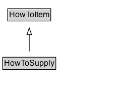

# HowToSupply

A supply consumed when performing the instructions for how to achieve a result.

## Diagram

=== "SVG (interactive)"

    <!-- Generated by graphviz version 14.1.3 (20260303.0454)
     -->
    <!-- Pages: 1 -->
    <svg width="176pt" height="132pt"
     viewBox="0.00 0.00 176.00 132.00" xmlns="http://www.w3.org/2000/svg" xmlns:xlink="http://www.w3.org/1999/xlink">
    <g id="graph0" class="graph" transform="scale(1 1) rotate(0) translate(4 128)">
    <polygon fill="white" stroke="none" points="-4,4 -4,-128 171.5,-128 171.5,4 -4,4"/>
    <g id="clust3" class="cluster">
    <title>cluster_associated</title>
    </g>
    <!-- HowToItem -->
    <g id="node1" class="node">
    <title>HowToItem</title>
    <g id="a_node1"><a xlink:href="../HowToItem" xlink:title="&lt;TABLE&gt;">
    <polygon fill="lightgray" stroke="none" points="8.5,-97.88 8.5,-114.12 70.5,-114.12 70.5,-97.88 8.5,-97.88"/>
    <text xml:space="preserve" text-anchor="start" x="9.5" y="-101.88" font-family="Arial" font-size="12.00">HowToItem</text>
    <polygon fill="none" stroke="black" points="7.5,-96.88 7.5,-115.12 71.5,-115.12 71.5,-96.88 7.5,-96.88"/>
    </a>
    </g>
    </g>
    <!-- HowToSupply -->
    <g id="node2" class="node">
    <title>HowToSupply</title>
    <g id="a_node2"><a xlink:href="../HowToSupply" xlink:title="&lt;TABLE&gt;">
    <polygon fill="lightgray" stroke="none" points="1,-25.88 1,-42.12 78,-42.12 78,-25.88 1,-25.88"/>
    <text xml:space="preserve" text-anchor="start" x="2" y="-29.88" font-family="Arial" font-size="12.00">HowToSupply</text>
    <polygon fill="none" stroke="black" points="0,-24.88 0,-43.12 79,-43.12 79,-24.88 0,-24.88"/>
    </a>
    </g>
    </g>
    <!-- HowToSupply&#45;&gt;HowToItem -->
    <g id="edge1" class="edge">
    <title>HowToSupply&#45;&gt;HowToItem</title>
    <path fill="none" stroke="black" d="M39.5,-51.79C39.5,-59.25 39.5,-68.24 39.5,-76.69"/>
    <polygon fill="none" stroke="black" points="36,-76.54 39.5,-86.54 43,-76.54 36,-76.54"/>
    </g>
    <!-- Invis -->
    </g>
    </svg>

=== "PNG"

    

## Formalization for HowToSupply

| Property | Constraint |
|----------|------------|
| subClassOf | [HowToItem](HowToItem.md) |

