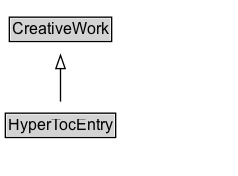

# HyperTocEntry

A HyperToEntry is an item within a [[HyperToc]], which represents a hypertext table of contents for complex media objects, such as [[VideoObject]], [[AudioObject]]. The media object itself is indicated using [[associatedMedia]]. Each section of interest within that content can be described with a [[HyperTocEntry]], with associated [[startOffset]] and [[endOffset]]. When several entries are all from the same file, [[associatedMedia]] is used on the overarching [[HyperTocEntry]]; if the content has been split into multiple files, they can be referenced using [[associatedMedia]] on each [[HyperTocEntry]].

## Diagram

=== "SVG (interactive)"

    <!-- Generated by graphviz version 14.1.3 (20260303.0454)
     -->
    <!-- Pages: 1 -->
    <svg width="178pt" height="132pt"
     viewBox="0.00 0.00 178.00 132.00" xmlns="http://www.w3.org/2000/svg" xmlns:xlink="http://www.w3.org/1999/xlink">
    <g id="graph0" class="graph" transform="scale(1 1) rotate(0) translate(4 128)">
    <polygon fill="white" stroke="none" points="-4,4 -4,-128 174.38,-128 174.38,4 -4,4"/>
    <g id="clust3" class="cluster">
    <title>cluster_associated</title>
    </g>
    <!-- CreativeWork -->
    <g id="node1" class="node">
    <title>CreativeWork</title>
    <g id="a_node1"><a xlink:href="../CreativeWork" xlink:title="&lt;TABLE&gt;">
    <polygon fill="lightgray" stroke="none" points="4,-97.88 4,-114.12 78.75,-114.12 78.75,-97.88 4,-97.88"/>
    <text xml:space="preserve" text-anchor="start" x="5" y="-101.88" font-family="Arial" font-size="12.00">CreativeWork</text>
    <polygon fill="none" stroke="black" points="3,-96.88 3,-115.12 79.75,-115.12 79.75,-96.88 3,-96.88"/>
    </a>
    </g>
    </g>
    <!-- HyperTocEntry -->
    <g id="node2" class="node">
    <title>HyperTocEntry</title>
    <g id="a_node2"><a xlink:href="../HyperTocEntry" xlink:title="&lt;TABLE&gt;">
    <polygon fill="lightgray" stroke="none" points="1,-25.88 1,-42.12 81.75,-42.12 81.75,-25.88 1,-25.88"/>
    <text xml:space="preserve" text-anchor="start" x="2" y="-29.88" font-family="Arial" font-size="12.00">HyperTocEntry</text>
    <polygon fill="none" stroke="black" points="0,-24.88 0,-43.12 82.75,-43.12 82.75,-24.88 0,-24.88"/>
    </a>
    </g>
    </g>
    <!-- HyperTocEntry&#45;&gt;CreativeWork -->
    <g id="edge1" class="edge">
    <title>HyperTocEntry&#45;&gt;CreativeWork</title>
    <path fill="none" stroke="black" d="M41.38,-51.79C41.38,-59.25 41.38,-68.24 41.38,-76.69"/>
    <polygon fill="none" stroke="black" points="37.88,-76.54 41.38,-86.54 44.88,-76.54 37.88,-76.54"/>
    </g>
    <!-- Invis -->
    </g>
    </svg>

=== "PNG"

    

## Formalization for HyperTocEntry

| Property | Constraint |
|----------|------------|
| subClassOf | [CreativeWork](CreativeWork.md) |

