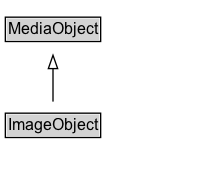

# ImageObject

An image file.

## Diagram

=== "SVG (interactive)"

    <!-- Generated by graphviz version 14.1.3 (20260303.0454)
     -->
    <!-- Pages: 1 -->
    <svg width="168pt" height="132pt"
     viewBox="0.00 0.00 168.00 132.00" xmlns="http://www.w3.org/2000/svg" xmlns:xlink="http://www.w3.org/1999/xlink">
    <g id="graph0" class="graph" transform="scale(1 1) rotate(0) translate(4 128)">
    <polygon fill="white" stroke="none" points="-4,4 -4,-128 163.75,-128 163.75,4 -4,4"/>
    <g id="clust3" class="cluster">
    <title>cluster_associated</title>
    </g>
    <!-- MediaObject -->
    <g id="node1" class="node">
    <title>MediaObject</title>
    <g id="a_node1"><a xlink:href="../MediaObject" xlink:title="&lt;TABLE&gt;">
    <polygon fill="lightgray" stroke="none" points="1,-97.88 1,-114.12 70.5,-114.12 70.5,-97.88 1,-97.88"/>
    <text xml:space="preserve" text-anchor="start" x="2" y="-101.88" font-family="Arial" font-size="12.00">MediaObject</text>
    <polygon fill="none" stroke="black" points="0,-96.88 0,-115.12 71.5,-115.12 71.5,-96.88 0,-96.88"/>
    </a>
    </g>
    </g>
    <!-- ImageObject -->
    <g id="node2" class="node">
    <title>ImageObject</title>
    <g id="a_node2"><a xlink:href="../ImageObject" xlink:title="&lt;TABLE&gt;">
    <polygon fill="lightgray" stroke="none" points="1,-25.88 1,-42.12 70.5,-42.12 70.5,-25.88 1,-25.88"/>
    <text xml:space="preserve" text-anchor="start" x="2" y="-29.88" font-family="Arial" font-size="12.00">ImageObject</text>
    <polygon fill="none" stroke="black" points="0,-24.88 0,-43.12 71.5,-43.12 71.5,-24.88 0,-24.88"/>
    </a>
    </g>
    </g>
    <!-- ImageObject&#45;&gt;MediaObject -->
    <g id="edge1" class="edge">
    <title>ImageObject&#45;&gt;MediaObject</title>
    <path fill="none" stroke="black" d="M35.75,-51.79C35.75,-59.25 35.75,-68.24 35.75,-76.69"/>
    <polygon fill="none" stroke="black" points="32.25,-76.54 35.75,-86.54 39.25,-76.54 32.25,-76.54"/>
    </g>
    <!-- Invis -->
    </g>
    </svg>

=== "PNG"

    

## Specializations of ImageObject

| Class | Description |
|-------|-------------|
| [Barcode](Barcode.md) | An image of a visual machine-readable code such as a barcode or QR code. |
| [Image Object Snapshot](ImageObjectSnapshot.md) | A specific and exact (byte-for-byte) version of an [[ImageObject]]. Two byte-for-byte identical files, for the purposes of this type, considered identical. If they have different embedded metadata (e.g. XMP, EXIF) the files will differ. Different external facts about the files, e.g. creator or dateCreated that aren't represented in their actual content, do not affect this notion of identity. |

## Formalization for ImageObject

| Property | Constraint |
|----------|------------|
| subClassOf | [MediaObject](MediaObject.md) |

