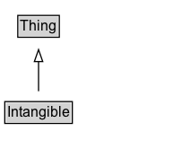

# Intangible

A utility class that serves as the umbrella for a number of 'intangible' things such as quantities, structured values, etc.

## Diagram

=== "SVG (interactive)"

    <!-- Generated by graphviz version 14.1.3 (20260303.0454)
     -->
    <!-- Pages: 1 -->
    <svg width="152pt" height="132pt"
     viewBox="0.00 0.00 152.00 132.00" xmlns="http://www.w3.org/2000/svg" xmlns:xlink="http://www.w3.org/1999/xlink">
    <g id="graph0" class="graph" transform="scale(1 1) rotate(0) translate(4 128)">
    <polygon fill="white" stroke="none" points="-4,4 -4,-128 148.25,-128 148.25,4 -4,4"/>
    <g id="clust3" class="cluster">
    <title>cluster_associated</title>
    </g>
    <!-- Thing -->
    <g id="node1" class="node">
    <title>Thing</title>
    <g id="a_node1"><a xlink:href="../Thing" xlink:title="&lt;TABLE&gt;">
    <polygon fill="lightgray" stroke="none" points="11.88,-97.88 11.88,-114.12 44.62,-114.12 44.62,-97.88 11.88,-97.88"/>
    <text xml:space="preserve" text-anchor="start" x="12.88" y="-101.88" font-family="Arial" font-size="12.00">Thing</text>
    <polygon fill="none" stroke="black" points="10.88,-96.88 10.88,-115.12 45.62,-115.12 45.62,-96.88 10.88,-96.88"/>
    </a>
    </g>
    </g>
    <!-- Intangible -->
    <g id="node2" class="node">
    <title>Intangible</title>
    <g id="a_node2"><a xlink:href="../Intangible" xlink:title="&lt;TABLE&gt;">
    <polygon fill="lightgray" stroke="none" points="1,-25.88 1,-42.12 55.5,-42.12 55.5,-25.88 1,-25.88"/>
    <text xml:space="preserve" text-anchor="start" x="2" y="-29.88" font-family="Arial" font-size="12.00">Intangible</text>
    <polygon fill="none" stroke="black" points="0,-24.88 0,-43.12 56.5,-43.12 56.5,-24.88 0,-24.88"/>
    </a>
    </g>
    </g>
    <!-- Intangible&#45;&gt;Thing -->
    <g id="edge1" class="edge">
    <title>Intangible&#45;&gt;Thing</title>
    <path fill="none" stroke="black" d="M28.25,-51.79C28.25,-59.25 28.25,-68.24 28.25,-76.69"/>
    <polygon fill="none" stroke="black" points="24.75,-76.54 28.25,-86.54 31.75,-76.54 24.75,-76.54"/>
    </g>
    <!-- Invis -->
    </g>
    </svg>

=== "PNG"

    

## Specializations of Intangible

| Class | Description |
|-------|-------------|
| [Action Access Specification](ActionAccessSpecification.md) | A set of requirements that must be fulfilled in order to perform an Action. |
| [Action Status Type](ActionStatusType.md) | The status of an Action. |
| [Adult Oriented Enumeration](AdultOrientedEnumeration.md) | Enumeration of considerations that make a product relevant or potentially restricted for adults only. |
| [Aggregate Offer](AggregateOffer.md) | When a single product is associated with multiple offers (for example, the same pair of shoes is offered by different merchants), then AggregateOffer can be used.\n\nNote: AggregateOffers are normally expected to associate multiple offers that all share the same defined [[businessFunction]] value, or default to http://purl.org/goodrelations/v1#Sell if businessFunction is not explicitly defined. |
| [Aggregate Rating](AggregateRating.md) | The average rating based on multiple ratings or reviews. |
| [Alignment Object](AlignmentObject.md) | An intangible item that describes an alignment between a learning resource and a node in an educational framework.
Should not be used where the nature of the alignment can be described using a simple property, for example to express that a resource [[teaches]] or [[assesses]] a competency. |
| [Am Radio Channel](AMRadioChannel.md) | A radio channel that uses AM. |
| [Audience](Audience.md) | Intended audience for an item, i.e. the group for whom the item was created. |
| [Bank Account](BankAccount.md) | A product or service offered by a bank whereby one may deposit, withdraw or transfer money and in some cases be paid interest. |
| [Bed Details](BedDetails.md) | An entity holding detailed information about the available bed types, e.g. the quantity of twin beds for a hotel room. For the single case of just one bed of a certain type, you can use bed directly with a text. See also [[BedType]] (under development). |
| [Bed Type](BedType.md) | A type of bed. This is used for indicating the bed or beds available in an accommodation. |
| [Boarding Policy Type](BoardingPolicyType.md) | A type of boarding policy used by an airline. |
| [Boat Reservation](BoatReservation.md) | A reservation for boat travel.

Note: This type is for information about actual reservations, e.g. in confirmation emails or HTML pages with individual confirmations of reservations. For offers of tickets, use [[Offer]]. |
| [Boat Trip](BoatTrip.md) | A trip on a commercial ferry line. |
| [Body Measurement Type Enumeration](BodyMeasurementTypeEnumeration.md) | Enumerates types (or dimensions) of a person's body measurements, for example for fitting of clothes. |
| [Book Format Type](BookFormatType.md) | The publication format of the book. |
| [Book Series](BookSeries.md) | A series of books. Included books can be indicated with the hasPart property. |
| [Brand](Brand.md) | A brand is a name used by an organization or business person for labeling a product, product group, or similar. |
| [Breadcrumb List](BreadcrumbList.md) | A BreadcrumbList is an ItemList consisting of a chain of linked Web pages, typically described using at least their URL and their name, and typically ending with the current page.\n\nThe [[position]] property is used to reconstruct the order of the items in a BreadcrumbList. The convention is that a breadcrumb list has an [[itemListOrder]] of [[ItemListOrderAscending]] (lower values listed first), and that the first items in this list correspond to the "top" or beginning of the breadcrumb trail, e.g. with a site or section homepage. The specific values of 'position' are not assigned meaning for a BreadcrumbList, but they should be integers, e.g. beginning with '1' for the first item in the list.
       |
| [Broadcast Channel](BroadcastChannel.md) | A unique instance of a BroadcastService on a CableOrSatelliteService lineup. |
| [Broadcast Frequency Specification](BroadcastFrequencySpecification.md) | The frequency in MHz and the modulation used for a particular BroadcastService. |
| [Broadcast Service](BroadcastService.md) | A delivery service through which content is provided via broadcast over the air or online. |
| [Brokerage Account](BrokerageAccount.md) | An account that allows an investor to deposit funds and place investment orders with a licensed broker or brokerage firm. |
| [Business Audience](BusinessAudience.md) | A set of characteristics belonging to businesses, e.g. who compose an item's target audience. |
| [Business Entity Type](BusinessEntityType.md) | A business entity type is a conceptual entity representing the legal form, the size, the main line of business, the position in the value chain, or any combination thereof, of an organization or business person.\n\nCommonly used values:\n\n* http://purl.org/goodrelations/v1#Business\n* http://purl.org/goodrelations/v1#Enduser\n* http://purl.org/goodrelations/v1#PublicInstitution\n* http://purl.org/goodrelations/v1#Reseller
     |
| [Business Function](BusinessFunction.md) | The business function specifies the type of activity or access (i.e., the bundle of rights) offered by the organization or business person through the offer. Typical are sell, rental or lease, maintenance or repair, manufacture / produce, recycle / dispose, engineering / construction, or installation. Proprietary specifications of access rights are also instances of this class.\n\nCommonly used values:\n\n* http://purl.org/goodrelations/v1#ConstructionInstallation\n* http://purl.org/goodrelations/v1#Dispose\n* http://purl.org/goodrelations/v1#LeaseOut\n* http://purl.org/goodrelations/v1#Maintain\n* http://purl.org/goodrelations/v1#ProvideService\n* http://purl.org/goodrelations/v1#Repair\n* http://purl.org/goodrelations/v1#Sell\n* http://purl.org/goodrelations/v1#Buy
         |
| [Bus Reservation](BusReservation.md) | A reservation for bus travel. \n\nNote: This type is for information about actual reservations, e.g. in confirmation emails or HTML pages with individual confirmations of reservations. For offers of tickets, use [[Offer]]. |
| [Bus Trip](BusTrip.md) | A trip on a commercial bus line. |
| [Cable Or Satellite Service](CableOrSatelliteService.md) | A service which provides access to media programming like TV or radio. Access may be via cable or satellite. |
| [Car Usage Type](CarUsageType.md) | A value indicating a special usage of a car, e.g. commercial rental, driving school, or as a taxi. |
| [Category Code](CategoryCode.md) | A Category Code. |
| [Cdcpmd Record](CDCPMDRecord.md) | A CDCPMDRecord is a data structure representing a record in a CDC tabular data format
      used for hospital data reporting. See [documentation](/docs/cdc-covid.html) for details, and the linked CDC materials for authoritative
      definitions used as the source here.
       |
| [Certification Status Enumeration](CertificationStatusEnumeration.md) | Enumerates the different statuses of a Certification (Active and Inactive). |
| [Class](Class.md) | A class, also often called a 'Type'; equivalent to rdfs:Class. |
| [Comic Series](ComicSeries.md) | A sequential publication of comic stories under a
    	unifying title, for example "The Amazing Spider-Man" or "Groo the
    	Wanderer". |
| [Compound Price Specification](CompoundPriceSpecification.md) | A compound price specification is one that bundles multiple prices that all apply in combination for different dimensions of consumption. Use the name property of the attached unit price specification for indicating the dimension of a price component (e.g. "electricity" or "final cleaning"). |
| [Computer Language](ComputerLanguage.md) | This type covers computer programming languages such as Scheme and Lisp, as well as other language-like computer representations. Natural languages are best represented with the [[Language]] type. |
| [Constraint Node](ConstraintNode.md) | The ConstraintNode type is provided to support usecases in which a node in a structured data graph is described with properties which appear to describe a single entity, but are being used in a situation where they serve a more abstract purpose. A [[ConstraintNode]] can be described using [[constraintProperty]] and [[numConstraints]]. These constraint properties can serve a
    variety of purposes, and their values may sometimes be understood to indicate sets of possible values rather than single, exact and specific values. |
| [Contact Point](ContactPoint.md) | A contact point&#x2014;for example, a Customer Complaints department. |
| [Contact Point Option](ContactPointOption.md) | Enumerated options related to a ContactPoint. |
| [Creative Work Series](CreativeWorkSeries.md) | A CreativeWorkSeries in schema.org is a group of related items, typically but not necessarily of the same kind. CreativeWorkSeries are usually organized into some order, often chronological. Unlike [[ItemList]] which is a general purpose data structure for lists of things, the emphasis with CreativeWorkSeries is on published materials (written e.g. books and periodicals, or media such as TV, radio and games).\n\nSpecific subtypes are available for describing [[TVSeries]], [[RadioSeries]], [[MovieSeries]], [[BookSeries]], [[Periodical]] and [[VideoGameSeries]]. In each case, the [[hasPart]] / [[isPartOf]] properties can be used to relate the CreativeWorkSeries to its parts. The general CreativeWorkSeries type serves largely just to organize these more specific and practical subtypes.\n\nIt is common for properties applicable to an item from the series to be usefully applied to the containing group. Schema.org attempts to anticipate some of these cases, but publishers should be free to apply properties of the series parts to the series as a whole wherever they seem appropriate.
     |
| [Credit Card](CreditCard.md) | A card payment method of a particular brand or name.  Used to mark up a particular payment method and/or the financial product/service that supplies the card account.\n\nCommonly used values:\n\n* http://purl.org/goodrelations/v1#AmericanExpress\n* http://purl.org/goodrelations/v1#DinersClub\n* http://purl.org/goodrelations/v1#Discover\n* http://purl.org/goodrelations/v1#JCB\n* http://purl.org/goodrelations/v1#MasterCard\n* http://purl.org/goodrelations/v1#VISA
        |
| [Credit Card](CreditCard.md) | A card payment method of a particular brand or name.  Used to mark up a particular payment method and/or the financial product/service that supplies the card account.\n\nCommonly used values:\n\n* http://purl.org/goodrelations/v1#AmericanExpress\n* http://purl.org/goodrelations/v1#DinersClub\n* http://purl.org/goodrelations/v1#Discover\n* http://purl.org/goodrelations/v1#JCB\n* http://purl.org/goodrelations/v1#MasterCard\n* http://purl.org/goodrelations/v1#VISA
        |
| [Currency Conversion Service](CurrencyConversionService.md) | A service to convert funds from one currency to another currency. |
| [Data Feed Item](DataFeedItem.md) | A single item within a larger data feed. |
| [Dated Money Specification](DatedMoneySpecification.md) | A DatedMoneySpecification represents monetary values with optional start and end dates. For example, this could represent an employee's salary over a specific period of time. __Note:__ This type has been superseded by [[MonetaryAmount]], use of that type is recommended. |
| [Day Of Week](DayOfWeek.md) | The day of the week, e.g. used to specify to which day the opening hours of an OpeningHoursSpecification refer.

Originally, URLs from [GoodRelations](http://purl.org/goodrelations/v1) were used (for [[Monday]], [[Tuesday]], [[Wednesday]], [[Thursday]], [[Friday]], [[Saturday]], [[Sunday]] plus a special entry for [[PublicHolidays]]); these have now been integrated directly into schema.org.
       |
| [Defined Region](DefinedRegion.md) | A DefinedRegion is a geographic area defined by potentially arbitrary (rather than political, administrative or natural geographical) criteria. Properties are provided for defining a region by reference to sets of postal codes.

Examples: a delivery destination when shopping. Region where regional pricing is configured.

Requirement 1:
Country: US
States: "NY", "CA"

Requirement 2:
Country: US
PostalCode Set: { [94000-94585], [97000, 97999], [13000, 13599]}
{ [12345, 12345], [78945, 78945], }
Region = state, canton, prefecture, autonomous community...
 |
| [Defined Term](DefinedTerm.md) | A word, name, acronym, phrase, etc. with a formal definition. Often used in the context of category or subject classification, glossaries or dictionaries, product or creative work types, etc. Use the name property for the term being defined, use termCode if the term has an alpha-numeric code allocated, use description to provide the definition of the term. Use the about property to specify what the term is about. |
| [Delivery Charge Specification](DeliveryChargeSpecification.md) | The price for the delivery of an offer using a particular delivery method. |
| [Delivery Method](DeliveryMethod.md) | A delivery method is a standardized procedure for transferring the product or service to the destination of fulfillment chosen by the customer. Delivery methods are characterized by the means of transportation used, and by the organization or group that is the contracting party for the sending organization or person.\n\nCommonly used values:\n\n* http://purl.org/goodrelations/v1#DeliveryModeDirectDownload\n* http://purl.org/goodrelations/v1#DeliveryModeFreight\n* http://purl.org/goodrelations/v1#DeliveryModeMail\n* http://purl.org/goodrelations/v1#DeliveryModeOwnFleet\n* http://purl.org/goodrelations/v1#DeliveryModePickUp\n* http://purl.org/goodrelations/v1#DHL\n* http://purl.org/goodrelations/v1#FederalExpress\n* http://purl.org/goodrelations/v1#UPS
         |
| [Demand](Demand.md) | A demand entity represents the public, not necessarily binding, not necessarily exclusive, announcement by an organization or person to seek a certain type of goods or services. For describing demand using this type, the very same properties used for Offer apply. |
| [Deposit Account](DepositAccount.md) | A type of Bank Account with a main purpose of depositing funds to gain interest or other benefits. |
| [Deposit Account](DepositAccount.md) | A type of Bank Account with a main purpose of depositing funds to gain interest or other benefits. |
| [Digital Document Permission](DigitalDocumentPermission.md) | A permission for a particular person or group to access a particular file. |
| [Digital Document Permission Type](DigitalDocumentPermissionType.md) | A type of permission which can be granted for accessing a digital document. |
| [Digital Platform Enumeration](DigitalPlatformEnumeration.md) | Enumerates some common technology platforms, for use with properties such as [[actionPlatform]]. It is not supposed to be comprehensive - when a suitable code is not enumerated here, textual or URL values can be used instead. These codes are at a fairly high level and do not deal with versioning and other nuance. Additional codes can be suggested [in github](https://github.com/schemaorg/schemaorg/issues/3057).  |
| [Distance](Distance.md) | Properties that take Distances as values are of the form '&lt;Number&gt; &lt;Length unit of measure&gt;'. E.g., '7 ft'. |
| [Drive Wheel Configuration Value](DriveWheelConfigurationValue.md) | A value indicating which roadwheels will receive torque. |
| [Drug Cost Category](DrugCostCategory.md) | Enumerated categories of medical drug costs. |
| [Drug Pregnancy Category](DrugPregnancyCategory.md) | Categories that represent an assessment of the risk of fetal injury due to a drug or pharmaceutical used as directed by the mother during pregnancy. |
| [Drug Prescription Status](DrugPrescriptionStatus.md) | Indicates whether this drug is available by prescription or over-the-counter. |
| [Duration](Duration.md) | Quantity: Duration (use [ISO 8601 duration format](http://en.wikipedia.org/wiki/ISO_8601)). |
| [Educational Audience](EducationalAudience.md) | An EducationalAudience. |
| [Educational Occupational Program](EducationalOccupationalProgram.md) | A program offered by an institution which determines the learning progress to achieve an outcome, usually a credential like a degree or certificate. This would define a discrete set of opportunities (e.g., job, courses) that together constitute a program with a clear start, end, set of requirements, and transition to a new occupational opportunity (e.g., a job), or sometimes a higher educational opportunity (e.g., an advanced degree). |
| [Employee Role](EmployeeRole.md) | A subclass of OrganizationRole used to describe employee relationships. |
| [Employer Aggregate Rating](EmployerAggregateRating.md) | An aggregate rating of an Organization related to its role as an employer. |
| [Endorsement Rating](EndorsementRating.md) | An EndorsementRating is a rating that expresses some level of endorsement, for example inclusion in a "critic's pick" blog, a
"Like" or "+1" on a social network. It can be considered the [[result]] of an [[EndorseAction]] in which the [[object]] of the action is rated positively by
some [[agent]]. As is common elsewhere in schema.org, it is sometimes more useful to describe the results of such an action without explicitly describing the [[Action]].

An [[EndorsementRating]] may be part of a numeric scale or organized system, but this is not required: having an explicit type for indicating a positive,
endorsement rating is particularly useful in the absence of numeric scales as it helps consumers understand that the rating is broadly positive.
 |
| [Energy](Energy.md) | Properties that take Energy as values are of the form '&lt;Number&gt; &lt;Energy unit of measure&gt;'. |
| [Energy Consumption Details](EnergyConsumptionDetails.md) | EnergyConsumptionDetails represents information related to the energy efficiency of a product that consumes energy. The information that can be provided is based on international regulations such as for example [EU directive 2017/1369](https://eur-lex.europa.eu/eli/reg/2017/1369/oj) for energy labeling and the [Energy labeling rule](https://www.ftc.gov/enforcement/rules/rulemaking-regulatory-reform-proceedings/energy-water-use-labeling-consumer) under the Energy Policy and Conservation Act (EPCA) in the US. |
| [Energy Efficiency Enumeration](EnergyEfficiencyEnumeration.md) | Enumerates energy efficiency levels (also known as "classes" or "ratings") and certifications that are part of several international energy efficiency standards. |
| [Energy Star Energy Efficiency Enumeration](EnergyStarEnergyEfficiencyEnumeration.md) | Used to indicate whether a product is EnergyStar certified. |
| [Engine Specification](EngineSpecification.md) | Information about the engine of the vehicle. A vehicle can have multiple engines represented by multiple engine specification entities. |
| [Entry Point](EntryPoint.md) | An entry point, within some Web-based protocol. |
| [Enumeration](Enumeration.md) | Lists or enumerations—for example, a list of cuisines or music genres, etc. |
| [Error](Error.md) | Representation of an Error. |
| [Eu Energy Efficiency Enumeration](EUEnergyEfficiencyEnumeration.md) | Enumerates the EU energy efficiency classes A-G as well as A+, A++, and A+++ as defined in EU directive 2017/1369. |
| [Event Attendance Mode Enumeration](EventAttendanceModeEnumeration.md) | An EventAttendanceModeEnumeration value is one of potentially several modes of organising an event, relating to whether it is online or offline. |
| [Event Reservation](EventReservation.md) | A reservation for an event like a concert, sporting event, or lecture.\n\nNote: This type is for information about actual reservations, e.g. in confirmation emails or HTML pages with individual confirmations of reservations. For offers of tickets, use [[Offer]]. |
| [Event Series](EventSeries.md) | A series of [[Event]]s. Included events can relate with the series using the [[superEvent]] property.

An EventSeries is a collection of events that share some unifying characteristic. For example, "The Olympic Games" is a series, which
is repeated regularly. The "2012 London Olympics" can be presented both as an [[Event]] in the series "Olympic Games", and as an
[[EventSeries]] that included a number of sporting competitions as Events.

The nature of the association between the events in an [[EventSeries]] can vary, but typical examples could
include a thematic event series (e.g. topical meetups or classes), or a series of regular events that share a location, attendee group and/or organizers.

EventSeries has been defined as a kind of Event to make it easy for publishers to use it in an Event context without
worrying about which kinds of series are really event-like enough to call an Event. In general an EventSeries
may seem more Event-like when the period of time is compact and when aspects such as location are fixed, but
it may also sometimes prove useful to describe a longer-term series as an Event.
    |
| [Event Status Type](EventStatusType.md) | EventStatusType is an enumeration type whose instances represent several states that an Event may be in. |
| [Exchange Rate Specification](ExchangeRateSpecification.md) | A structured value representing exchange rate. |
| [Financial Incentive](FinancialIncentive.md) | 
Represents financial incentives for goods/services offered by an organization (or individual).

Typically contains the [[name]] of the incentive, the [[incentivizedItem]], the [[incentiveAmount]], the [[incentiveStatus]], [[incentiveType]], the [[provider]] of the incentive, and [[eligibleWithSupplier]].

Optionally contains criteria on whether the incentive is limited based on [[purchaseType]], [[purchasePriceLimit]], [[incomeLimit]], and the [[qualifiedExpense]].
     |
| [Financial Product](FinancialProduct.md) | A product provided to consumers and businesses by financial institutions such as banks, insurance companies, brokerage firms, consumer finance companies, and investment companies which comprise the financial services industry. |
| [Flight](Flight.md) | An airline flight. |
| [Flight Reservation](FlightReservation.md) | A reservation for air travel.\n\nNote: This type is for information about actual reservations, e.g. in confirmation emails or HTML pages with individual confirmations of reservations. For offers of tickets, use [[Offer]]. |
| [Floor Plan](FloorPlan.md) | A FloorPlan is an explicit representation of a collection of similar accommodations, allowing the provision of common information (room counts, sizes, layout diagrams) and offers for rental or sale. In typical use, some [[ApartmentComplex]] has an [[accommodationFloorPlan]] which is a [[FloorPlan]].  A FloorPlan is always in the context of a particular place, either a larger [[ApartmentComplex]] or a single [[Apartment]]. The visual/spatial aspects of a floor plan (i.e. room layout, [see wikipedia](https://en.wikipedia.org/wiki/Floor_plan)) can be indicated using [[image]].  |
| [Fm Radio Channel](FMRadioChannel.md) | A radio channel that uses FM. |
| [Food Establishment Reservation](FoodEstablishmentReservation.md) | A reservation to dine at a food-related business.\n\nNote: This type is for information about actual reservations, e.g. in confirmation emails or HTML pages with individual confirmations of reservations. |
| [Food Service](FoodService.md) | A food service, like breakfast, lunch, or dinner. |
| [Fulfillment Type Enumeration](FulfillmentTypeEnumeration.md) | A type of product fulfillment. |
| [Game Availability Enumeration](GameAvailabilityEnumeration.md) | For a [[VideoGame]], such as used with a [[PlayGameAction]], an enumeration of the kind of game availability offered.  |
| [Game Play Mode](GamePlayMode.md) | Indicates whether this game is multi-player, co-op or single-player. |
| [Game Server](GameServer.md) | Server that provides game interaction in a multiplayer game. |
| [Game Server Status](GameServerStatus.md) | Status of a game server. |
| [Gender Type](GenderType.md) | An enumeration of genders. |
| [Geo Circle](GeoCircle.md) | A GeoCircle is a GeoShape representing a circular geographic area. As it is a GeoShape
          it provides the simple textual property 'circle', but also allows the combination of postalCode alongside geoRadius.
          The center of the circle can be indicated via the 'geoMidpoint' property, or more approximately using 'address', 'postalCode'.
        |
| [Geo Coordinates](GeoCoordinates.md) | The geographic coordinates of a place or event. |
| [Geo Shape](GeoShape.md) | The geographic shape of a place. A GeoShape can be described using several properties whose values are based on latitude/longitude pairs. Either whitespace or commas can be used to separate latitude and longitude; whitespace should be used when writing a list of several such points. |
| [Geospatial Geometry](GeospatialGeometry.md) | (Eventually to be defined as) a supertype of GeoShape designed to accommodate definitions from Geo-Spatial best practices. |
| [Government Benefits Type](GovernmentBenefitsType.md) | GovernmentBenefitsType enumerates several kinds of government benefits to support the COVID-19 situation. Note that this structure may not capture all benefits offered. |
| [Government Permit](GovernmentPermit.md) | A permit issued by a government agency. |
| [Government Service](GovernmentService.md) | A service provided by a government organization, e.g. food stamps, veterans benefits, etc. |
| [Grant](Grant.md) | A grant, typically financial or otherwise quantifiable, of resources. Typically a [[funder]] sponsors some [[MonetaryAmount]] to an [[Organization]] or [[Person]],
    sometimes not necessarily via a dedicated or long-lived [[Project]], resulting in one or more outputs, or [[fundedItem]]s. For financial sponsorship, indicate the [[funder]] of a [[MonetaryGrant]]. For non-financial support, indicate [[sponsor]] of [[Grant]]s of resources (e.g. office space).

Grants support  activities directed towards some agreed collective goals, often but not always organized as [[Project]]s. Long-lived projects are sometimes sponsored by a variety of grants over time, but it is also common for a project to be associated with a single grant.

The amount of a [[Grant]] is represented using [[amount]] as a [[MonetaryAmount]].
     |
| [Health Aspect Enumeration](HealthAspectEnumeration.md) | HealthAspectEnumeration enumerates several aspects of health content online, each of which might be described using [[hasHealthAspect]] and [[HealthTopicContent]]. |
| [Health Insurance Plan](HealthInsurancePlan.md) | A US-style health insurance plan, including PPOs, EPOs, and HMOs. |
| [Health Plan Cost Sharing Specification](HealthPlanCostSharingSpecification.md) | A description of costs to the patient under a given network or formulary. |
| [Health Plan Formulary](HealthPlanFormulary.md) | For a given health insurance plan, the specification for costs and coverage of prescription drugs. |
| [Health Plan Network](HealthPlanNetwork.md) | A US-style health insurance plan network. |
| [How To Direction](HowToDirection.md) | A direction indicating a single action to do in the instructions for how to achieve a result. |
| [How To Item](HowToItem.md) | An item used as either a tool or supply when performing the instructions for how to achieve a result. |
| [How To Section](HowToSection.md) | A sub-grouping of steps in the instructions for how to achieve a result (e.g. steps for making a pie crust within a pie recipe). |
| [How To Section](HowToSection.md) | A sub-grouping of steps in the instructions for how to achieve a result (e.g. steps for making a pie crust within a pie recipe). |
| [How To Step](HowToStep.md) | A step in the instructions for how to achieve a result. It is an ordered list with HowToDirection and/or HowToTip items. |
| [How To Step](HowToStep.md) | A step in the instructions for how to achieve a result. It is an ordered list with HowToDirection and/or HowToTip items. |
| [How To Supply](HowToSupply.md) | A supply consumed when performing the instructions for how to achieve a result. |
| [How To Tip](HowToTip.md) | An explanation in the instructions for how to achieve a result. It provides supplementary information about a technique, supply, author's preference, etc. It can explain what could be done, or what should not be done, but doesn't specify what should be done (see HowToDirection). |
| [How To Tool](HowToTool.md) | A tool used (but not consumed) when performing instructions for how to achieve a result. |
| [Incentive Qualified Expense Type](IncentiveQualifiedExpenseType.md) | The types of expenses that are covered by the incentive. For example some incentives are only for the goods (tangible items) but the services (labor) are excluded. |
| [Incentive Status](IncentiveStatus.md) | Enumerates a status for an incentive, such as whether it is active. |
| [Incentive Type](IncentiveType.md) | Enumerates common financial incentives for products, including tax credits, tax deductions, rebates and subsidies, etc. |
| [Infectious Agent Class](InfectiousAgentClass.md) | Classes of agents or pathogens that transmit infectious diseases. Enumerated type. |
| [Instantaneous Event](InstantaneousEvent.md) | An event with no duration, like for instance a computer log entry. |
| [Interaction Counter](InteractionCounter.md) | A summary of how users have interacted with this CreativeWork. In most cases, authors will use a subtype to specify the specific type of interaction. |
| [Investment Fund](InvestmentFund.md) | A company or fund that gathers capital from a number of investors to create a pool of money that is then re-invested into stocks, bonds and other assets. |
| [Investment Or Deposit](InvestmentOrDeposit.md) | A type of financial product that typically requires the client to transfer funds to a financial service in return for potential beneficial financial return. |
| [Invoice](Invoice.md) | A statement of the money due for goods or services; a bill. |
| [Iptc Digital Source Enumeration](IPTCDigitalSourceEnumeration.md) | <a href="https://www.iptc.org/">IPTC</a> "Digital Source" codes for use with the [[digitalSourceType]] property, providing information about the source for a digital media object.
In general these codes are not declared here to be mutually exclusive, although some combinations would be contradictory if applied simultaneously, or might be considered mutually incompatible by upstream maintainers of the definitions. See the IPTC <a href="https://www.iptc.org/std/photometadata/documentation/userguide/">documentation</a>
 for <a href="https://cv.iptc.org/newscodes/digitalsourcetype/">detailed definitions</a> of all terms. |
| [Item Availability](ItemAvailability.md) | A list of possible product availability options. |
| [Item List](ItemList.md) | A list of items of any sort&#x2014;for example, Top 10 Movies About Weathermen, or Top 100 Party Songs. Not to be confused with HTML lists, which are often used only for formatting. |
| [Item List Order Type](ItemListOrderType.md) | Enumerated for values for itemListOrder for indicating how an ordered ItemList is organized. |
| [Job Posting](JobPosting.md) | A listing that describes a job opening in a certain organization. |
| [Language](Language.md) | Natural languages such as Spanish, Tamil, Hindi, English, etc. Formal language code tags expressed in [BCP 47](https://en.wikipedia.org/wiki/IETF_language_tag) can be used via the [[alternateName]] property. The Language type previously also covered programming languages such as Scheme and Lisp, which are now best represented using [[ComputerLanguage]]. |
| [Legal Force Status](LegalForceStatus.md) | A list of possible statuses for the legal force of a legislation. |
| [Legal Value Level](LegalValueLevel.md) | A list of possible levels for the legal validity of a legislation. |
| [Link Role](LinkRole.md) | A Role that represents a Web link, e.g. as expressed via the 'url' property. Its linkRelationship property can indicate URL-based and plain textual link types, e.g. those in IANA link registry or others such as 'amphtml'. This structure provides a placeholder where details from HTML's link element can be represented outside of HTML, e.g. in JSON-LD feeds. |
| [List Item](ListItem.md) | An list item, e.g. a step in a checklist or how-to description. |
| [Loan Or Credit](LoanOrCredit.md) | A financial product for the loaning of an amount of money, or line of credit, under agreed terms and charges. |
| [Location Feature Specification](LocationFeatureSpecification.md) | Specifies a location feature by providing a structured value representing a feature of an accommodation as a property-value pair of varying degrees of formality. |
| [Lodging Reservation](LodgingReservation.md) | A reservation for lodging at a hotel, motel, inn, etc.\n\nNote: This type is for information about actual reservations, e.g. in confirmation emails or HTML pages with individual confirmations of reservations. |
| [Map Category Type](MapCategoryType.md) | An enumeration of several kinds of Map. |
| [Mass](Mass.md) | Properties that take Mass as values are of the form '&lt;Number&gt; &lt;Mass unit of measure&gt;'. E.g., '7 kg'. |
| [Measurement Method Enum](MeasurementMethodEnum.md) | Enumeration(s) for use with [[measurementMethod]]. |
| [Measurement Type Enumeration](MeasurementTypeEnumeration.md) | Enumeration of common measurement types (or dimensions), for example "chest" for a person, "inseam" for pants, "gauge" for screws, or "wheel" for bicycles. |
| [Media Enumeration](MediaEnumeration.md) | MediaEnumeration enumerations are lists of codes, labels etc. useful for describing media objects. They may be reflections of externally developed lists, or created at schema.org, or a combination. |
| [Media Manipulation Rating Enumeration](MediaManipulationRatingEnumeration.md) |  Codes for use with the [[mediaAuthenticityCategory]] property, indicating the authenticity of a media object (in the context of how it was published or shared). In general these codes are not mutually exclusive, although some combinations (such as 'original' versus 'transformed', 'edited' and 'staged') would be contradictory if applied in the same [[MediaReview]]. Note that the application of these codes is with regard to a piece of media shared or published in a particular context. |
| [Media Subscription](MediaSubscription.md) | A subscription which allows a user to access media including audio, video, books, etc. |
| [Medical Audience](MedicalAudience.md) | Target audiences for medical web pages. |
| [Medical Audience](MedicalAudience.md) | Target audiences for medical web pages. |
| [Medical Audience Type](MedicalAudienceType.md) | Target audiences types for medical web pages. Enumerated type. |
| [Medical Code](MedicalCode.md) | A code for a medical entity. |
| [Medical Device Purpose](MedicalDevicePurpose.md) | Categories of medical devices, organized by the purpose or intended use of the device. |
| [Medical Enumeration](MedicalEnumeration.md) | Enumerations related to health and the practice of medicine: A concept that is used to attribute a quality to another concept, as a qualifier, a collection of items or a listing of all of the elements of a set in medicine practice. |
| [Medical Evidence Level](MedicalEvidenceLevel.md) | Level of evidence for a medical guideline. Enumerated type. |
| [Medical Imaging Technique](MedicalImagingTechnique.md) | Any medical imaging modality typically used for diagnostic purposes. Enumerated type. |
| [Medical Observational Study Design](MedicalObservationalStudyDesign.md) | Design models for observational medical studies. Enumerated type. |
| [Medical Procedure Type](MedicalProcedureType.md) | An enumeration that describes different types of medical procedures. |
| [Medical Specialty](MedicalSpecialty.md) | Any specific branch of medical science or practice. Medical specialities include clinical specialties that pertain to particular organ systems and their respective disease states, as well as allied health specialties. Enumerated type. |
| [Medical Specialty](MedicalSpecialty.md) | Any specific branch of medical science or practice. Medical specialities include clinical specialties that pertain to particular organ systems and their respective disease states, as well as allied health specialties. Enumerated type. |
| [Medical Study Status](MedicalStudyStatus.md) | The status of a medical study. Enumerated type. |
| [Medical Trial Design](MedicalTrialDesign.md) | Design models for medical trials. Enumerated type. |
| [Medicine System](MedicineSystem.md) | Systems of medical practice. |
| [Member Program](MemberProgram.md) | A MemberProgram defines a loyalty (or membership) program that provides its members with certain benefits, for example better pricing, free shipping or returns, or the ability to earn loyalty points. Member programs may have multiple tiers, for example silver and gold members, each with different benefits. |
| [Member Program Tier](MemberProgramTier.md) | A MemberProgramTier specifies a tier under a loyalty (member) program, for example "gold". |
| [Menu Item](MenuItem.md) | A food or drink item listed in a menu or menu section. |
| [Merchant Return Enumeration](MerchantReturnEnumeration.md) | Enumerates several kinds of product return policies. |
| [Merchant Return Policy](MerchantReturnPolicy.md) | A MerchantReturnPolicy provides information about product return policies associated with an [[Organization]], [[Product]], or [[Offer]]. |
| [Merchant Return Policy Seasonal Override](MerchantReturnPolicySeasonalOverride.md) | A seasonal override of a return policy, for example used for holidays. |
| [Monetary Amount](MonetaryAmount.md) | A monetary value or range. This type can be used to describe an amount of money such as $50 USD, or a range as in describing a bank account being suitable for a balance between £1,000 and £1,000,000 GBP, or the value of a salary, etc. It is recommended to use [[PriceSpecification]] Types to describe the price of an Offer, Invoice, etc. |
| [Monetary Amount Distribution](MonetaryAmountDistribution.md) | A statistical distribution of monetary amounts. |
| [Monetary Grant](MonetaryGrant.md) | A monetary grant. |
| [Mortgage Loan](MortgageLoan.md) | A loan in which property or real estate is used as collateral. (A loan securitized against some real estate.) |
| [Movie Series](MovieSeries.md) | A series of movies. Included movies can be indicated with the hasPart property. |
| [Music Album Production Type](MusicAlbumProductionType.md) | Classification of the album by its type of content: soundtrack, live album, studio album, etc. |
| [Music Album Release Type](MusicAlbumReleaseType.md) | The kind of release which this album is: single, EP or album. |
| [Music Release Format Type](MusicReleaseFormatType.md) | Format of this release (the type of recording media used, i.e. compact disc, digital media, LP, etc.). |
| [Newspaper](Newspaper.md) | A publication containing information about varied topics that are pertinent to general information, a geographic area, or a specific subject matter (i.e. business, culture, education). Often published daily. |
| [Nl Nonprofit Type](NLNonprofitType.md) | NLNonprofitType: Non-profit organization type originating from the Netherlands. |
| [Nonprofit Type](NonprofitType.md) | NonprofitType enumerates several kinds of official non-profit types of which a non-profit organization can be. |
| [Nutrition Information](NutritionInformation.md) | Nutritional information about the recipe. |
| [Observation](Observation.md) | Instances of the class [[Observation]] are used to specify observations about an entity at a particular time. The principal properties of an [[Observation]] are [[observationAbout]], [[measuredProperty]], [[statType]], [[value] and [[observationDate]]  and [[measuredProperty]]. Some but not all Observations represent a [[QuantitativeValue]]. Quantitative observations can be about a [[StatisticalVariable]], which is an abstract specification about which we can make observations that are grounded at a particular location and time.

Observations can also encode a subset of simple RDF-like statements (its observationAbout, a StatisticalVariable, defining the measuredPoperty; its observationAbout property indicating the entity the statement is about, and [[value]] )

In the context of a quantitative knowledge graph, typical properties could include [[measuredProperty]], [[observationAbout]], [[observationDate]], [[value]], [[unitCode]], [[unitText]], [[measurementMethod]].
     |
| [Observation](Observation.md) | Instances of the class [[Observation]] are used to specify observations about an entity at a particular time. The principal properties of an [[Observation]] are [[observationAbout]], [[measuredProperty]], [[statType]], [[value] and [[observationDate]]  and [[measuredProperty]]. Some but not all Observations represent a [[QuantitativeValue]]. Quantitative observations can be about a [[StatisticalVariable]], which is an abstract specification about which we can make observations that are grounded at a particular location and time.

Observations can also encode a subset of simple RDF-like statements (its observationAbout, a StatisticalVariable, defining the measuredPoperty; its observationAbout property indicating the entity the statement is about, and [[value]] )

In the context of a quantitative knowledge graph, typical properties could include [[measuredProperty]], [[observationAbout]], [[observationDate]], [[value]], [[unitCode]], [[unitText]], [[measurementMethod]].
     |
| [Occupation](Occupation.md) | A profession, may involve prolonged training and/or a formal qualification. |
| [Occupational Experience Requirements](OccupationalExperienceRequirements.md) | Indicates employment-related experience requirements, e.g. [[monthsOfExperience]]. |
| [Offer](Offer.md) | An offer to transfer some rights to an item or to provide a service — for example, an offer to sell tickets to an event, to rent the DVD of a movie, to stream a TV show over the internet, to repair a motorcycle, or to loan a book.\n\nNote: As the [[businessFunction]] property, which identifies the form of offer (e.g. sell, lease, repair, dispose), defaults to http://purl.org/goodrelations/v1#Sell; an Offer without a defined businessFunction value can be assumed to be an offer to sell.\n\nFor [GTIN](http://www.gs1.org/barcodes/technical/idkeys/gtin)-related fields, see [Check Digit calculator](http://www.gs1.org/barcodes/support/check_digit_calculator) and [validation guide](http://www.gs1us.org/resources/standards/gtin-validation-guide) from [GS1](http://www.gs1.org/). |
| [Offer Catalog](OfferCatalog.md) | An OfferCatalog is an ItemList that contains related Offers and/or further OfferCatalogs that are offeredBy the same provider. |
| [Offer For Lease](OfferForLease.md) | An [[OfferForLease]] in Schema.org represents an [[Offer]] to lease out something, i.e. an [[Offer]] whose
  [[businessFunction]] is [lease out](http://purl.org/goodrelations/v1#LeaseOut.). See [Good Relations](https://en.wikipedia.org/wiki/GoodRelations) for
  background on the underlying concepts.
   |
| [Offer For Purchase](OfferForPurchase.md) | An [[OfferForPurchase]] in Schema.org represents an [[Offer]] to sell something, i.e. an [[Offer]] whose
  [[businessFunction]] is [sell](http://purl.org/goodrelations/v1#Sell.). See [Good Relations](https://en.wikipedia.org/wiki/GoodRelations) for
  background on the underlying concepts.
   |
| [Offer Item Condition](OfferItemCondition.md) | A list of possible conditions for the item. |
| [Offer Shipping Details](OfferShippingDetails.md) | OfferShippingDetails represents information about shipping destinations.

Multiple of these entities can be used to represent different shipping rates for different destinations:

One entity for Alaska/Hawaii. A different one for continental US. A different one for all France.

Multiple of these entities can be used to represent different shipping costs and delivery times.

Two entities that are identical but differ in rate and time:

E.g. Cheaper and slower: $5 in 5-7 days
or Fast and expensive: $15 in 1-2 days. |
| [Opening Hours Specification](OpeningHoursSpecification.md) | A structured value providing information about the opening hours of a place or a certain service inside a place.\n\n
The place is __open__ if the [[opens]] property is specified, and __closed__ otherwise.\n\nIf the value for the [[closes]] property is less than the value for the [[opens]] property then the hour range is assumed to span over the next day.
       |
| [Order](Order.md) | An order is a confirmation of a transaction (a receipt), which can contain multiple line items, each represented by an Offer that has been accepted by the customer. |
| [Order Item](OrderItem.md) | An order item is a line of an order. It includes the quantity and shipping details of a bought offer. |
| [Order Status](OrderStatus.md) | Enumerated status values for Order. |
| [Organization Role](OrganizationRole.md) | A subclass of Role used to describe roles within organizations. |
| [Ownership Info](OwnershipInfo.md) | A structured value providing information about when a certain organization or person owned a certain product. |
| [Parcel Delivery](ParcelDelivery.md) | The delivery of a parcel either via the postal service or a commercial service. |
| [Parent Audience](ParentAudience.md) | A set of characteristics describing parents, who can be interested in viewing some content. |
| [Patient](Patient.md) | A patient is any person recipient of health care services. |
| [Payment Card](PaymentCard.md) | A payment method using a credit, debit, store or other card to associate the payment with an account. |
| [Payment Card](PaymentCard.md) | A payment method using a credit, debit, store or other card to associate the payment with an account. |
| [Payment Charge Specification](PaymentChargeSpecification.md) | The costs of settling the payment using a particular payment method. |
| [Payment Method](PaymentMethod.md) | A payment method is a standardized procedure for transferring the monetary amount for a purchase. Payment methods are characterized by the legal and technical structures used, and by the organization or group carrying out the transaction. The following legacy values should be accepted: \n\n* http://purl.org/goodrelations/v1#ByBankTransferInAdvance\n* http://purl.org/goodrelations/v1#ByInvoice\n* http://purl.org/goodrelations/v1#Cash\n* http://purl.org/goodrelations/v1#CheckInAdvance\n* http://purl.org/goodrelations/v1#COD\n* http://purl.org/goodrelations/v1#DirectDebit\n* http://purl.org/goodrelations/v1#GoogleCheckout\n* http://purl.org/goodrelations/v1#PayPal\n* http://purl.org/goodrelations/v1#PaySwarm\n\nStructured values, or [UNCE payment means](https://vocabulary.uncefact.org/PaymentMeans) are recommended or for newer annotations. |
| [Payment Method Type](PaymentMethodType.md) | The type of payment method, only for generic payment types, specific forms of payments, like card payment should be expressed using subclasses of PaymentMethod. |
| [Payment Service](PaymentService.md) | A Service to transfer funds from a person or organization to a beneficiary person or organization. |
| [Payment Service](PaymentService.md) | A Service to transfer funds from a person or organization to a beneficiary person or organization. |
| [Payment Status Type](PaymentStatusType.md) | A specific payment status. For example, PaymentDue, PaymentComplete, etc. |
| [People Audience](PeopleAudience.md) | A set of characteristics belonging to people, e.g. who compose an item's target audience. |
| [Performance Role](PerformanceRole.md) | A PerformanceRole is a Role that some entity places with regard to a theatrical performance, e.g. in a Movie, TVSeries etc. |
| [Periodical](Periodical.md) | A publication in any medium issued in successive parts bearing numerical or chronological designations and intended to continue indefinitely, such as a magazine, scholarly journal, or newspaper.\n\nSee also [blog post](https://blog.schema.org/2014/09/02/schema-org-support-for-bibliographic-relationships-and-periodicals/). |
| [Permit](Permit.md) | A permit issued by an organization, e.g. a parking pass. |
| [Physical Activity Category](PhysicalActivityCategory.md) | Categories of physical activity, organized by physiologic classification. |
| [Physical Exam](PhysicalExam.md) | A type of physical examination of a patient performed by a physician.  |
| [Podcast Series](PodcastSeries.md) | A podcast is an episodic series of digital audio or video files which a user can download and listen to. |
| [Postal Address](PostalAddress.md) | The mailing address. |
| [Postal Code Range Specification](PostalCodeRangeSpecification.md) | Indicates a range of postal codes, usually defined as the set of valid codes between [[postalCodeBegin]] and [[postalCodeEnd]], inclusively. |
| [Price Component Type Enumeration](PriceComponentTypeEnumeration.md) | Enumerates different price components that together make up the total price for an offered product. |
| [Price Specification](PriceSpecification.md) | A structured value representing a price or price range. Typically, only the subclasses of this type are used for markup. It is recommended to use [[MonetaryAmount]] to describe independent amounts of money such as a salary, credit card limits, etc. |
| [Price Type Enumeration](PriceTypeEnumeration.md) | Enumerates different price types, for example list price, invoice price, and sale price. |
| [Program Membership](ProgramMembership.md) | Used to describe membership in a loyalty programs (e.g. "StarAliance"), traveler clubs (e.g. "AAA"), purchase clubs ("Safeway Club"), etc. |
| [Property](Property.md) | A property, used to indicate attributes and relationships of some Thing; equivalent to rdf:Property. |
| [Property Value](PropertyValue.md) | A property-value pair, e.g. representing a feature of a product or place. Use the 'name' property for the name of the property. If there is an additional human-readable version of the value, put that into the 'description' property.\n\n Always use specific schema.org properties when a) they exist and b) you can populate them. Using PropertyValue as a substitute will typically not trigger the same effect as using the original, specific property.
     |
| [Property Value Specification](PropertyValueSpecification.md) | A Property value specification. |
| [Purchase Type](PurchaseType.md) | Enumerates a purchase type for an item. |
| [Qualitative Value](QualitativeValue.md) | A predefined value for a product characteristic, e.g. the power cord plug type 'US' or the garment sizes 'S', 'M', 'L', and 'XL'. |
| [Quantitative Value](QuantitativeValue.md) |  A point value or interval for product characteristics and other purposes. |
| [Quantitative Value Distribution](QuantitativeValueDistribution.md) | A statistical distribution of values. |
| [Quantity](Quantity.md) | Quantities such as distance, time, mass, weight, etc. Particular instances of say Mass are entities like '3 kg' or '4 milligrams'. |
| [Radio Broadcast Service](RadioBroadcastService.md) | A delivery service through which radio content is provided via broadcast over the air or online. |
| [Radio Channel](RadioChannel.md) | A unique instance of a radio BroadcastService on a CableOrSatelliteService lineup. |
| [Radio Series](RadioSeries.md) | CreativeWorkSeries dedicated to radio broadcast and associated online delivery. |
| [Rating](Rating.md) | A rating is an evaluation on a numeric scale, such as 1 to 5 stars. |
| [Refund Type Enumeration](RefundTypeEnumeration.md) | Enumerates several kinds of product return refund types. |
| [Rental Car Reservation](RentalCarReservation.md) | A reservation for a rental car.\n\nNote: This type is for information about actual reservations, e.g. in confirmation emails or HTML pages with individual confirmations of reservations. |
| [Repayment Specification](RepaymentSpecification.md) | A structured value representing repayment. |
| [Researcher](Researcher.md) | Researchers. |
| [Reservation](Reservation.md) | Describes a reservation for travel, dining or an event. Some reservations require tickets. \n\nNote: This type is for information about actual reservations, e.g. in confirmation emails or HTML pages with individual confirmations of reservations. For offers of tickets, restaurant reservations, flights, or rental cars, use [[Offer]]. |
| [Reservation Package](ReservationPackage.md) | A group of multiple reservations with common values for all sub-reservations. |
| [Reservation Status Type](ReservationStatusType.md) | Enumerated status values for Reservation. |
| [Restricted Diet](RestrictedDiet.md) | A diet restricted to certain foods or preparations for cultural, religious, health or lifestyle reasons.  |
| [Return Fees Enumeration](ReturnFeesEnumeration.md) | Enumerates several kinds of policies for product return fees. |
| [Return Label Source Enumeration](ReturnLabelSourceEnumeration.md) | Enumerates several types of return labels for product returns. |
| [Return Method Enumeration](ReturnMethodEnumeration.md) | Enumerates several types of product return methods. |
| [Role](Role.md) | Represents additional information about a relationship or property. For example a Role can be used to say that a 'member' role linking some SportsTeam to a player occurred during a particular time period. Or that a Person's 'actor' role in a Movie was for some particular characterName. Such properties can be attached to a Role entity, which is then associated with the main entities using ordinary properties like 'member' or 'actor'.\n\nSee also [blog post](https://blog.schema.org/2014/06/16/introducing-role/). |
| [Rsvp Response Type](RsvpResponseType.md) | RsvpResponseType is an enumeration type whose instances represent responding to an RSVP request. |
| [Schedule](Schedule.md) | A schedule defines a repeating time period used to describe a regularly occurring [[Event]]. At a minimum a schedule will specify [[repeatFrequency]] which describes the interval between occurrences of the event. Additional information can be provided to specify the schedule more precisely.
      This includes identifying the day(s) of the week or month when the recurring event will take place, in addition to its start and end time. Schedules may also
      have start and end dates to indicate when they are active, e.g. to define a limited calendar of events. |
| [Seat](Seat.md) | Used to describe a seat, such as a reserved seat in an event reservation. |
| [Series](Series.md) | A Series in schema.org is a group of related items, typically but not necessarily of the same kind. See also [[CreativeWorkSeries]], [[EventSeries]]. |
| [Service](Service.md) | A service provided by an organization, e.g. delivery service, print services, etc. |
| [Service Channel](ServiceChannel.md) | A means for accessing a service, e.g. a government office location, web site, or phone number. |
| [Service Period](ServicePeriod.md) | ServicePeriod represents a duration with some constraints about cutoff time and business days. This is used e.g. in shipping for handling times or transit time. |
| [Shipping Conditions](ShippingConditions.md) | ShippingConditions represent a set of constraints and information about the conditions of shipping a product. Such conditions may apply to only a subset of the products being shipped, depending on aspects of the product like weight, size, price, destination, and others. All the specified conditions must be met for this ShippingConditions to apply. |
| [Shipping Delivery Time](ShippingDeliveryTime.md) | ShippingDeliveryTime provides various pieces of information about delivery times for shipping. |
| [Shipping Rate Settings](ShippingRateSettings.md) | A ShippingRateSettings represents re-usable pieces of shipping information. It is designed for publication on an URL that may be referenced via the [[shippingSettingsLink]] property of an [[OfferShippingDetails]]. Several occurrences can be published, distinguished and matched (i.e. identified/referenced) by their different values for [[shippingLabel]]. |
| [Shipping Service](ShippingService.md) | ShippingService represents the criteria used to determine if and how an offer could be shipped to a customer. |
| [Size Group Enumeration](SizeGroupEnumeration.md) | Enumerates common size groups for various product categories. |
| [Size Specification](SizeSpecification.md) | Size related properties of a product, typically a size code ([[name]]) and optionally a [[sizeSystem]], [[sizeGroup]], and product measurements ([[hasMeasurement]]). In addition, the intended audience can be defined through [[suggestedAge]], [[suggestedGender]], and suggested body measurements ([[suggestedMeasurement]]). |
| [Size System Enumeration](SizeSystemEnumeration.md) | Enumerates common size systems for different categories of products, for example "EN-13402" or "UK" for wearables or "Imperial" for screws. |
| [Speakable Specification](SpeakableSpecification.md) | A SpeakableSpecification indicates (typically via [[xpath]] or [[cssSelector]]) sections of a document that are highlighted as particularly [[speakable]]. Instances of this type are expected to be used primarily as values of the [[speakable]] property. |
| [Specialty](Specialty.md) | Any branch of a field in which people typically develop specific expertise, usually after significant study, time, and effort. |
| [Statistical Population](StatisticalPopulation.md) | A StatisticalPopulation is a set of instances of a certain given type that satisfy some set of constraints. The property [[populationType]] is used to specify the type. Any property that can be used on instances of that type can appear on the statistical population. For example, a [[StatisticalPopulation]] representing all [[Person]]s with a [[homeLocation]] of East Podunk California would be described by applying the appropriate [[homeLocation]] and [[populationType]] properties to a [[StatisticalPopulation]] item that stands for that set of people.
The properties [[numConstraints]] and [[constraintProperty]] are used to specify which of the populations properties are used to specify the population. Note that the sense of "population" used here is the general sense of a statistical
population, and does not imply that the population consists of people. For example, a [[populationType]] of [[Event]] or [[NewsArticle]] could be used. See also [[Observation]], where a [[populationType]] such as [[Person]] or [[Event]] can be indicated directly. In most cases it may be better to use [[StatisticalVariable]] instead of [[StatisticalPopulation]]. |
| [Statistical Variable](StatisticalVariable.md) | [[StatisticalVariable]] represents any type of statistical metric that can be measured at a place and time. The usage pattern for [[StatisticalVariable]] is typically expressed using [[Observation]] with an explicit [[populationType]], which is a type, typically drawn from Schema.org. Each [[StatisticalVariable]] is marked as a [[ConstraintNode]], meaning that some properties (those listed using [[constraintProperty]]) serve in this setting solely to define the statistical variable rather than literally describe a specific person, place or thing. For example, a [[StatisticalVariable]] Median_Height_Person_Female representing the median height of women, could be written as follows: the population type is [[Person]]; the measuredProperty [[height]]; the [[statType]] [[median]]; the [[gender]] [[Female]]. It is important to note that there are many kinds of scientific quantitative observation which are not fully, perfectly or unambiguously described following this pattern, or with solely Schema.org terminology. The approach taken here is designed to allow partial, incremental or minimal description of [[StatisticalVariable]]s, and the use of detailed sets of entity and property IDs from external repositories. The [[measurementMethod]], [[unitCode]] and [[unitText]] properties can also be used to clarify the specific nature and notation of an observed measurement.  |
| [Status Enumeration](StatusEnumeration.md) | Lists or enumerations dealing with status types. |
| [Steering Position Value](SteeringPositionValue.md) | A value indicating a steering position. |
| [Structured Value](StructuredValue.md) | Structured values are used when the value of a property has a more complex structure than simply being a textual value or a reference to another thing. |
| [Taxi](Taxi.md) | A taxi. |
| [Taxi Reservation](TaxiReservation.md) | A reservation for a taxi.\n\nNote: This type is for information about actual reservations, e.g. in confirmation emails or HTML pages with individual confirmations of reservations. For offers of tickets, use [[Offer]]. |
| [Taxi Service](TaxiService.md) | A service for a vehicle for hire with a driver for local travel. Fares are usually calculated based on distance traveled. |
| [Television Channel](TelevisionChannel.md) | A unique instance of a television BroadcastService on a CableOrSatelliteService lineup. |
| [Ticket](Ticket.md) | Used to describe a ticket to an event, a flight, a bus ride, etc. |
| [Tier Benefit Enumeration](TierBenefitEnumeration.md) | An enumeration of possible benefits as part of a loyalty (members) program. |
| [Tourist Trip](TouristTrip.md) | A tourist trip. A created itinerary of visits to one or more places of interest ([[TouristAttraction]]/[[TouristDestination]]) often linked by a similar theme, geographic area, or interest to a particular [[touristType]]. The [UNWTO](http://www2.unwto.org/) defines tourism trip as the Trip taken by visitors.
  (See examples below.) |
| [Train Reservation](TrainReservation.md) | A reservation for train travel.\n\nNote: This type is for information about actual reservations, e.g. in confirmation emails or HTML pages with individual confirmations of reservations. For offers of tickets, use [[Offer]]. |
| [Train Trip](TrainTrip.md) | A trip on a commercial train line. |
| [Trip](Trip.md) | A trip or journey. An itinerary of visits to one or more places. |
| [Tv Series](TVSeries.md) | CreativeWorkSeries dedicated to TV broadcast and associated online delivery. |
| [Type And Quantity Node](TypeAndQuantityNode.md) | A structured value indicating the quantity, unit of measurement, and business function of goods included in a bundle offer. |
| [Uk Nonprofit Type](UKNonprofitType.md) | UKNonprofitType: Non-profit organization type originating from the United Kingdom. |
| [Unit Price Specification](UnitPriceSpecification.md) | The price asked for a given offer by the respective organization or person. |
| [Us Nonprofit Type](USNonprofitType.md) | USNonprofitType: Non-profit organization type originating from the United States. |
| [Video Game Series](VideoGameSeries.md) | A video game series. |
| [Virtual Location](VirtualLocation.md) | An online or virtual location for attending events. For example, one may attend an online seminar or educational event. While a virtual location may be used as the location of an event, virtual locations should not be confused with physical locations in the real world. |
| [Warranty Promise](WarrantyPromise.md) | A structured value representing the duration and scope of services that will be provided to a customer free of charge in case of a defect or malfunction of a product. |
| [Warranty Scope](WarrantyScope.md) | A range of services that will be provided to a customer free of charge in case of a defect or malfunction of a product.\n\nCommonly used values:\n\n* http://purl.org/goodrelations/v1#Labor-BringIn\n* http://purl.org/goodrelations/v1#PartsAndLabor-BringIn\n* http://purl.org/goodrelations/v1#PartsAndLabor-PickUp
       |
| [Wearable Measurement Type Enumeration](WearableMeasurementTypeEnumeration.md) | Enumerates common types of measurement for wearables products. |
| [Wearable Size Group Enumeration](WearableSizeGroupEnumeration.md) | Enumerates common size groups (also known as "size types") for wearable products. |
| [Wearable Size System Enumeration](WearableSizeSystemEnumeration.md) | Enumerates common size systems specific for wearable products. |
| [Web Api](WebAPI.md) | An application programming interface accessible over Web/Internet technologies. |
| [Work Based Program](WorkBasedProgram.md) | A program with both an educational and employment component. Typically based at a workplace and structured around work-based learning, with the aim of instilling competencies related to an occupation. WorkBasedProgram is used to distinguish programs such as apprenticeships from school, college or other classroom based educational programs. |

## Formalization for Intangible

| Property | Constraint |
|----------|------------|
| subClassOf | [Thing](Thing.md) |

