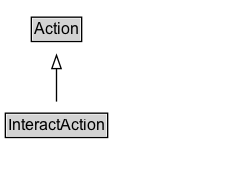

# InteractAction

The act of interacting with another person or organization.

## Diagram

=== "SVG (interactive)"

    <!-- Generated by graphviz version 14.1.3 (20260303.0454)
     -->
    <!-- Pages: 1 -->
    <svg width="172pt" height="132pt"
     viewBox="0.00 0.00 172.00 132.00" xmlns="http://www.w3.org/2000/svg" xmlns:xlink="http://www.w3.org/1999/xlink">
    <g id="graph0" class="graph" transform="scale(1 1) rotate(0) translate(4 128)">
    <polygon fill="white" stroke="none" points="-4,4 -4,-128 168.38,-128 168.38,4 -4,4"/>
    <g id="clust3" class="cluster">
    <title>cluster_associated</title>
    </g>
    <!-- Action -->
    <g id="node1" class="node">
    <title>Action</title>
    <g id="a_node1"><a xlink:href="../Action" xlink:title="&lt;TABLE&gt;">
    <polygon fill="lightgray" stroke="none" points="20.5,-97.88 20.5,-114.12 56.25,-114.12 56.25,-97.88 20.5,-97.88"/>
    <text xml:space="preserve" text-anchor="start" x="21.5" y="-101.88" font-family="Arial" font-size="12.00">Action</text>
    <polygon fill="none" stroke="black" points="19.5,-96.88 19.5,-115.12 57.25,-115.12 57.25,-96.88 19.5,-96.88"/>
    </a>
    </g>
    </g>
    <!-- InteractAction -->
    <g id="node2" class="node">
    <title>InteractAction</title>
    <g id="a_node2"><a xlink:href="../InteractAction" xlink:title="&lt;TABLE&gt;">
    <polygon fill="lightgray" stroke="none" points="1,-25.88 1,-42.12 75.75,-42.12 75.75,-25.88 1,-25.88"/>
    <text xml:space="preserve" text-anchor="start" x="2" y="-29.88" font-family="Arial" font-size="12.00">InteractAction</text>
    <polygon fill="none" stroke="black" points="0,-24.88 0,-43.12 76.75,-43.12 76.75,-24.88 0,-24.88"/>
    </a>
    </g>
    </g>
    <!-- InteractAction&#45;&gt;Action -->
    <g id="edge1" class="edge">
    <title>InteractAction&#45;&gt;Action</title>
    <path fill="none" stroke="black" d="M38.38,-51.79C38.38,-59.25 38.38,-68.24 38.38,-76.69"/>
    <polygon fill="none" stroke="black" points="34.88,-76.54 38.38,-86.54 41.88,-76.54 34.88,-76.54"/>
    </g>
    <!-- Invis -->
    </g>
    </svg>

=== "PNG"

    

## Specializations of InteractAction

| Class | Description |
|-------|-------------|
| [Ask Action](AskAction.md) | The act of posing a question / favor to someone.\n\nRelated actions:\n\n* [[ReplyAction]]: Appears generally as a response to AskAction. |
| [Befriend Action](BefriendAction.md) | The act of forming a personal connection with someone (object) mutually/bidirectionally/symmetrically.\n\nRelated actions:\n\n* [[FollowAction]]: Unlike FollowAction, BefriendAction implies that the connection is reciprocal. |
| [Check In Action](CheckInAction.md) | The act of an agent communicating (service provider, social media, etc) their arrival by registering/confirming for a previously reserved service (e.g. flight check-in) or at a place (e.g. hotel), possibly resulting in a result (boarding pass, etc).\n\nRelated actions:\n\n* [[CheckOutAction]]: The antonym of CheckInAction.\n* [[ArriveAction]]: Unlike ArriveAction, CheckInAction implies that the agent is informing/confirming the start of a previously reserved service.\n* [[ConfirmAction]]: Unlike ConfirmAction, CheckInAction implies that the agent is informing/confirming the *start* of a previously reserved service rather than its validity/existence. |
| [Check Out Action](CheckOutAction.md) | The act of an agent communicating (service provider, social media, etc) their departure of a previously reserved service (e.g. flight check-in) or place (e.g. hotel).\n\nRelated actions:\n\n* [[CheckInAction]]: The antonym of CheckOutAction.\n* [[DepartAction]]: Unlike DepartAction, CheckOutAction implies that the agent is informing/confirming the end of a previously reserved service.\n* [[CancelAction]]: Unlike CancelAction, CheckOutAction implies that the agent is informing/confirming the end of a previously reserved service. |
| [Comment Action](CommentAction.md) | The act of generating a comment about a subject. |
| [Communicate Action](CommunicateAction.md) | The act of conveying information to another person via a communication medium (instrument) such as speech, email, or telephone conversation. |
| [Confirm Action](ConfirmAction.md) | The act of notifying someone that a future event/action is going to happen as expected.\n\nRelated actions:\n\n* [[CancelAction]]: The antonym of ConfirmAction. |
| [Follow Action](FollowAction.md) | The act of forming a personal connection with someone/something (object) unidirectionally/asymmetrically to get updates polled from.\n\nRelated actions:\n\n* [[BefriendAction]]: Unlike BefriendAction, FollowAction implies that the connection is *not* necessarily reciprocal.\n* [[SubscribeAction]]: Unlike SubscribeAction, FollowAction implies that the follower acts as an active agent constantly/actively polling for updates.\n* [[RegisterAction]]: Unlike RegisterAction, FollowAction implies that the agent is interested in continuing receiving updates from the object.\n* [[JoinAction]]: Unlike JoinAction, FollowAction implies that the agent is interested in getting updates from the object.\n* [[TrackAction]]: Unlike TrackAction, FollowAction refers to the polling of updates of all aspects of animate objects rather than the location of inanimate objects (e.g. you track a package, but you don't follow it). |
| [Inform Action](InformAction.md) | The act of notifying someone of information pertinent to them, with no expectation of a response. |
| [Invite Action](InviteAction.md) | The act of asking someone to attend an event. Reciprocal of RsvpAction. |
| [Join Action](JoinAction.md) | An agent joins an event/group with participants/friends at a location.\n\nRelated actions:\n\n* [[RegisterAction]]: Unlike RegisterAction, JoinAction refers to joining a group/team of people.\n* [[SubscribeAction]]: Unlike SubscribeAction, JoinAction does not imply that you'll be receiving updates.\n* [[FollowAction]]: Unlike FollowAction, JoinAction does not imply that you'll be polling for updates. |
| [Leave Action](LeaveAction.md) | An agent leaves an event / group with participants/friends at a location.\n\nRelated actions:\n\n* [[JoinAction]]: The antonym of LeaveAction.\n* [[UnRegisterAction]]: Unlike UnRegisterAction, LeaveAction implies leaving a group/team of people rather than a service. |
| [Marry Action](MarryAction.md) | The act of marrying a person. |
| [Register Action](RegisterAction.md) | The act of registering to be a user of a service, product or web page.\n\nRelated actions:\n\n* [[JoinAction]]: Unlike JoinAction, RegisterAction implies you are registering to be a user of a service, *not* a group/team of people.\n* [[FollowAction]]: Unlike FollowAction, RegisterAction doesn't imply that the agent is expecting to poll for updates from the object.\n* [[SubscribeAction]]: Unlike SubscribeAction, RegisterAction doesn't imply that the agent is expecting updates from the object. |
| [Reply Action](ReplyAction.md) | The act of responding to a question/message asked/sent by the object. Related to [[AskAction]].\n\nRelated actions:\n\n* [[AskAction]]: Appears generally as an origin of a ReplyAction. |
| [Rsvp Action](RsvpAction.md) | The act of notifying an event organizer as to whether you expect to attend the event. |
| [Share Action](ShareAction.md) | The act of distributing content to people for their amusement or edification. |
| [Subscribe Action](SubscribeAction.md) | The act of forming a personal connection with someone/something (object) unidirectionally/asymmetrically to get updates pushed to.\n\nRelated actions:\n\n* [[FollowAction]]: Unlike FollowAction, SubscribeAction implies that the subscriber acts as a passive agent being constantly/actively pushed for updates.\n* [[RegisterAction]]: Unlike RegisterAction, SubscribeAction implies that the agent is interested in continuing receiving updates from the object.\n* [[JoinAction]]: Unlike JoinAction, SubscribeAction implies that the agent is interested in continuing receiving updates from the object. |
| [Un Register Action](UnRegisterAction.md) | The act of un-registering from a service.\n\nRelated actions:\n\n* [[RegisterAction]]: antonym of UnRegisterAction.\n* [[LeaveAction]]: Unlike LeaveAction, UnRegisterAction implies that you are unregistering from a service you were previously registered, rather than leaving a team/group of people. |

## Formalization for InteractAction

| Property | Constraint |
|----------|------------|
| subClassOf | [Action](Action.md) |

