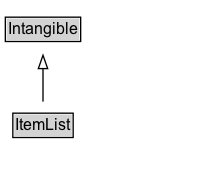

# ItemList

A list of items of any sort&#x2014;for example, Top 10 Movies About Weathermen, or Top 100 Party Songs. Not to be confused with HTML lists, which are often used only for formatting.

## Diagram

=== "SVG (interactive)"

    <!-- Generated by graphviz version 14.1.3 (20260303.0454)
     -->
    <!-- Pages: 1 -->
    <svg width="151pt" height="132pt"
     viewBox="0.00 0.00 151.00 132.00" xmlns="http://www.w3.org/2000/svg" xmlns:xlink="http://www.w3.org/1999/xlink">
    <g id="graph0" class="graph" transform="scale(1 1) rotate(0) translate(4 128)">
    <polygon fill="white" stroke="none" points="-4,4 -4,-128 147.25,-128 147.25,4 -4,4"/>
    <g id="clust3" class="cluster">
    <title>cluster_associated</title>
    </g>
    <!-- Intangible -->
    <g id="node1" class="node">
    <title>Intangible</title>
    <g id="a_node1"><a xlink:href="../Intangible" xlink:title="&lt;TABLE&gt;">
    <polygon fill="lightgray" stroke="none" points="1,-97.88 1,-114.12 55.5,-114.12 55.5,-97.88 1,-97.88"/>
    <text xml:space="preserve" text-anchor="start" x="2" y="-101.88" font-family="Arial" font-size="12.00">Intangible</text>
    <polygon fill="none" stroke="black" points="0,-96.88 0,-115.12 56.5,-115.12 56.5,-96.88 0,-96.88"/>
    </a>
    </g>
    </g>
    <!-- ItemList -->
    <g id="node2" class="node">
    <title>ItemList</title>
    <g id="a_node2"><a xlink:href="../ItemList" xlink:title="&lt;TABLE&gt;">
    <polygon fill="lightgray" stroke="none" points="6.62,-25.88 6.62,-42.12 49.88,-42.12 49.88,-25.88 6.62,-25.88"/>
    <text xml:space="preserve" text-anchor="start" x="7.62" y="-29.88" font-family="Arial" font-size="12.00">ItemList</text>
    <polygon fill="none" stroke="black" points="5.62,-24.88 5.62,-43.12 50.88,-43.12 50.88,-24.88 5.62,-24.88"/>
    </a>
    </g>
    </g>
    <!-- ItemList&#45;&gt;Intangible -->
    <g id="edge1" class="edge">
    <title>ItemList&#45;&gt;Intangible</title>
    <path fill="none" stroke="black" d="M28.25,-51.79C28.25,-59.25 28.25,-68.24 28.25,-76.69"/>
    <polygon fill="none" stroke="black" points="24.75,-76.54 28.25,-86.54 31.75,-76.54 24.75,-76.54"/>
    </g>
    <!-- Invis -->
    </g>
    </svg>

=== "PNG"

    

## Specializations of ItemList

| Class | Description |
|-------|-------------|
| [Breadcrumb List](BreadcrumbList.md) | A BreadcrumbList is an ItemList consisting of a chain of linked Web pages, typically described using at least their URL and their name, and typically ending with the current page.\n\nThe [[position]] property is used to reconstruct the order of the items in a BreadcrumbList. The convention is that a breadcrumb list has an [[itemListOrder]] of [[ItemListOrderAscending]] (lower values listed first), and that the first items in this list correspond to the "top" or beginning of the breadcrumb trail, e.g. with a site or section homepage. The specific values of 'position' are not assigned meaning for a BreadcrumbList, but they should be integers, e.g. beginning with '1' for the first item in the list.
       |
| [How To Section](HowToSection.md) | A sub-grouping of steps in the instructions for how to achieve a result (e.g. steps for making a pie crust within a pie recipe). |
| [How To Step](HowToStep.md) | A step in the instructions for how to achieve a result. It is an ordered list with HowToDirection and/or HowToTip items. |
| [Offer Catalog](OfferCatalog.md) | An OfferCatalog is an ItemList that contains related Offers and/or further OfferCatalogs that are offeredBy the same provider. |

## Formalization for ItemList

| Property | Constraint |
|----------|------------|
| subClassOf | [Intangible](Intangible.md) |

