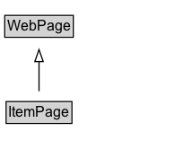

# ItemPage

A page devoted to a single item, such as a particular product or hotel.

## Diagram

=== "SVG (interactive)"

    <!-- Generated by graphviz version 14.1.3 (20260303.0454)
     -->
    <!-- Pages: 1 -->
    <svg width="153pt" height="132pt"
     viewBox="0.00 0.00 153.00 132.00" xmlns="http://www.w3.org/2000/svg" xmlns:xlink="http://www.w3.org/1999/xlink">
    <g id="graph0" class="graph" transform="scale(1 1) rotate(0) translate(4 128)">
    <polygon fill="white" stroke="none" points="-4,4 -4,-128 148.62,-128 148.62,4 -4,4"/>
    <g id="clust3" class="cluster">
    <title>cluster_associated</title>
    </g>
    <!-- WebPage -->
    <g id="node1" class="node">
    <title>WebPage</title>
    <g id="a_node1"><a xlink:href="../WebPage" xlink:title="&lt;TABLE&gt;">
    <polygon fill="lightgray" stroke="none" points="1,-97.88 1,-114.12 56.25,-114.12 56.25,-97.88 1,-97.88"/>
    <text xml:space="preserve" text-anchor="start" x="2" y="-101.88" font-family="Arial" font-size="12.00">WebPage</text>
    <polygon fill="none" stroke="black" points="0,-96.88 0,-115.12 57.25,-115.12 57.25,-96.88 0,-96.88"/>
    </a>
    </g>
    </g>
    <!-- ItemPage -->
    <g id="node2" class="node">
    <title>ItemPage</title>
    <g id="a_node2"><a xlink:href="../ItemPage" xlink:title="&lt;TABLE&gt;">
    <polygon fill="lightgray" stroke="none" points="2.12,-25.88 2.12,-42.12 55.12,-42.12 55.12,-25.88 2.12,-25.88"/>
    <text xml:space="preserve" text-anchor="start" x="3.12" y="-29.88" font-family="Arial" font-size="12.00">ItemPage</text>
    <polygon fill="none" stroke="black" points="1.12,-24.88 1.12,-43.12 56.12,-43.12 56.12,-24.88 1.12,-24.88"/>
    </a>
    </g>
    </g>
    <!-- ItemPage&#45;&gt;WebPage -->
    <g id="edge1" class="edge">
    <title>ItemPage&#45;&gt;WebPage</title>
    <path fill="none" stroke="black" d="M28.62,-51.79C28.62,-59.25 28.62,-68.24 28.62,-76.69"/>
    <polygon fill="none" stroke="black" points="25.13,-76.54 28.63,-86.54 32.13,-76.54 25.13,-76.54"/>
    </g>
    <!-- Invis -->
    </g>
    </svg>

=== "PNG"

    

## Formalization for ItemPage

| Property | Constraint |
|----------|------------|
| subClassOf | [WebPage](WebPage.md) |

