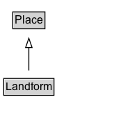

# Landform

A landform or physical feature.  Landform elements include mountains, plains, lakes, rivers, seascape and oceanic waterbody interface features such as bays, peninsulas, seas and so forth, including sub-aqueous terrain features such as submersed mountain ranges, volcanoes, and the great ocean basins.

## Diagram

=== "SVG (interactive)"

    <!-- Generated by graphviz version 14.1.3 (20260303.0454)
     -->
    <!-- Pages: 1 -->
    <svg width="150pt" height="132pt"
     viewBox="0.00 0.00 150.00 132.00" xmlns="http://www.w3.org/2000/svg" xmlns:xlink="http://www.w3.org/1999/xlink">
    <g id="graph0" class="graph" transform="scale(1 1) rotate(0) translate(4 128)">
    <polygon fill="white" stroke="none" points="-4,4 -4,-128 146.12,-128 146.12,4 -4,4"/>
    <g id="clust3" class="cluster">
    <title>cluster_associated</title>
    </g>
    <!-- Place -->
    <g id="node1" class="node">
    <title>Place</title>
    <g id="a_node1"><a xlink:href="../Place" xlink:title="&lt;TABLE&gt;">
    <polygon fill="lightgray" stroke="none" points="10.75,-97.88 10.75,-114.12 43.5,-114.12 43.5,-97.88 10.75,-97.88"/>
    <text xml:space="preserve" text-anchor="start" x="11.75" y="-101.88" font-family="Arial" font-size="12.00">Place</text>
    <polygon fill="none" stroke="black" points="9.75,-96.88 9.75,-115.12 44.5,-115.12 44.5,-96.88 9.75,-96.88"/>
    </a>
    </g>
    </g>
    <!-- Landform -->
    <g id="node2" class="node">
    <title>Landform</title>
    <g id="a_node2"><a xlink:href="../Landform" xlink:title="&lt;TABLE&gt;">
    <polygon fill="lightgray" stroke="none" points="1,-25.88 1,-42.12 53.25,-42.12 53.25,-25.88 1,-25.88"/>
    <text xml:space="preserve" text-anchor="start" x="2" y="-29.88" font-family="Arial" font-size="12.00">Landform</text>
    <polygon fill="none" stroke="black" points="0,-24.88 0,-43.12 54.25,-43.12 54.25,-24.88 0,-24.88"/>
    </a>
    </g>
    </g>
    <!-- Landform&#45;&gt;Place -->
    <g id="edge1" class="edge">
    <title>Landform&#45;&gt;Place</title>
    <path fill="none" stroke="black" d="M27.12,-51.79C27.12,-59.25 27.12,-68.24 27.12,-76.69"/>
    <polygon fill="none" stroke="black" points="23.63,-76.54 27.13,-86.54 30.63,-76.54 23.63,-76.54"/>
    </g>
    <!-- Invis -->
    </g>
    </svg>

=== "PNG"

    

## Specializations of Landform

| Class | Description |
|-------|-------------|
| [Body Of Water](BodyOfWater.md) | A body of water, such as a sea, ocean, or lake. |
| [Canal](Canal.md) | A canal, like the Panama Canal. |
| [Continent](Continent.md) | One of the continents (for example, Europe or Africa). |
| [Lake Body Of Water](LakeBodyOfWater.md) | A lake (for example, Lake Pontrachain). |
| [Mountain](Mountain.md) | A mountain, like Mount Whitney or Mount Everest. |
| [Ocean Body Of Water](OceanBodyOfWater.md) | An ocean (for example, the Pacific). |
| [Pond](Pond.md) | A pond. |
| [Reservoir](Reservoir.md) | A reservoir of water, typically an artificially created lake, like the Lake Kariba reservoir. |
| [River Body Of Water](RiverBodyOfWater.md) | A river (for example, the broad majestic Shannon). |
| [Sea Body Of Water](SeaBodyOfWater.md) | A sea (for example, the Caspian sea). |
| [Volcano](Volcano.md) | A volcano, like Fujisan. |
| [Waterfall](Waterfall.md) | A waterfall, like Niagara. |

## Formalization for Landform

| Property | Constraint |
|----------|------------|
| subClassOf | [Place](Place.md) |

