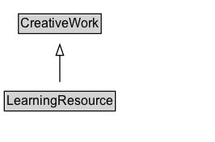

# LearningResource

The LearningResource type can be used to indicate [[CreativeWork]]s (whether physical or digital) that have a particular and explicit orientation towards learning, education, skill acquisition, and other educational purposes.

[[LearningResource]] is expected to be used as an addition to a primary type such as [[Book]], [[VideoObject]], [[Product]] etc.

[[EducationEvent]] serves a similar purpose for event-like things (e.g. a [[Trip]]). A [[LearningResource]] may be created as a result of an [[EducationEvent]], for example by recording one.

## Diagram

=== "SVG (interactive)"

    <!-- Generated by graphviz version 14.1.3 (20260303.0454)
     -->
    <!-- Pages: 1 -->
    <svg width="200pt" height="132pt"
     viewBox="0.00 0.00 200.00 132.00" xmlns="http://www.w3.org/2000/svg" xmlns:xlink="http://www.w3.org/1999/xlink">
    <g id="graph0" class="graph" transform="scale(1 1) rotate(0) translate(4 128)">
    <polygon fill="white" stroke="none" points="-4,4 -4,-128 195.5,-128 195.5,4 -4,4"/>
    <g id="clust3" class="cluster">
    <title>cluster_associated</title>
    </g>
    <!-- CreativeWork -->
    <g id="node1" class="node">
    <title>CreativeWork</title>
    <g id="a_node1"><a xlink:href="../CreativeWork" xlink:title="&lt;TABLE&gt;">
    <polygon fill="lightgray" stroke="none" points="14.12,-97.88 14.12,-114.12 88.88,-114.12 88.88,-97.88 14.12,-97.88"/>
    <text xml:space="preserve" text-anchor="start" x="15.12" y="-101.88" font-family="Arial" font-size="12.00">CreativeWork</text>
    <polygon fill="none" stroke="black" points="13.12,-96.88 13.12,-115.12 89.88,-115.12 89.88,-96.88 13.12,-96.88"/>
    </a>
    </g>
    </g>
    <!-- LearningResource -->
    <g id="node2" class="node">
    <title>LearningResource</title>
    <g id="a_node2"><a xlink:href="../LearningResource" xlink:title="&lt;TABLE&gt;">
    <polygon fill="lightgray" stroke="none" points="1,-25.88 1,-42.12 102,-42.12 102,-25.88 1,-25.88"/>
    <text xml:space="preserve" text-anchor="start" x="2" y="-29.88" font-family="Arial" font-size="12.00">LearningResource</text>
    <polygon fill="none" stroke="black" points="0,-24.88 0,-43.12 103,-43.12 103,-24.88 0,-24.88"/>
    </a>
    </g>
    </g>
    <!-- LearningResource&#45;&gt;CreativeWork -->
    <g id="edge1" class="edge">
    <title>LearningResource&#45;&gt;CreativeWork</title>
    <path fill="none" stroke="black" d="M51.5,-51.79C51.5,-59.25 51.5,-68.24 51.5,-76.69"/>
    <polygon fill="none" stroke="black" points="48,-76.54 51.5,-86.54 55,-76.54 48,-76.54"/>
    </g>
    <!-- Invis -->
    </g>
    </svg>

=== "PNG"

    

## Specializations of LearningResource

| Class | Description |
|-------|-------------|
| [Course](Course.md) | A description of an educational course which may be offered as distinct instances which take place at different times or take place at different locations, or be offered through different media or modes of study. An educational course is a sequence of one or more educational events and/or creative works which aims to build knowledge, competence or ability of learners. |
| [Quiz](Quiz.md) | Quiz: A test of knowledge, skills and abilities. |
| [Syllabus](Syllabus.md) | A syllabus that describes the material covered in a course, often with several such sections per [[Course]] so that a distinct [[timeRequired]] can be provided for that section of the [[Course]]. |

## Formalization for LearningResource

| Property | Constraint |
|----------|------------|
| subClassOf | [CreativeWork](CreativeWork.md) |

