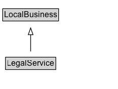

# LegalService

A LegalService is a business that provides legally-oriented services, advice and representation, e.g. law firms.\n\nAs a [[LocalBusiness]] it can be described as a [[provider]] of one or more [[Service]]\(s).

## Diagram

=== "SVG (interactive)"

    <!-- Generated by graphviz version 14.1.3 (20260303.0454)
     -->
    <!-- Pages: 1 -->
    <svg width="174pt" height="132pt"
     viewBox="0.00 0.00 174.00 132.00" xmlns="http://www.w3.org/2000/svg" xmlns:xlink="http://www.w3.org/1999/xlink">
    <g id="graph0" class="graph" transform="scale(1 1) rotate(0) translate(4 128)">
    <polygon fill="white" stroke="none" points="-4,4 -4,-128 170.38,-128 170.38,4 -4,4"/>
    <g id="clust3" class="cluster">
    <title>cluster_associated</title>
    </g>
    <!-- LocalBusiness -->
    <g id="node1" class="node">
    <title>LocalBusiness</title>
    <g id="a_node1"><a xlink:href="../LocalBusiness" xlink:title="&lt;TABLE&gt;">
    <polygon fill="lightgray" stroke="none" points="1,-97.88 1,-114.12 81.75,-114.12 81.75,-97.88 1,-97.88"/>
    <text xml:space="preserve" text-anchor="start" x="2" y="-101.88" font-family="Arial" font-size="12.00">LocalBusiness</text>
    <polygon fill="none" stroke="black" points="0,-96.88 0,-115.12 82.75,-115.12 82.75,-96.88 0,-96.88"/>
    </a>
    </g>
    </g>
    <!-- LegalService -->
    <g id="node2" class="node">
    <title>LegalService</title>
    <g id="a_node2"><a xlink:href="../LegalService" xlink:title="&lt;TABLE&gt;">
    <polygon fill="lightgray" stroke="none" points="5.12,-25.88 5.12,-42.12 77.62,-42.12 77.62,-25.88 5.12,-25.88"/>
    <text xml:space="preserve" text-anchor="start" x="6.12" y="-29.88" font-family="Arial" font-size="12.00">LegalService</text>
    <polygon fill="none" stroke="black" points="4.12,-24.88 4.12,-43.12 78.62,-43.12 78.62,-24.88 4.12,-24.88"/>
    </a>
    </g>
    </g>
    <!-- LegalService&#45;&gt;LocalBusiness -->
    <g id="edge1" class="edge">
    <title>LegalService&#45;&gt;LocalBusiness</title>
    <path fill="none" stroke="black" d="M41.38,-51.79C41.38,-59.25 41.38,-68.24 41.38,-76.69"/>
    <polygon fill="none" stroke="black" points="37.88,-76.54 41.38,-86.54 44.88,-76.54 37.88,-76.54"/>
    </g>
    <!-- Invis -->
    </g>
    </svg>

=== "PNG"

    

## Specializations of LegalService

| Class | Description |
|-------|-------------|
| [Attorney](Attorney.md) | Professional service: Attorney. \n\nThis type is deprecated - [[LegalService]] is more inclusive and less ambiguous. |
| [Notary](Notary.md) | A notary. |

## Formalization for LegalService

| Property | Constraint |
|----------|------------|
| subClassOf | [LocalBusiness](LocalBusiness.md) |

