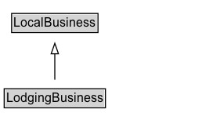

# LodgingBusiness

A lodging business, such as a motel, hotel, or inn.

## Diagram

=== "SVG (interactive)"

    <!-- Generated by graphviz version 14.1.3 (20260303.0454)
     -->
    <!-- Pages: 1 -->
    <svg width="194pt" height="132pt"
     viewBox="0.00 0.00 194.00 132.00" xmlns="http://www.w3.org/2000/svg" xmlns:xlink="http://www.w3.org/1999/xlink">
    <g id="graph0" class="graph" transform="scale(1 1) rotate(0) translate(4 128)">
    <polygon fill="white" stroke="none" points="-4,4 -4,-128 189.5,-128 189.5,4 -4,4"/>
    <g id="clust3" class="cluster">
    <title>cluster_associated</title>
    </g>
    <!-- LocalBusiness -->
    <g id="node1" class="node">
    <title>LocalBusiness</title>
    <g id="a_node1"><a xlink:href="../LocalBusiness" xlink:title="&lt;TABLE&gt;">
    <polygon fill="lightgray" stroke="none" points="8.12,-97.88 8.12,-114.12 88.88,-114.12 88.88,-97.88 8.12,-97.88"/>
    <text xml:space="preserve" text-anchor="start" x="9.12" y="-101.88" font-family="Arial" font-size="12.00">LocalBusiness</text>
    <polygon fill="none" stroke="black" points="7.12,-96.88 7.12,-115.12 89.88,-115.12 89.88,-96.88 7.12,-96.88"/>
    </a>
    </g>
    </g>
    <!-- LodgingBusiness -->
    <g id="node2" class="node">
    <title>LodgingBusiness</title>
    <g id="a_node2"><a xlink:href="../LodgingBusiness" xlink:title="&lt;TABLE&gt;">
    <polygon fill="lightgray" stroke="none" points="1,-25.88 1,-42.12 96,-42.12 96,-25.88 1,-25.88"/>
    <text xml:space="preserve" text-anchor="start" x="2" y="-29.88" font-family="Arial" font-size="12.00">LodgingBusiness</text>
    <polygon fill="none" stroke="black" points="0,-24.88 0,-43.12 97,-43.12 97,-24.88 0,-24.88"/>
    </a>
    </g>
    </g>
    <!-- LodgingBusiness&#45;&gt;LocalBusiness -->
    <g id="edge1" class="edge">
    <title>LodgingBusiness&#45;&gt;LocalBusiness</title>
    <path fill="none" stroke="black" d="M48.5,-51.79C48.5,-59.25 48.5,-68.24 48.5,-76.69"/>
    <polygon fill="none" stroke="black" points="45,-76.54 48.5,-86.54 52,-76.54 45,-76.54"/>
    </g>
    <!-- Invis -->
    </g>
    </svg>

=== "PNG"

    

## Specializations of LodgingBusiness

| Class | Description |
|-------|-------------|
| [Bed And Breakfast](BedAndBreakfast.md) | Bed and breakfast.
  
See also the <a href="/docs/hotels.html">dedicated document on the use of schema.org for marking up hotels and other forms of accommodations</a>.
 |
| [Campground](Campground.md) | A camping site, campsite, or [[Campground]] is a place used for overnight stay in the outdoors, typically containing individual [[CampingPitch]] locations. \n\n
In British English a campsite is an area, usually divided into a number of pitches, where people can camp overnight using tents or camper vans or caravans; this British English use of the word is synonymous with the American English expression campground. In American English the term campsite generally means an area where an individual, family, group, or military unit can pitch a tent or park a camper; a campground may contain many campsites (source: Wikipedia, see [https://en.wikipedia.org/wiki/Campsite](https://en.wikipedia.org/wiki/Campsite)).\n\n

See also the dedicated [document on the use of schema.org for marking up hotels and other forms of accommodations](/docs/hotels.html).
 |
| [Hostel](Hostel.md) | A hostel - cheap accommodation, often in shared dormitories.
  
See also the <a href="/docs/hotels.html">dedicated document on the use of schema.org for marking up hotels and other forms of accommodations</a>.
 |
| [Hotel](Hotel.md) | A hotel is an establishment that provides lodging paid on a short-term basis (source: Wikipedia, the free encyclopedia, see http://en.wikipedia.org/wiki/Hotel).
  
See also the <a href="/docs/hotels.html">dedicated document on the use of schema.org for marking up hotels and other forms of accommodations</a>.
 |
| [Motel](Motel.md) | A motel.
  
See also the <a href="/docs/hotels.html">dedicated document on the use of schema.org for marking up hotels and other forms of accommodations</a>.
 |
| [Resort](Resort.md) | A resort is a place used for relaxation or recreation, attracting visitors for holidays or vacations. Resorts are places, towns or sometimes commercial establishments operated by a single company (source: Wikipedia, the free encyclopedia, see <a href="http://en.wikipedia.org/wiki/Resort">http://en.wikipedia.org/wiki/Resort</a>).
  
See also the <a href="/docs/hotels.html">dedicated document on the use of schema.org for marking up hotels and other forms of accommodations</a>.
     |
| [Ski Resort](SkiResort.md) | A ski resort. |
| [Vacation Rental](VacationRental.md) | A kind of lodging business that focuses on renting single properties for limited time. |

## Formalization for LodgingBusiness

| Property | Constraint |
|----------|------------|
| subClassOf | [LocalBusiness](LocalBusiness.md) |

