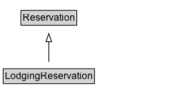

# LodgingReservation

A reservation for lodging at a hotel, motel, inn, etc.\n\nNote: This type is for information about actual reservations, e.g. in confirmation emails or HTML pages with individual confirmations of reservations.

## Diagram

=== "SVG (interactive)"

    <!-- Generated by graphviz version 14.1.3 (20260303.0454)
     -->
    <!-- Pages: 1 -->
    <svg width="208pt" height="132pt"
     viewBox="0.00 0.00 208.00 132.00" xmlns="http://www.w3.org/2000/svg" xmlns:xlink="http://www.w3.org/1999/xlink">
    <g id="graph0" class="graph" transform="scale(1 1) rotate(0) translate(4 128)">
    <polygon fill="white" stroke="none" points="-4,4 -4,-128 204,-128 204,4 -4,4"/>
    <g id="clust3" class="cluster">
    <title>cluster_associated</title>
    </g>
    <!-- Reservation -->
    <g id="node1" class="node">
    <title>Reservation</title>
    <g id="a_node1"><a xlink:href="../Reservation" xlink:title="&lt;TABLE&gt;">
    <polygon fill="lightgray" stroke="none" points="22.75,-97.88 22.75,-114.12 89.25,-114.12 89.25,-97.88 22.75,-97.88"/>
    <text xml:space="preserve" text-anchor="start" x="23.75" y="-101.88" font-family="Arial" font-size="12.00">Reservation</text>
    <polygon fill="none" stroke="black" points="21.75,-96.88 21.75,-115.12 90.25,-115.12 90.25,-96.88 21.75,-96.88"/>
    </a>
    </g>
    </g>
    <!-- LodgingReservation -->
    <g id="node2" class="node">
    <title>LodgingReservation</title>
    <g id="a_node2"><a xlink:href="../LodgingReservation" xlink:title="&lt;TABLE&gt;">
    <polygon fill="lightgray" stroke="none" points="1,-25.88 1,-42.12 111,-42.12 111,-25.88 1,-25.88"/>
    <text xml:space="preserve" text-anchor="start" x="2" y="-29.88" font-family="Arial" font-size="12.00">LodgingReservation</text>
    <polygon fill="none" stroke="black" points="0,-24.88 0,-43.12 112,-43.12 112,-24.88 0,-24.88"/>
    </a>
    </g>
    </g>
    <!-- LodgingReservation&#45;&gt;Reservation -->
    <g id="edge1" class="edge">
    <title>LodgingReservation&#45;&gt;Reservation</title>
    <path fill="none" stroke="black" d="M56,-51.79C56,-59.25 56,-68.24 56,-76.69"/>
    <polygon fill="none" stroke="black" points="52.5,-76.54 56,-86.54 59.5,-76.54 52.5,-76.54"/>
    </g>
    <!-- Invis -->
    </g>
    </svg>

=== "PNG"

    

## Formalization for LodgingReservation

| Property | Constraint |
|----------|------------|
| subClassOf | [Reservation](Reservation.md) |

