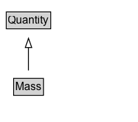

# Mass

Properties that take Mass as values are of the form '&lt;Number&gt; &lt;Mass unit of measure&gt;'. E.g., '7 kg'.

## Diagram

=== "SVG (interactive)"

    <!-- Generated by graphviz version 14.1.3 (20260303.0454)
     -->
    <!-- Pages: 1 -->
    <svg width="150pt" height="132pt"
     viewBox="0.00 0.00 150.00 132.00" xmlns="http://www.w3.org/2000/svg" xmlns:xlink="http://www.w3.org/1999/xlink">
    <g id="graph0" class="graph" transform="scale(1 1) rotate(0) translate(4 128)">
    <polygon fill="white" stroke="none" points="-4,4 -4,-128 146,-128 146,4 -4,4"/>
    <g id="clust3" class="cluster">
    <title>cluster_associated</title>
    </g>
    <!-- Quantity -->
    <g id="node1" class="node">
    <title>Quantity</title>
    <g id="a_node1"><a xlink:href="../Quantity" xlink:title="&lt;TABLE&gt;">
    <polygon fill="lightgray" stroke="none" points="3.88,-97.88 3.88,-114.12 50.12,-114.12 50.12,-97.88 3.88,-97.88"/>
    <text xml:space="preserve" text-anchor="start" x="4.88" y="-101.88" font-family="Arial" font-size="12.00">Quantity</text>
    <polygon fill="none" stroke="black" points="2.88,-96.88 2.88,-115.12 51.12,-115.12 51.12,-96.88 2.88,-96.88"/>
    </a>
    </g>
    </g>
    <!-- Mass -->
    <g id="node2" class="node">
    <title>Mass</title>
    <g id="a_node2"><a xlink:href="../Mass" xlink:title="&lt;TABLE&gt;">
    <polygon fill="lightgray" stroke="none" points="11.75,-25.88 11.75,-42.12 42.25,-42.12 42.25,-25.88 11.75,-25.88"/>
    <text xml:space="preserve" text-anchor="start" x="12.75" y="-29.88" font-family="Arial" font-size="12.00">Mass</text>
    <polygon fill="none" stroke="black" points="10.75,-24.88 10.75,-43.12 43.25,-43.12 43.25,-24.88 10.75,-24.88"/>
    </a>
    </g>
    </g>
    <!-- Mass&#45;&gt;Quantity -->
    <g id="edge1" class="edge">
    <title>Mass&#45;&gt;Quantity</title>
    <path fill="none" stroke="black" d="M27,-51.79C27,-59.25 27,-68.24 27,-76.69"/>
    <polygon fill="none" stroke="black" points="23.5,-76.54 27,-86.54 30.5,-76.54 23.5,-76.54"/>
    </g>
    <!-- Invis -->
    </g>
    </svg>

=== "PNG"

    

## Formalization for Mass

| Property | Constraint |
|----------|------------|
| subClassOf | [Quantity](Quantity.md) |

