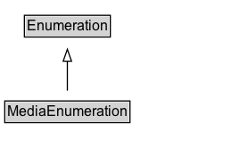

# MediaEnumeration

MediaEnumeration enumerations are lists of codes, labels etc. useful for describing media objects. They may be reflections of externally developed lists, or created at schema.org, or a combination.

## Diagram

=== "SVG (interactive)"

    <!-- Generated by graphviz version 14.1.3 (20260303.0454)
     -->
    <!-- Pages: 1 -->
    <svg width="202pt" height="132pt"
     viewBox="0.00 0.00 202.00 132.00" xmlns="http://www.w3.org/2000/svg" xmlns:xlink="http://www.w3.org/1999/xlink">
    <g id="graph0" class="graph" transform="scale(1 1) rotate(0) translate(4 128)">
    <polygon fill="white" stroke="none" points="-4,4 -4,-128 197.62,-128 197.62,4 -4,4"/>
    <g id="clust3" class="cluster">
    <title>cluster_associated</title>
    </g>
    <!-- Enumeration -->
    <g id="node1" class="node">
    <title>Enumeration</title>
    <g id="a_node1"><a xlink:href="../Enumeration" xlink:title="&lt;TABLE&gt;">
    <polygon fill="lightgray" stroke="none" points="17.5,-97.88 17.5,-114.12 87.75,-114.12 87.75,-97.88 17.5,-97.88"/>
    <text xml:space="preserve" text-anchor="start" x="18.5" y="-101.88" font-family="Arial" font-size="12.00">Enumeration</text>
    <polygon fill="none" stroke="black" points="16.5,-96.88 16.5,-115.12 88.75,-115.12 88.75,-96.88 16.5,-96.88"/>
    </a>
    </g>
    </g>
    <!-- MediaEnumeration -->
    <g id="node2" class="node">
    <title>MediaEnumeration</title>
    <g id="a_node2"><a xlink:href="../MediaEnumeration" xlink:title="&lt;TABLE&gt;">
    <polygon fill="lightgray" stroke="none" points="1,-25.88 1,-42.12 104.25,-42.12 104.25,-25.88 1,-25.88"/>
    <text xml:space="preserve" text-anchor="start" x="2" y="-29.88" font-family="Arial" font-size="12.00">MediaEnumeration</text>
    <polygon fill="none" stroke="black" points="0,-24.88 0,-43.12 105.25,-43.12 105.25,-24.88 0,-24.88"/>
    </a>
    </g>
    </g>
    <!-- MediaEnumeration&#45;&gt;Enumeration -->
    <g id="edge1" class="edge">
    <title>MediaEnumeration&#45;&gt;Enumeration</title>
    <path fill="none" stroke="black" d="M52.62,-51.79C52.62,-59.25 52.62,-68.24 52.62,-76.69"/>
    <polygon fill="none" stroke="black" points="49.13,-76.54 52.63,-86.54 56.13,-76.54 49.13,-76.54"/>
    </g>
    <!-- Invis -->
    </g>
    </svg>

=== "PNG"

    

## Specializations of MediaEnumeration

| Class | Description |
|-------|-------------|
| [Iptc Digital Source Enumeration](IPTCDigitalSourceEnumeration.md) | <a href="https://www.iptc.org/">IPTC</a> "Digital Source" codes for use with the [[digitalSourceType]] property, providing information about the source for a digital media object.
In general these codes are not declared here to be mutually exclusive, although some combinations would be contradictory if applied simultaneously, or might be considered mutually incompatible by upstream maintainers of the definitions. See the IPTC <a href="https://www.iptc.org/std/photometadata/documentation/userguide/">documentation</a>
 for <a href="https://cv.iptc.org/newscodes/digitalsourcetype/">detailed definitions</a> of all terms. |

## Formalization for MediaEnumeration

| Property | Constraint |
|----------|------------|
| subClassOf | [Enumeration](Enumeration.md) |

