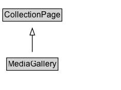

# MediaGallery

Web page type: Media gallery page. A mixed-media page that can contain media such as images, videos, and other multimedia.

## Diagram

=== "SVG (interactive)"

    <!-- Generated by graphviz version 14.1.3 (20260303.0454)
     -->
    <!-- Pages: 1 -->
    <svg width="177pt" height="132pt"
     viewBox="0.00 0.00 177.00 132.00" xmlns="http://www.w3.org/2000/svg" xmlns:xlink="http://www.w3.org/1999/xlink">
    <g id="graph0" class="graph" transform="scale(1 1) rotate(0) translate(4 128)">
    <polygon fill="white" stroke="none" points="-4,4 -4,-128 173.25,-128 173.25,4 -4,4"/>
    <g id="clust3" class="cluster">
    <title>cluster_associated</title>
    </g>
    <!-- CollectionPage -->
    <g id="node1" class="node">
    <title>CollectionPage</title>
    <g id="a_node1"><a xlink:href="../CollectionPage" xlink:title="&lt;TABLE&gt;">
    <polygon fill="lightgray" stroke="none" points="1,-97.88 1,-114.12 85.5,-114.12 85.5,-97.88 1,-97.88"/>
    <text xml:space="preserve" text-anchor="start" x="2" y="-101.88" font-family="Arial" font-size="12.00">CollectionPage</text>
    <polygon fill="none" stroke="black" points="0,-96.88 0,-115.12 86.5,-115.12 86.5,-96.88 0,-96.88"/>
    </a>
    </g>
    </g>
    <!-- MediaGallery -->
    <g id="node2" class="node">
    <title>MediaGallery</title>
    <g id="a_node2"><a xlink:href="../MediaGallery" xlink:title="&lt;TABLE&gt;">
    <polygon fill="lightgray" stroke="none" points="6.62,-25.88 6.62,-42.12 79.88,-42.12 79.88,-25.88 6.62,-25.88"/>
    <text xml:space="preserve" text-anchor="start" x="7.62" y="-29.88" font-family="Arial" font-size="12.00">MediaGallery</text>
    <polygon fill="none" stroke="black" points="5.62,-24.88 5.62,-43.12 80.88,-43.12 80.88,-24.88 5.62,-24.88"/>
    </a>
    </g>
    </g>
    <!-- MediaGallery&#45;&gt;CollectionPage -->
    <g id="edge1" class="edge">
    <title>MediaGallery&#45;&gt;CollectionPage</title>
    <path fill="none" stroke="black" d="M43.25,-51.79C43.25,-59.25 43.25,-68.24 43.25,-76.69"/>
    <polygon fill="none" stroke="black" points="39.75,-76.54 43.25,-86.54 46.75,-76.54 39.75,-76.54"/>
    </g>
    <!-- Invis -->
    </g>
    </svg>

=== "PNG"

    

## Specializations of MediaGallery

| Class | Description |
|-------|-------------|
| [Image Gallery](ImageGallery.md) | Web page type: Image gallery page. |
| [Video Gallery](VideoGallery.md) | Web page type: Video gallery page. |

## Formalization for MediaGallery

| Property | Constraint |
|----------|------------|
| subClassOf | [CollectionPage](CollectionPage.md) |

