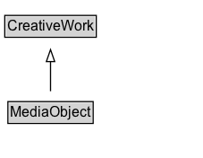

# MediaObject

A media object, such as an image, video, audio, or text object embedded in a web page or a downloadable dataset i.e. DataDownload. Note that a creative work may have many media objects associated with it on the same web page. For example, a page about a single song (MusicRecording) may have a music video (VideoObject), and a high and low bandwidth audio stream (2 AudioObject's).

## Diagram

=== "SVG (interactive)"

    <!-- Generated by graphviz version 14.1.3 (20260303.0454)
     -->
    <!-- Pages: 1 -->
    <svg width="170pt" height="132pt"
     viewBox="0.00 0.00 170.00 132.00" xmlns="http://www.w3.org/2000/svg" xmlns:xlink="http://www.w3.org/1999/xlink">
    <g id="graph0" class="graph" transform="scale(1 1) rotate(0) translate(4 128)">
    <polygon fill="white" stroke="none" points="-4,4 -4,-128 166.38,-128 166.38,4 -4,4"/>
    <g id="clust3" class="cluster">
    <title>cluster_associated</title>
    </g>
    <!-- CreativeWork -->
    <g id="node1" class="node">
    <title>CreativeWork</title>
    <g id="a_node1"><a xlink:href="../CreativeWork" xlink:title="&lt;TABLE&gt;">
    <polygon fill="lightgray" stroke="none" points="1,-97.88 1,-114.12 75.75,-114.12 75.75,-97.88 1,-97.88"/>
    <text xml:space="preserve" text-anchor="start" x="2" y="-101.88" font-family="Arial" font-size="12.00">CreativeWork</text>
    <polygon fill="none" stroke="black" points="0,-96.88 0,-115.12 76.75,-115.12 76.75,-96.88 0,-96.88"/>
    </a>
    </g>
    </g>
    <!-- MediaObject -->
    <g id="node2" class="node">
    <title>MediaObject</title>
    <g id="a_node2"><a xlink:href="../MediaObject" xlink:title="&lt;TABLE&gt;">
    <polygon fill="lightgray" stroke="none" points="3.62,-25.88 3.62,-42.12 73.12,-42.12 73.12,-25.88 3.62,-25.88"/>
    <text xml:space="preserve" text-anchor="start" x="4.62" y="-29.88" font-family="Arial" font-size="12.00">MediaObject</text>
    <polygon fill="none" stroke="black" points="2.62,-24.88 2.62,-43.12 74.12,-43.12 74.12,-24.88 2.62,-24.88"/>
    </a>
    </g>
    </g>
    <!-- MediaObject&#45;&gt;CreativeWork -->
    <g id="edge1" class="edge">
    <title>MediaObject&#45;&gt;CreativeWork</title>
    <path fill="none" stroke="black" d="M38.38,-51.79C38.38,-59.25 38.38,-68.24 38.38,-76.69"/>
    <polygon fill="none" stroke="black" points="34.88,-76.54 38.38,-86.54 41.88,-76.54 34.88,-76.54"/>
    </g>
    <!-- Invis -->
    </g>
    </svg>

=== "PNG"

    

## Specializations of MediaObject

| Class | Description |
|-------|-------------|
| [3 D Model](3DModel.md) | A 3D model represents some kind of 3D content, which may have [[encoding]]s in one or more [[MediaObject]]s. Many 3D formats are available (e.g. see [Wikipedia](https://en.wikipedia.org/wiki/Category:3D_graphics_file_formats)); specific encoding formats can be represented using the [[encodingFormat]] property applied to the relevant [[MediaObject]]. For the
case of a single file published after Zip compression, the convention of appending '+zip' to the [[encodingFormat]] can be used. Geospatial, AR/VR, artistic/animation, gaming, engineering and scientific content can all be represented using [[3DModel]]. |
| [Amp Story](AmpStory.md) | A creative work with a visual storytelling format intended to be viewed online, particularly on mobile devices. |
| [Audiobook](Audiobook.md) | An audiobook. |
| [Audio Object](AudioObject.md) | An audio file. |
| [Audio Object Snapshot](AudioObjectSnapshot.md) | A specific and exact (byte-for-byte) version of an [[AudioObject]]. Two byte-for-byte identical files, for the purposes of this type, considered identical. If they have different embedded metadata the files will differ. Different external facts about the files, e.g. creator or dateCreated that aren't represented in their actual content, do not affect this notion of identity. |
| [Barcode](Barcode.md) | An image of a visual machine-readable code such as a barcode or QR code. |
| [Data Download](DataDownload.md) | All or part of a [[Dataset]] in downloadable form.  |
| [Image Object](ImageObject.md) | An image file. |
| [Image Object Snapshot](ImageObjectSnapshot.md) | A specific and exact (byte-for-byte) version of an [[ImageObject]]. Two byte-for-byte identical files, for the purposes of this type, considered identical. If they have different embedded metadata (e.g. XMP, EXIF) the files will differ. Different external facts about the files, e.g. creator or dateCreated that aren't represented in their actual content, do not affect this notion of identity. |
| [Legislation Object](LegislationObject.md) | A specific object or file containing a Legislation. Note that the same Legislation can be published in multiple files. For example, a digitally signed PDF, a plain PDF and an HTML version. |
| [Music Video Object](MusicVideoObject.md) | A music video file. |
| [Text Object](TextObject.md) | A text file. The text can be unformatted or contain markup, html, etc. |
| [Video Object](VideoObject.md) | A video file. |
| [Video Object Snapshot](VideoObjectSnapshot.md) | A specific and exact (byte-for-byte) version of a [[VideoObject]]. Two byte-for-byte identical files, for the purposes of this type, considered identical. If they have different embedded metadata the files will differ. Different external facts about the files, e.g. creator or dateCreated that aren't represented in their actual content, do not affect this notion of identity. |

## Formalization for MediaObject

| Property | Constraint |
|----------|------------|
| subClassOf | [CreativeWork](CreativeWork.md) |

