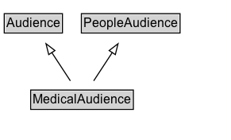

# MedicalAudience

Target audiences for medical web pages.

## Diagram

=== "SVG (interactive)"

    <!-- Generated by graphviz version 14.1.3 (20260303.0454)
     -->
    <!-- Pages: 1 -->
    <svg width="219pt" height="132pt"
     viewBox="0.00 0.00 219.00 132.00" xmlns="http://www.w3.org/2000/svg" xmlns:xlink="http://www.w3.org/1999/xlink">
    <g id="graph0" class="graph" transform="scale(1 1) rotate(0) translate(4 128)">
    <polygon fill="white" stroke="none" points="-4,4 -4,-128 214.5,-128 214.5,4 -4,4"/>
    <g id="clust3" class="cluster">
    <title>cluster_associated</title>
    </g>
    <!-- Audience -->
    <g id="node1" class="node">
    <title>Audience</title>
    <g id="a_node1"><a xlink:href="../Audience" xlink:title="&lt;TABLE&gt;">
    <polygon fill="lightgray" stroke="none" points="1,-97.88 1,-114.12 54,-114.12 54,-97.88 1,-97.88"/>
    <text xml:space="preserve" text-anchor="start" x="2" y="-101.88" font-family="Arial" font-size="12.00">Audience</text>
    <polygon fill="none" stroke="black" points="0,-96.88 0,-115.12 55,-115.12 55,-96.88 0,-96.88"/>
    </a>
    </g>
    </g>
    <!-- PeopleAudience -->
    <g id="node2" class="node">
    <title>PeopleAudience</title>
    <g id="a_node2"><a xlink:href="../PeopleAudience" xlink:title="&lt;TABLE&gt;">
    <polygon fill="lightgray" stroke="none" points="73.88,-97.88 73.88,-114.12 165.12,-114.12 165.12,-97.88 73.88,-97.88"/>
    <text xml:space="preserve" text-anchor="start" x="74.88" y="-101.88" font-family="Arial" font-size="12.00">PeopleAudience</text>
    <polygon fill="none" stroke="black" points="72.88,-96.88 72.88,-115.12 166.12,-115.12 166.12,-96.88 72.88,-96.88"/>
    </a>
    </g>
    </g>
    <!-- MedicalAudience -->
    <g id="node3" class="node">
    <title>MedicalAudience</title>
    <g id="a_node3"><a xlink:href="../MedicalAudience" xlink:title="&lt;TABLE&gt;">
    <polygon fill="lightgray" stroke="none" points="26,-25.88 26,-42.12 121,-42.12 121,-25.88 26,-25.88"/>
    <text xml:space="preserve" text-anchor="start" x="27" y="-29.88" font-family="Arial" font-size="12.00">MedicalAudience</text>
    <polygon fill="none" stroke="black" points="25,-24.88 25,-43.12 122,-43.12 122,-24.88 25,-24.88"/>
    </a>
    </g>
    </g>
    <!-- MedicalAudience&#45;&gt;Audience -->
    <g id="edge1" class="edge">
    <title>MedicalAudience&#45;&gt;Audience</title>
    <path fill="none" stroke="black" d="M62.47,-51.79C57.17,-59.85 50.7,-69.69 44.77,-78.71"/>
    <polygon fill="none" stroke="black" points="42.03,-76.51 39.47,-86.79 47.88,-80.36 42.03,-76.51"/>
    </g>
    <!-- MedicalAudience&#45;&gt;PeopleAudience -->
    <g id="edge2" class="edge">
    <title>MedicalAudience&#45;&gt;PeopleAudience</title>
    <path fill="none" stroke="black" d="M84.53,-51.79C89.83,-59.85 96.3,-69.69 102.23,-78.71"/>
    <polygon fill="none" stroke="black" points="99.12,-80.36 107.53,-86.79 104.97,-76.51 99.12,-80.36"/>
    </g>
    <!-- Invis -->
    </g>
    </svg>

=== "PNG"

    

## Specializations of MedicalAudience

| Class | Description |
|-------|-------------|
| [Patient](Patient.md) | A patient is any person recipient of health care services. |

## Formalization for MedicalAudience

| Property | Constraint |
|----------|------------|
| subClassOf | [Audience](Audience.md) |
| subClassOf | [PeopleAudience](PeopleAudience.md) |

